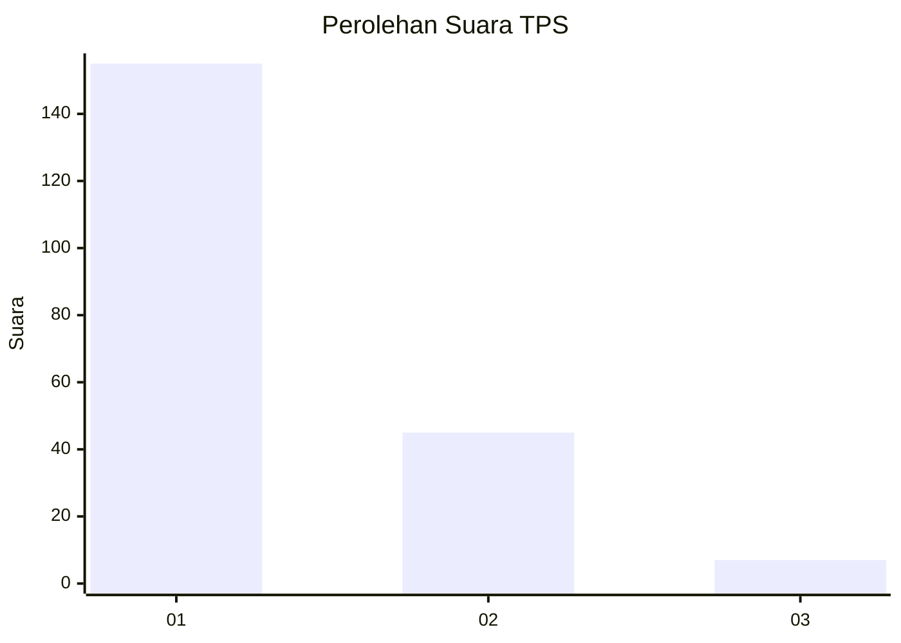
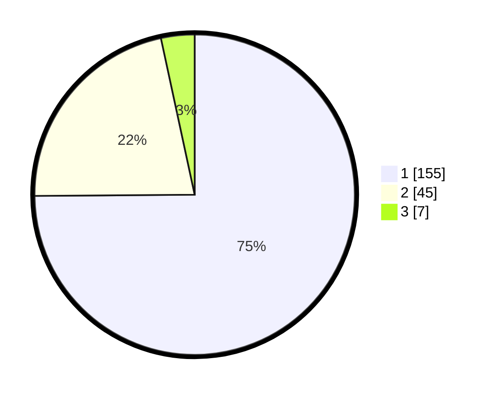

# Hasil

## Grafik

## Tabel

| No. | Nama Paslon    | Suara | Suara (raw) | Persentase |
|:--- |:-------------- | -----:| -----------:| ----------:|
| 1   | ANIES MUHAIMIN | 155   | [155][p-1]  | 74,88      |
| 2   | PRABOWO GIBRAN | 45    | [45][p-2]   | 21,74      |
| 3   | GANJAR MAHFUD  | 7     | [7][p-3]    | 3,38       |

[p-1]: https://github.com/gigit-pemilu/pemilu-2024-11-aceh/blob/main/pilpres/hitung-suara/sub/11-aceh/sub/02-aceh-tenggara/sub/03-bambel/sub/2029-pulo-perengge/sub/001-tps/sub/paslon-1.txt
[p-2]: https://github.com/gigit-pemilu/pemilu-2024-11-aceh/blob/main/pilpres/hitung-suara/sub/11-aceh/sub/02-aceh-tenggara/sub/03-bambel/sub/2029-pulo-perengge/sub/001-tps/sub/paslon-2.txt
[p-3]: https://github.com/gigit-pemilu/pemilu-2024-11-aceh/blob/main/pilpres/hitung-suara/sub/11-aceh/sub/02-aceh-tenggara/sub/03-bambel/sub/2029-pulo-perengge/sub/001-tps/sub/paslon-3.txt

## Foto C Plano

https://sirekap-obj-formc.kpu.go.id/fc71/pemilu/ppwp/11/02/03/20/29/1102032029001-20240215-015521--ea64f791-2978-4684-a064-e849228f731f.jpg

https://sirekap-obj-formc.kpu.go.id/fc71/pemilu/ppwp/11/02/03/20/29/1102032029001-20240215-015617--68e9946d-ef7d-410c-8cb0-efa025c4be24.jpg

https://sirekap-obj-formc.kpu.go.id/fc71/pemilu/ppwp/11/02/03/20/29/1102032029001-20240215-015717--4396716f-2101-443d-a14a-eff4d02eae3d.jpg

## Metadata

| Key        | Value               |
| ---------- | ------------------- |
| Time Stamp | 2024-02-24 22:31:28 |

