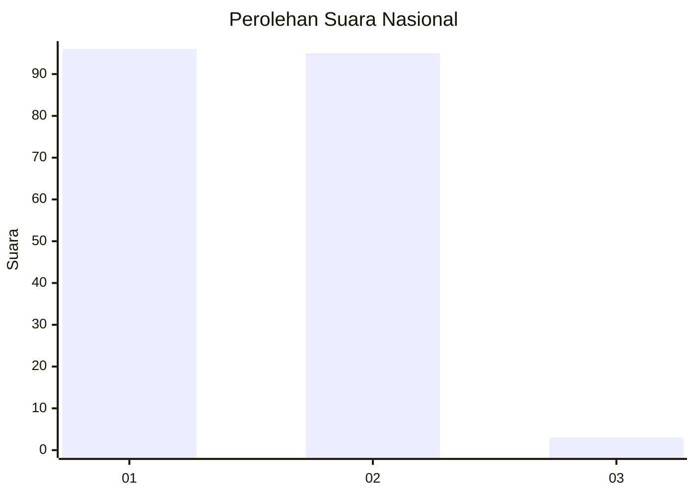
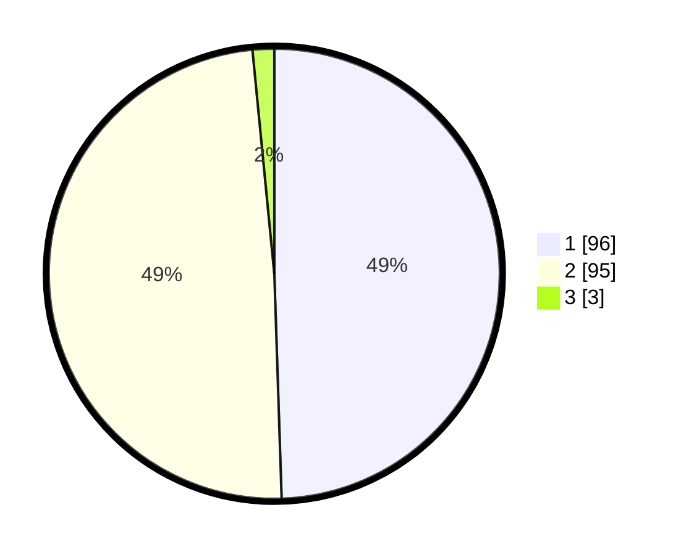

# Hasil

## Grafik

## Tabel

| No. | Nama Paslon    | Suara | Suara (raw) | Persentase |
|:--- |:-------------- | -----:| -----------:| ----------:|
| 1   | ANIES MUHAIMIN | 96    | [96][p-1]   | 49,48      |
| 2   | PRABOWO GIBRAN | 95    | [95][p-2]   | 48,97      |
| 3   | GANJAR MAHFUD  | 3     | [3][p-3]    | 1,55       |

[p-1]: https://github.com/gigit-pemilu/pemilu-2024/blob/main/pilpres/hitung-suara/sub/11-aceh/sub/02-aceh-tenggara/sub/03-bambel/sub/2034-biak-muli-baru/sub/002-tps/sub/paslon-1.txt
[p-2]: https://github.com/gigit-pemilu/pemilu-2024/blob/main/pilpres/hitung-suara/sub/11-aceh/sub/02-aceh-tenggara/sub/03-bambel/sub/2034-biak-muli-baru/sub/002-tps/sub/paslon-2.txt
[p-3]: https://github.com/gigit-pemilu/pemilu-2024/blob/main/pilpres/hitung-suara/sub/11-aceh/sub/02-aceh-tenggara/sub/03-bambel/sub/2034-biak-muli-baru/sub/002-tps/sub/paslon-3.txt

## Foto C Plano

https://sirekap-obj-formc.kpu.go.id/f70e/pemilu/ppwp/11/02/03/20/34/1102032034002-20240218-221833--1621b6fa-8f99-4237-8cb8-c468e50c1a07.jpg

https://sirekap-obj-formc.kpu.go.id/f70e/pemilu/ppwp/11/02/03/20/34/1102032034002-20240218-221926--81333cc2-ef57-4dcb-b9a3-33ba5f40d4cc.jpg

https://sirekap-obj-formc.kpu.go.id/f70e/pemilu/ppwp/11/02/03/20/34/1102032034002-20240218-222005--2446a35e-2486-47da-b7b7-80e5d0ce6798.jpg

## Metadata

| Key        | Value               |
| ---------- | ------------------- |
| Time Stamp | 2024-02-24 22:31:28 |

