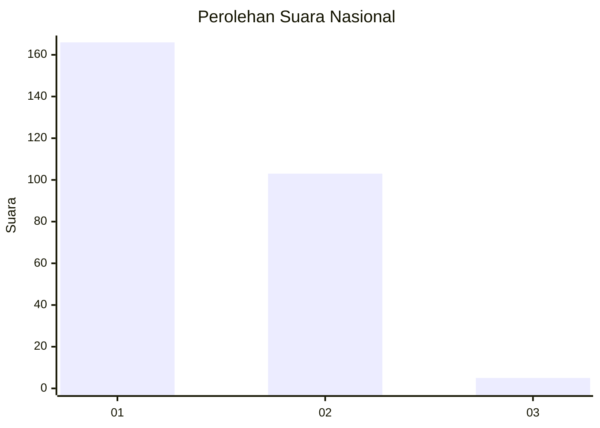
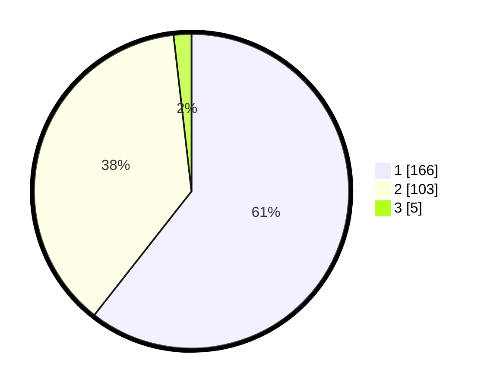

# Hasil

## Grafik

## Tabel

| No. | Nama Paslon    | Suara | Suara (raw) | Persentase |
|:--- |:-------------- | -----:| -----------:| ----------:|
| 1   | ANIES MUHAIMIN | 166   | [166][p-1]  | 60,58      |
| 2   | PRABOWO GIBRAN | 103   | [103][p-2]  | 37,59      |
| 3   | GANJAR MAHFUD  | 5     | [5][p-3]    | 1,82       |

[p-1]: https://github.com/gigit-pemilu/pemilu-2024/blob/main/pilpres/hitung-suara/sub/11-aceh/sub/02-aceh-tenggara/sub/03-bambel/sub/2035-biak-muli-pantai-raja/sub/001-tps/sub/paslon-1.txt
[p-2]: https://github.com/gigit-pemilu/pemilu-2024/blob/main/pilpres/hitung-suara/sub/11-aceh/sub/02-aceh-tenggara/sub/03-bambel/sub/2035-biak-muli-pantai-raja/sub/001-tps/sub/paslon-2.txt
[p-3]: https://github.com/gigit-pemilu/pemilu-2024/blob/main/pilpres/hitung-suara/sub/11-aceh/sub/02-aceh-tenggara/sub/03-bambel/sub/2035-biak-muli-pantai-raja/sub/001-tps/sub/paslon-3.txt

## Foto C Plano

https://sirekap-obj-formc.kpu.go.id/0a54/pemilu/ppwp/11/02/03/20/35/1102032035001-20240216-151705--9da4012e-1454-4f08-8e47-4aa4401a60a7.jpg

https://sirekap-obj-formc.kpu.go.id/0a54/pemilu/ppwp/11/02/03/20/35/1102032035001-20240216-151707--abbbe701-77fb-4b41-b688-92928bbb3559.jpg

https://sirekap-obj-formc.kpu.go.id/0a54/pemilu/ppwp/11/02/03/20/35/1102032035001-20240216-151706--a6cb274c-4f98-413b-83bf-f3d370d60f36.jpg

## Metadata

| Key        | Value               |
| ---------- | ------------------- |
| Time Stamp | 2024-02-16 23:30:00 |

## DATA PEMILIH TETAP

Jumlah pemilih dalam DPT: **290**.
 * L: **136**.
 * P: **154**.

## DATA PENGGUNA HAK PILIH

Jumlah pengguna hak pilih dalam DPT: **269**.
 * L: **124**.
 * P: **145**.

Jumlah pengguna hak pilih dalam DPTb: **2**.
 * L: **1**.
 * P: **1**.

Jumlah pengguna hak pilih dalam DPK: **7**.
 * L: **2**.
 * P: **5**.

Jumlah pengguna hak pilih: **278**.
 * L: **127**.
 * P: **151**.

## JUMLAH SUARA SAH DAN TIDAK SAH

JUMLAH SELURUH SUARA SAH: **274**.

JUMLAH SUARA TIDAK SAH: **4**.

JUMLAH SELURUH SUARA SAH DAN SUARA TIDAK SAH: **278**.

