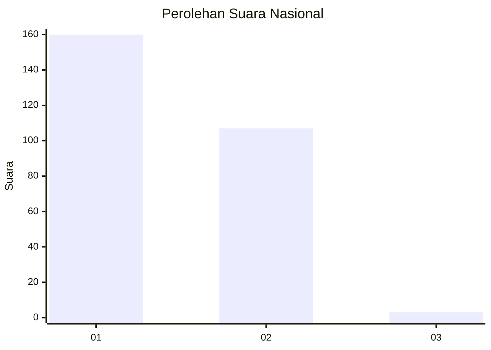
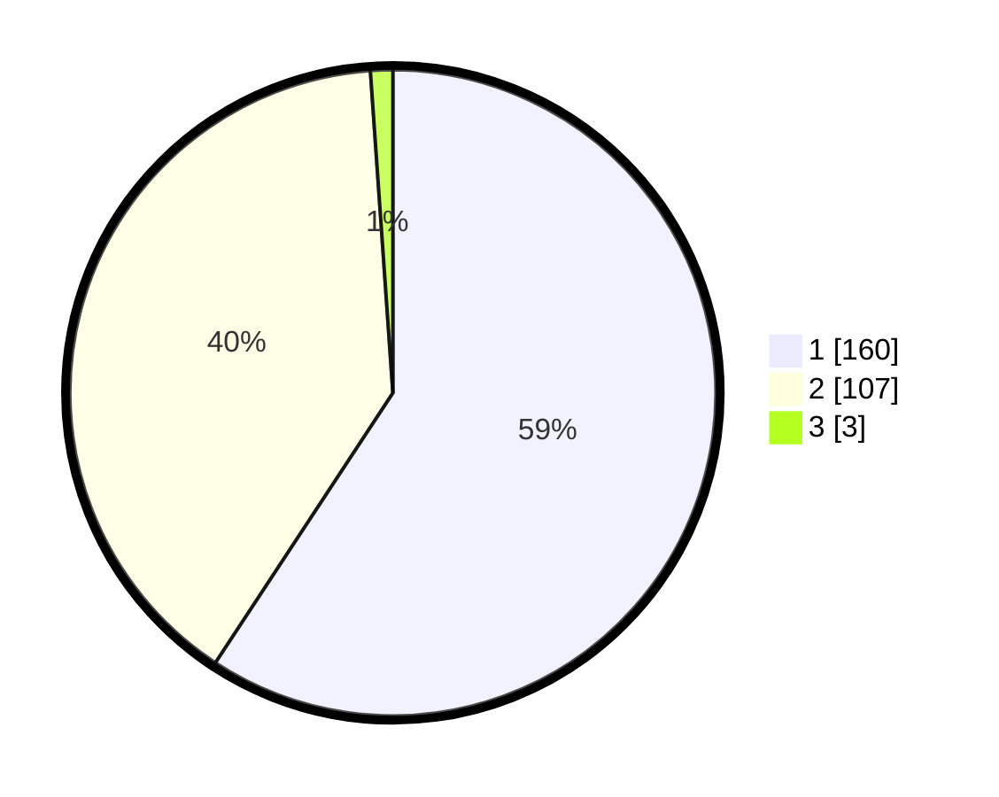

# Hasil

## Grafik

## Tabel

| No. | Nama Paslon    | Suara | Suara (raw) | Persentase |
|:--- |:-------------- | -----:| -----------:| ----------:|
| 1   | ANIES MUHAIMIN | 160   | [160][p-1]  | 59,26      |
| 2   | PRABOWO GIBRAN | 107   | [107][p-2]  | 39,63      |
| 3   | GANJAR MAHFUD  | 3     | [3][p-3]    | 1,11       |

[p-1]: https://github.com/gigit-pemilu/pemilu-2024/blob/main/pilpres/hitung-suara/sub/11-aceh/sub/02-aceh-tenggara/sub/03-bambel/sub/2039-lawe-hijo-metuah/sub/001-tps/sub/paslon-1.txt
[p-2]: https://github.com/gigit-pemilu/pemilu-2024/blob/main/pilpres/hitung-suara/sub/11-aceh/sub/02-aceh-tenggara/sub/03-bambel/sub/2039-lawe-hijo-metuah/sub/001-tps/sub/paslon-2.txt
[p-3]: https://github.com/gigit-pemilu/pemilu-2024/blob/main/pilpres/hitung-suara/sub/11-aceh/sub/02-aceh-tenggara/sub/03-bambel/sub/2039-lawe-hijo-metuah/sub/001-tps/sub/paslon-3.txt

## Foto C Plano

https://sirekap-obj-formc.kpu.go.id/9e00/pemilu/ppwp/11/02/03/20/39/1102032039001-20240216-162521--5b89de29-5450-4ffb-8f8e-ba6a8f449798.jpg

https://sirekap-obj-formc.kpu.go.id/9e00/pemilu/ppwp/11/02/03/20/39/1102032039001-20240216-162523--3f5fce28-28cd-4d90-875b-b02da6865247.jpg

https://sirekap-obj-formc.kpu.go.id/9e00/pemilu/ppwp/11/02/03/20/39/1102032039001-20240216-162522--cae1ca9a-6bbb-4046-a724-d9935ed20daf.jpg

## Metadata

| Key        | Value               |
| ---------- | ------------------- |
| Time Stamp | 2024-02-24 22:31:28 |

## DATA PEMILIH TETAP

Jumlah pemilih dalam DPT: **275**.
 * L: **126**.
 * P: **149**.

## DATA PENGGUNA HAK PILIH

Jumlah pengguna hak pilih dalam DPT: **275**.
 * L: **126**.
 * P: **149**.

Jumlah pengguna hak pilih dalam DPTb: **0**.
 * L: **0**.
 * P: **0**.

Jumlah pengguna hak pilih dalam DPK: **2**.
 * L: **0**.
 * P: **2**.

Jumlah pengguna hak pilih: **277**.
 * L: **126**.
 * P: **151**.

## JUMLAH SUARA SAH DAN TIDAK SAH

JUMLAH SELURUH SUARA SAH: **270**.

JUMLAH SUARA TIDAK SAH: **7**.

JUMLAH SELURUH SUARA SAH DAN SUARA TIDAK SAH: **277**.

