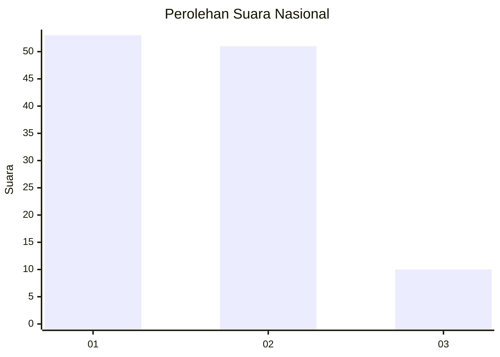
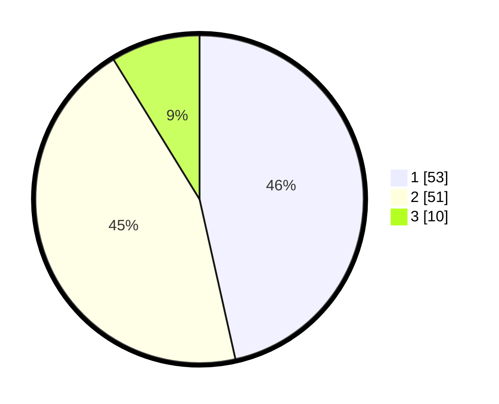

# Hasil

## Grafik

## Tabel

| No. | Nama Paslon    | Suara | Suara (raw) | Persentase |
|:--- |:-------------- | -----:| -----------:| ----------:|
| 1   | ANIES MUHAIMIN | 53    | [53][p-1]   | 46,49      |
| 2   | PRABOWO GIBRAN | 51    | [51][p-2]   | 44,74      |
| 3   | GANJAR MAHFUD  | 10    | [10][p-3]   | 8,77       |

[p-1]: https://github.com/gigit-pemilu/pemilu-2024/blob/main/pilpres/hitung-suara/sub/11-aceh/sub/02-aceh-tenggara/sub/04-babussalam/sub/2001-kota-kutacane/sub/001-tps/sub/paslon-1.txt
[p-2]: https://github.com/gigit-pemilu/pemilu-2024/blob/main/pilpres/hitung-suara/sub/11-aceh/sub/02-aceh-tenggara/sub/04-babussalam/sub/2001-kota-kutacane/sub/001-tps/sub/paslon-2.txt
[p-3]: https://github.com/gigit-pemilu/pemilu-2024/blob/main/pilpres/hitung-suara/sub/11-aceh/sub/02-aceh-tenggara/sub/04-babussalam/sub/2001-kota-kutacane/sub/001-tps/sub/paslon-3.txt

## Foto C Plano

https://sirekap-obj-formc.kpu.go.id/dbaa/pemilu/ppwp/11/02/04/20/01/1102042001001-20240216-124709--b5c3ae41-4e70-44d7-9690-d32115e885a4.jpg

https://sirekap-obj-formc.kpu.go.id/dbaa/pemilu/ppwp/11/02/04/20/01/1102042001001-20240216-124714--b240ff35-bc26-406f-98a9-b676f7b4e22c.jpg

https://sirekap-obj-formc.kpu.go.id/dbaa/pemilu/ppwp/11/02/04/20/01/1102042001001-20240216-124712--2c995d6c-7386-451f-a8cd-f27843062b3e.jpg

## Metadata

| Key        | Value               |
| ---------- | ------------------- |
| Time Stamp | 2024-02-20 13:00:00 |

## DATA PEMILIH TETAP

Jumlah pemilih dalam DPT: **164**.
 * L: **63**.
 * P: **101**.

## DATA PENGGUNA HAK PILIH

Jumlah pengguna hak pilih dalam DPT: **107**.
 * L: **39**.
 * P: **68**.

Jumlah pengguna hak pilih dalam DPTb: **6**.
 * L: **3**.
 * P: **3**.

Jumlah pengguna hak pilih dalam DPK: **3**.
 * L: **1**.
 * P: **2**.

Jumlah pengguna hak pilih: **116**.
 * L: **43**.
 * P: **73**.

## JUMLAH SUARA SAH DAN TIDAK SAH

JUMLAH SELURUH SUARA SAH: **114**.

JUMLAH SUARA TIDAK SAH: **2**.

JUMLAH SELURUH SUARA SAH DAN SUARA TIDAK SAH: **116**.

