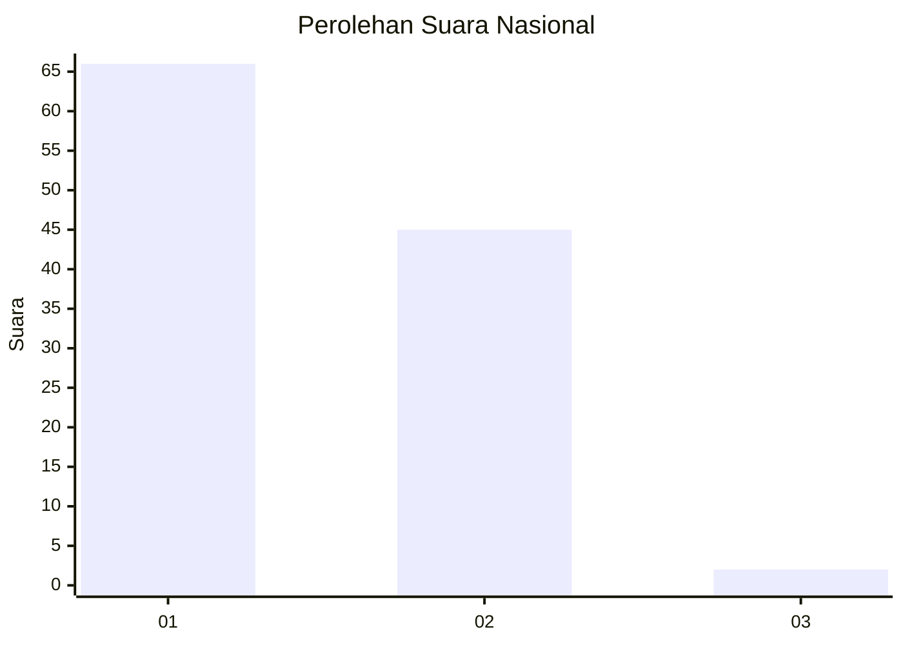
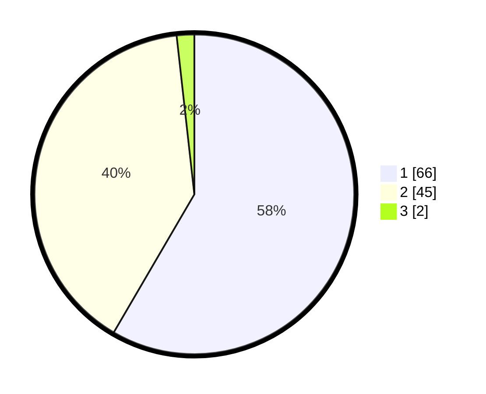

# Hasil

## Grafik

## Tabel

| No. | Nama Paslon    | Suara | Suara (raw) | Persentase |
|:--- |:-------------- | -----:| -----------:| ----------:|
| 1   | ANIES MUHAIMIN | 66    | [66][p-1]   | 58,41      |
| 2   | PRABOWO GIBRAN | 45    | [45][p-2]   | 39,82      |
| 3   | GANJAR MAHFUD  | 2     | [2][p-3]    | 1,77       |

[p-1]: https://github.com/gigit-pemilu/pemilu-2024/blob/main/pilpres/hitung-suara/sub/11-aceh/sub/02-aceh-tenggara/sub/04-babussalam/sub/2001-kota-kutacane/sub/002-tps/sub/paslon-1.txt
[p-2]: https://github.com/gigit-pemilu/pemilu-2024/blob/main/pilpres/hitung-suara/sub/11-aceh/sub/02-aceh-tenggara/sub/04-babussalam/sub/2001-kota-kutacane/sub/002-tps/sub/paslon-2.txt
[p-3]: https://github.com/gigit-pemilu/pemilu-2024/blob/main/pilpres/hitung-suara/sub/11-aceh/sub/02-aceh-tenggara/sub/04-babussalam/sub/2001-kota-kutacane/sub/002-tps/sub/paslon-3.txt

## Foto C Plano

https://sirekap-obj-formc.kpu.go.id/bbab/pemilu/ppwp/11/02/04/20/01/1102042001002-20240216-215243--bacda056-3002-4ab7-b08c-6058802c0694.jpg

https://sirekap-obj-formc.kpu.go.id/bbab/pemilu/ppwp/11/02/04/20/01/1102042001002-20240216-220418--b2ec1d30-79b4-4913-a77c-b1528cdaeb98.jpg

https://sirekap-obj-formc.kpu.go.id/bbab/pemilu/ppwp/11/02/04/20/01/1102042001002-20240216-215404--804ee6d8-fad8-4f7b-bacf-0b972986cf21.jpg

## Metadata

| Key        | Value               |
| ---------- | ------------------- |
| Time Stamp | 2024-02-20 13:00:00 |

## DATA PEMILIH TETAP

Jumlah pemilih dalam DPT: **145**.
 * L: **70**.
 * P: **75**.

## DATA PENGGUNA HAK PILIH

Jumlah pengguna hak pilih dalam DPT: **107**.
 * L: **48**.
 * P: **59**.

Jumlah pengguna hak pilih dalam DPTb: **5**.
 * L: **3**.
 * P: **2**.

Jumlah pengguna hak pilih dalam DPK: **2**.
 * L: **1**.
 * P: **1**.

Jumlah pengguna hak pilih: **114**.
 * L: **52**.
 * P: **62**.

## JUMLAH SUARA SAH DAN TIDAK SAH

JUMLAH SELURUH SUARA SAH: **113**.

JUMLAH SUARA TIDAK SAH: **1**.

JUMLAH SELURUH SUARA SAH DAN SUARA TIDAK SAH: **114**.

