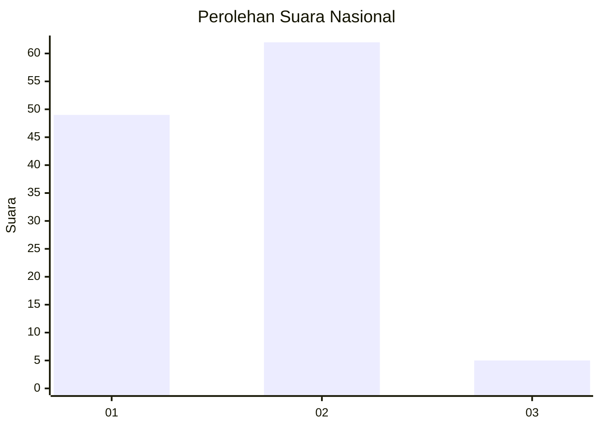
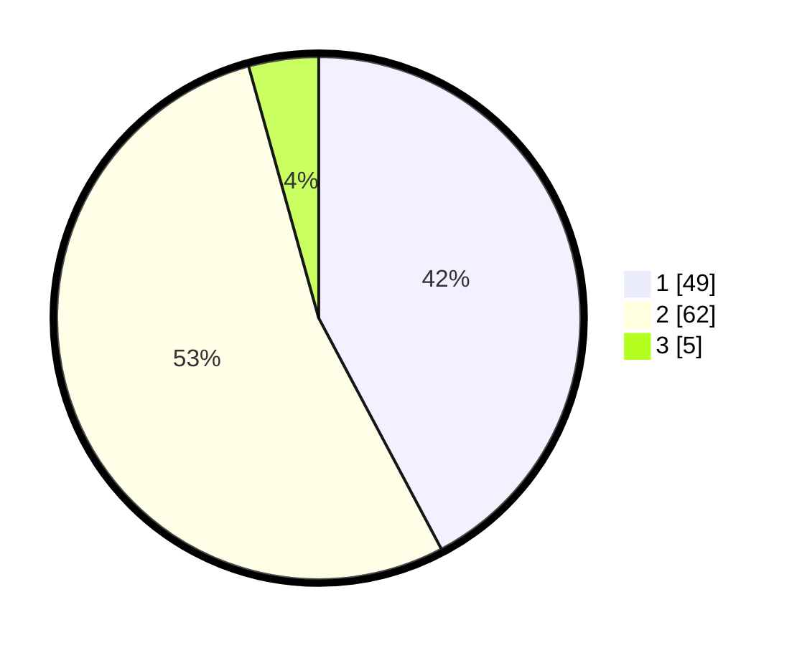

# Hasil

## Grafik

## Tabel

| No. | Nama Paslon    | Suara | Suara (raw) | Persentase |
|:--- |:-------------- | -----:| -----------:| ----------:|
| 1   | ANIES MUHAIMIN | 49    | [49][p-1]   | 42,24      |
| 2   | PRABOWO GIBRAN | 62    | [62][p-2]   | 53,45      |
| 3   | GANJAR MAHFUD  | 5     | [5][p-3]    | 4,31       |

[p-1]: https://github.com/gigit-pemilu/pemilu-2024/blob/main/pilpres/hitung-suara/sub/11-aceh/sub/02-aceh-tenggara/sub/04-babussalam/sub/2001-kota-kutacane/sub/003-tps/sub/paslon-1.txt
[p-2]: https://github.com/gigit-pemilu/pemilu-2024/blob/main/pilpres/hitung-suara/sub/11-aceh/sub/02-aceh-tenggara/sub/04-babussalam/sub/2001-kota-kutacane/sub/003-tps/sub/paslon-2.txt
[p-3]: https://github.com/gigit-pemilu/pemilu-2024/blob/main/pilpres/hitung-suara/sub/11-aceh/sub/02-aceh-tenggara/sub/04-babussalam/sub/2001-kota-kutacane/sub/003-tps/sub/paslon-3.txt

## Foto C Plano

https://sirekap-obj-formc.kpu.go.id/bd42/pemilu/ppwp/11/02/04/20/01/1102042001003-20240216-220807--0eface4d-a0f7-4ff2-ac4e-d3d325db8a3a.jpg

https://sirekap-obj-formc.kpu.go.id/bd42/pemilu/ppwp/11/02/04/20/01/1102042001003-20240216-220942--c89a7187-1205-4d23-b5a0-cc98d06d8547.jpg

https://sirekap-obj-formc.kpu.go.id/bd42/pemilu/ppwp/11/02/04/20/01/1102042001003-20240216-221031--62d1f4c4-5c99-45bc-9c7c-c7f380a71388.jpg

## Metadata

| Key        | Value               |
| ---------- | ------------------- |
| Time Stamp | 2024-02-20 13:00:00 |

## DATA PEMILIH TETAP

Jumlah pemilih dalam DPT: **145**.
 * L: **69**.
 * P: **76**.

## DATA PENGGUNA HAK PILIH

Jumlah pengguna hak pilih dalam DPT: **117**.
 * L: **56**.
 * P: **61**.

Jumlah pengguna hak pilih dalam DPTb: **1**.
 * L: **1**.
 * P: **0**.

Jumlah pengguna hak pilih dalam DPK: **1**.
 * L: **0**.
 * P: **1**.

Jumlah pengguna hak pilih: **119**.
 * L: **57**.
 * P: **62**.

## JUMLAH SUARA SAH DAN TIDAK SAH

JUMLAH SELURUH SUARA SAH: **116**.

JUMLAH SUARA TIDAK SAH: **3**.

JUMLAH SELURUH SUARA SAH DAN SUARA TIDAK SAH: **119**.

