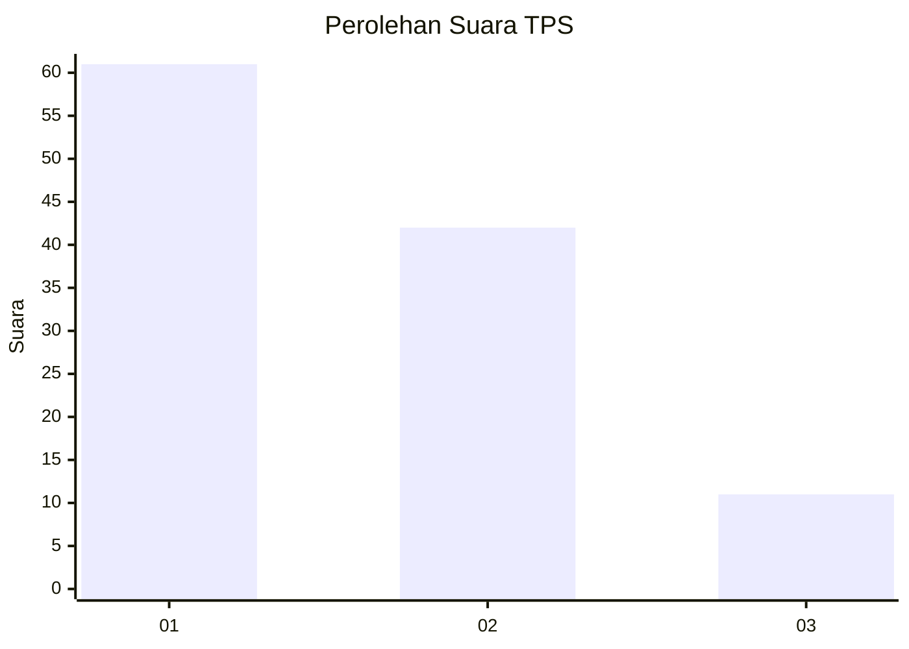
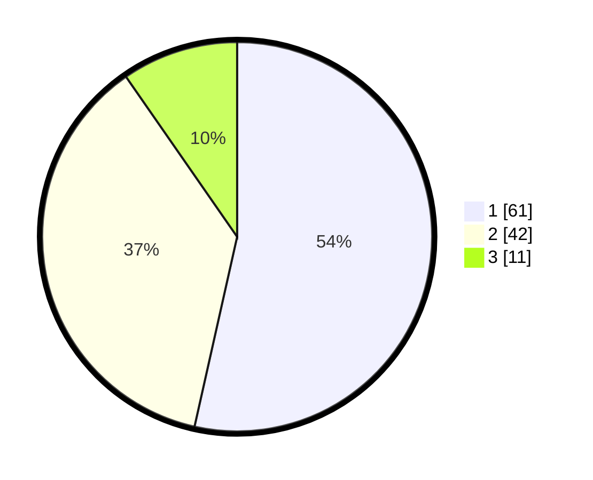

# Hasil

## Grafik

## Tabel

| No. | Nama Paslon    | Suara | Suara (raw) | Persentase |
|:--- |:-------------- | -----:| -----------:| ----------:|
| 1   | ANIES MUHAIMIN | 61    | [61][p-1]   | 53,51      |
| 2   | PRABOWO GIBRAN | 42    | [42][p-2]   | 36,84      |
| 3   | GANJAR MAHFUD  | 11    | [11][p-3]   | 9,65       |

[p-1]: https://github.com/gigit-pemilu/pemilu-2024-11-aceh/blob/main/pilpres/hitung-suara/sub/11-aceh/sub/02-aceh-tenggara/sub/04-babussalam/sub/2001-kota-kutacane/sub/005-tps/sub/paslon-1.txt
[p-2]: https://github.com/gigit-pemilu/pemilu-2024-11-aceh/blob/main/pilpres/hitung-suara/sub/11-aceh/sub/02-aceh-tenggara/sub/04-babussalam/sub/2001-kota-kutacane/sub/005-tps/sub/paslon-2.txt
[p-3]: https://github.com/gigit-pemilu/pemilu-2024-11-aceh/blob/main/pilpres/hitung-suara/sub/11-aceh/sub/02-aceh-tenggara/sub/04-babussalam/sub/2001-kota-kutacane/sub/005-tps/sub/paslon-3.txt

## Foto C Plano

https://sirekap-obj-formc.kpu.go.id/0fd9/pemilu/ppwp/11/02/04/20/01/1102042001005-20240216-231233--1b3d7e14-b531-4e05-af9e-080f191e60e2.jpg

https://sirekap-obj-formc.kpu.go.id/0fd9/pemilu/ppwp/11/02/04/20/01/1102042001005-20240216-231521--abad3057-81f2-4487-8033-4b032c5352bf.jpg

https://sirekap-obj-formc.kpu.go.id/0fd9/pemilu/ppwp/11/02/04/20/01/1102042001005-20240216-231706--6cebc12f-44f1-49ea-8b94-03205f9907d3.jpg

## Metadata

| Key        | Value               |
| ---------- | ------------------- |
| Time Stamp | 2024-02-16 23:30:00 |

## DATA PEMILIH TETAP

Jumlah pemilih dalam DPT: **142**.
 * L: **66**.
 * P: **76**.

## DATA PENGGUNA HAK PILIH

Jumlah pengguna hak pilih dalam DPT: **114**.
 * L: **53**.
 * P: **61**.

Jumlah pengguna hak pilih dalam DPTb: **0**.
 * L: **0**.
 * P: **0**.

Jumlah pengguna hak pilih dalam DPK: **0**.
 * L: **0**.
 * P: **0**.

Jumlah pengguna hak pilih: **114**.
 * L: **53**.
 * P: **61**.

## JUMLAH SUARA SAH DAN TIDAK SAH

JUMLAH SELURUH SUARA SAH: **114**.

JUMLAH SUARA TIDAK SAH: **0**.

JUMLAH SELURUH SUARA SAH DAN SUARA TIDAK SAH: **114**.

