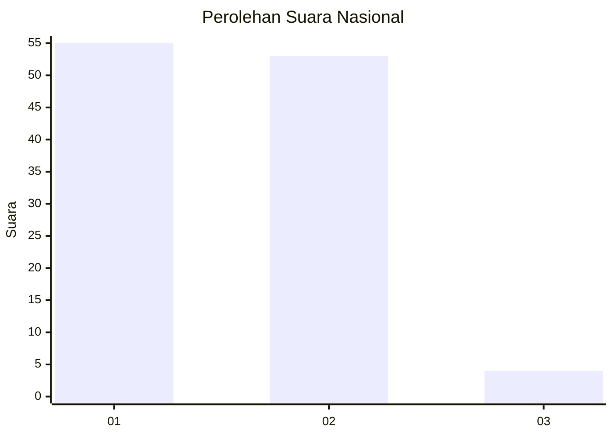
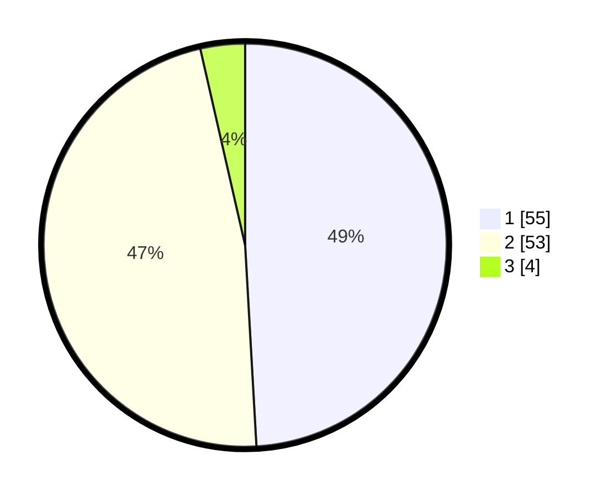

# Hasil

## Grafik

## Tabel

| No. | Nama Paslon    | Suara | Suara (raw) | Persentase |
|:--- |:-------------- | -----:| -----------:| ----------:|
| 1   | ANIES MUHAIMIN | 55    | [55][p-1]   | 49,11      |
| 2   | PRABOWO GIBRAN | 53    | [53][p-2]   | 47,32      |
| 3   | GANJAR MAHFUD  | 4     | [4][p-3]    | 3,57       |

[p-1]: https://github.com/gigit-pemilu/pemilu-2024/blob/main/pilpres/hitung-suara/sub/11-aceh/sub/02-aceh-tenggara/sub/04-babussalam/sub/2001-kota-kutacane/sub/006-tps/sub/paslon-1.txt
[p-2]: https://github.com/gigit-pemilu/pemilu-2024/blob/main/pilpres/hitung-suara/sub/11-aceh/sub/02-aceh-tenggara/sub/04-babussalam/sub/2001-kota-kutacane/sub/006-tps/sub/paslon-2.txt
[p-3]: https://github.com/gigit-pemilu/pemilu-2024/blob/main/pilpres/hitung-suara/sub/11-aceh/sub/02-aceh-tenggara/sub/04-babussalam/sub/2001-kota-kutacane/sub/006-tps/sub/paslon-3.txt

## Foto C Plano

https://sirekap-obj-formc.kpu.go.id/8d7f/pemilu/ppwp/11/02/04/20/01/1102042001006-20240216-232518--eb5e765f-faae-49c0-a016-8b2a828edb0e.jpg

https://sirekap-obj-formc.kpu.go.id/8d7f/pemilu/ppwp/11/02/04/20/01/1102042001006-20240216-232841--d0b92cf1-2010-41c3-82c1-f27dbe04d50a.jpg

https://sirekap-obj-formc.kpu.go.id/8d7f/pemilu/ppwp/11/02/04/20/01/1102042001006-20240216-233024--28f039ce-503a-410b-a984-e4d179162eb4.jpg

## Metadata

| Key        | Value               |
| ---------- | ------------------- |
| Time Stamp | 2024-02-20 13:00:00 |

## DATA PEMILIH TETAP

Jumlah pemilih dalam DPT: **140**.
 * L: **61**.
 * P: **79**.

## DATA PENGGUNA HAK PILIH

Jumlah pengguna hak pilih dalam DPT: **112**.
 * L: **44**.
 * P: **68**.

Jumlah pengguna hak pilih dalam DPTb: **0**.
 * L: **0**.
 * P: **0**.

Jumlah pengguna hak pilih dalam DPK: **1**.
 * L: **0**.
 * P: **1**.

Jumlah pengguna hak pilih: **113**.
 * L: **44**.
 * P: **69**.

## JUMLAH SUARA SAH DAN TIDAK SAH

JUMLAH SELURUH SUARA SAH: **112**.

JUMLAH SUARA TIDAK SAH: **1**.

JUMLAH SELURUH SUARA SAH DAN SUARA TIDAK SAH: **113**.

