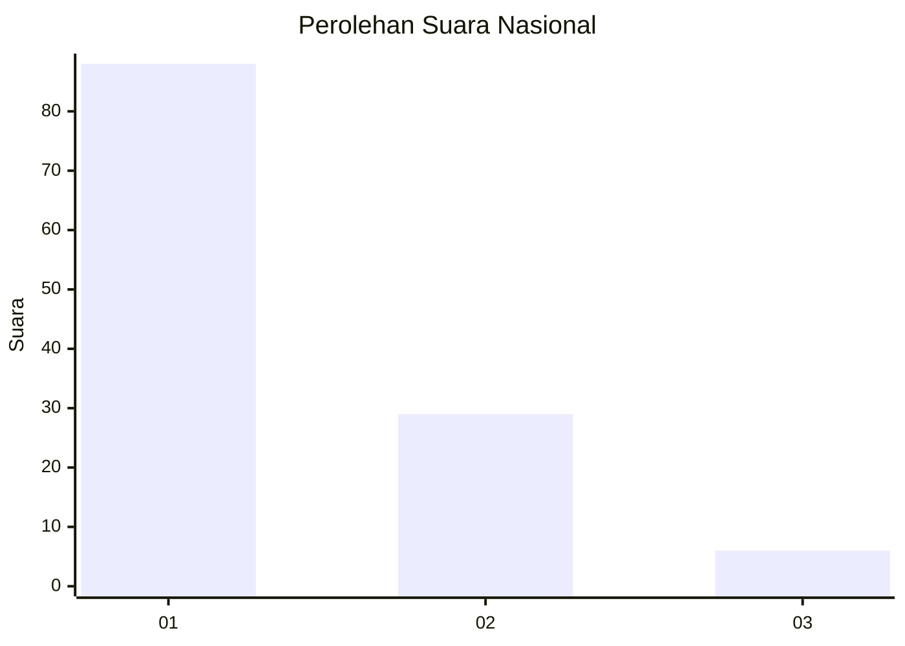
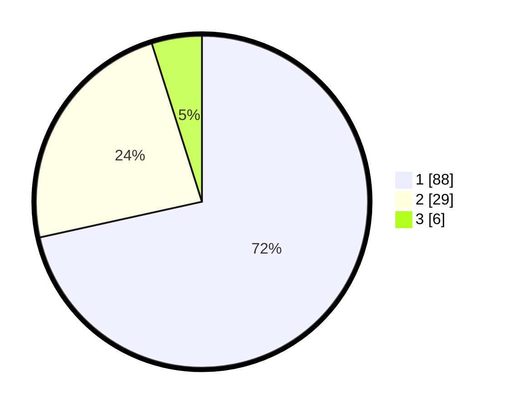

# Hasil

## Grafik

## Tabel

| No. | Nama Paslon    | Suara | Suara (raw) | Persentase |
|:--- |:-------------- | -----:| -----------:| ----------:|
| 1   | ANIES MUHAIMIN | 88    | [88][p-1]   | 71,54      |
| 2   | PRABOWO GIBRAN | 29    | [29][p-2]   | 23,58      |
| 3   | GANJAR MAHFUD  | 6     | [6][p-3]    | 4,88       |

[p-1]: https://github.com/gigit-pemilu/pemilu-2024/blob/main/pilpres/hitung-suara/sub/11-aceh/sub/02-aceh-tenggara/sub/04-babussalam/sub/2001-kota-kutacane/sub/007-tps/sub/paslon-1.txt
[p-2]: https://github.com/gigit-pemilu/pemilu-2024/blob/main/pilpres/hitung-suara/sub/11-aceh/sub/02-aceh-tenggara/sub/04-babussalam/sub/2001-kota-kutacane/sub/007-tps/sub/paslon-2.txt
[p-3]: https://github.com/gigit-pemilu/pemilu-2024/blob/main/pilpres/hitung-suara/sub/11-aceh/sub/02-aceh-tenggara/sub/04-babussalam/sub/2001-kota-kutacane/sub/007-tps/sub/paslon-3.txt

## Foto C Plano

https://sirekap-obj-formc.kpu.go.id/e558/pemilu/ppwp/11/02/04/20/01/1102042001007-20240215-002446--5484fa49-0f3a-4f3b-8b7b-83117db7d8b4.jpg

https://sirekap-obj-formc.kpu.go.id/e558/pemilu/ppwp/11/02/04/20/01/1102042001007-20240215-002703--2dcfa5ef-5a8e-4295-9f8b-84ac92eb8955.jpg

https://sirekap-obj-formc.kpu.go.id/e558/pemilu/ppwp/11/02/04/20/01/1102042001007-20240215-003132--10d04019-31b0-4647-a8c4-c95f91b31d64.jpg

## Metadata

| Key        | Value               |
| ---------- | ------------------- |
| Time Stamp | 2024-02-24 22:31:28 |

