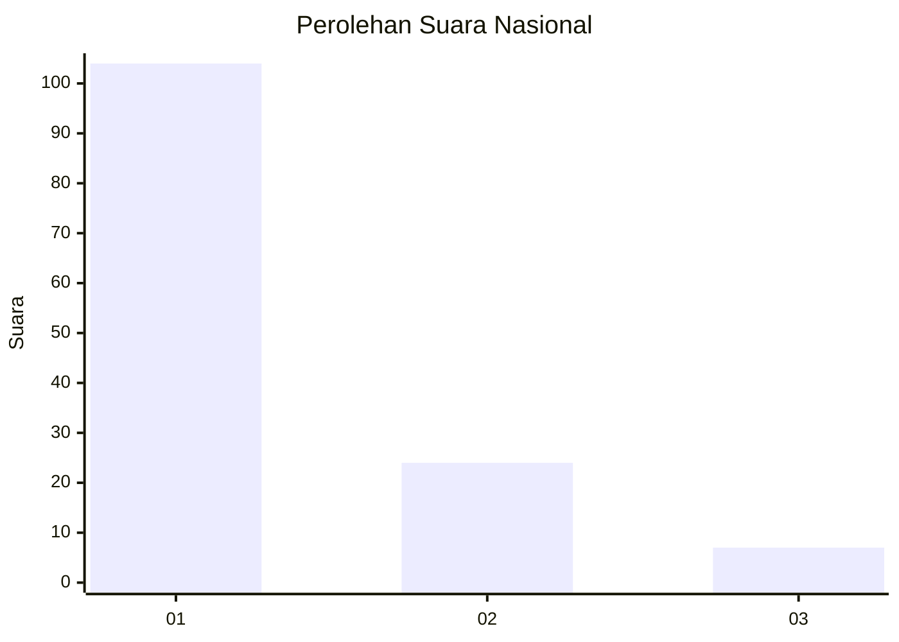
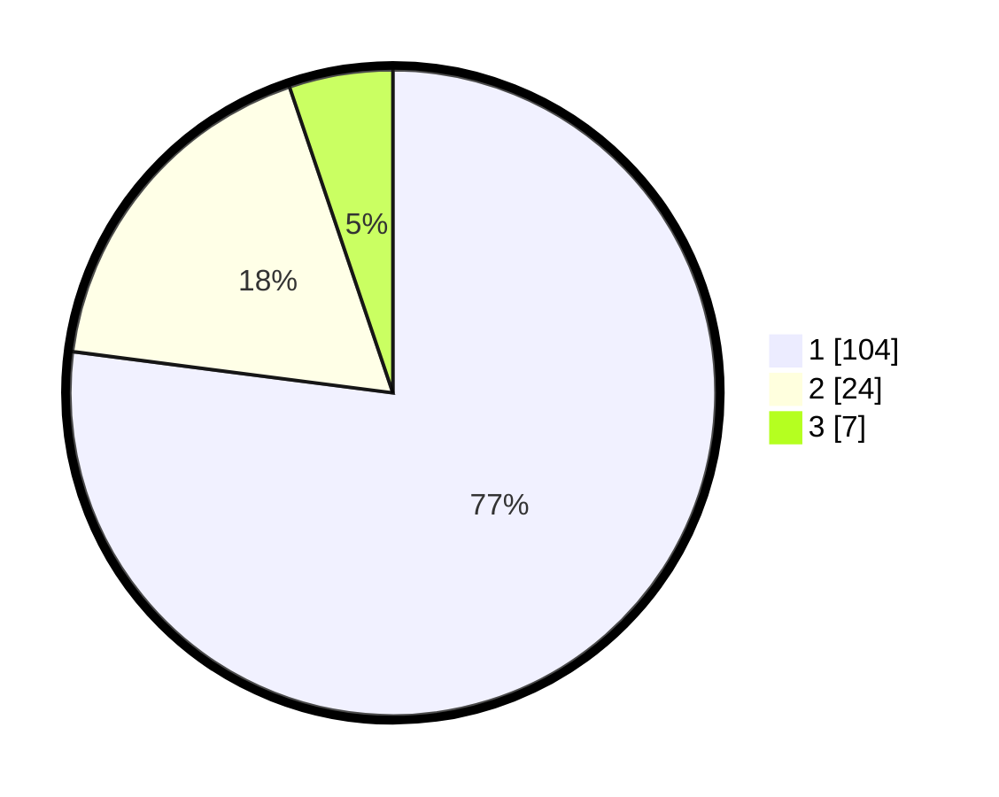

# Hasil

## Grafik

## Tabel

| No. | Nama Paslon    | Suara | Suara (raw) | Persentase |
|:--- |:-------------- | -----:| -----------:| ----------:|
| 1   | ANIES MUHAIMIN | 104   | [104][p-1]  | 77,04      |
| 2   | PRABOWO GIBRAN | 24    | [24][p-2]   | 17,78      |
| 3   | GANJAR MAHFUD  | 7     | [7][p-3]    | 5,19       |

[p-1]: https://github.com/gigit-pemilu/pemilu-2024/blob/main/pilpres/hitung-suara/sub/11-aceh/sub/02-aceh-tenggara/sub/04-babussalam/sub/2001-kota-kutacane/sub/015-tps/sub/paslon-1.txt
[p-2]: https://github.com/gigit-pemilu/pemilu-2024/blob/main/pilpres/hitung-suara/sub/11-aceh/sub/02-aceh-tenggara/sub/04-babussalam/sub/2001-kota-kutacane/sub/015-tps/sub/paslon-2.txt
[p-3]: https://github.com/gigit-pemilu/pemilu-2024/blob/main/pilpres/hitung-suara/sub/11-aceh/sub/02-aceh-tenggara/sub/04-babussalam/sub/2001-kota-kutacane/sub/015-tps/sub/paslon-3.txt

## Foto C Plano

https://sirekap-obj-formc.kpu.go.id/bc02/pemilu/ppwp/11/02/04/20/01/1102042001015-20240215-025800--8abbd60e-0c6e-497b-b54d-44b1e30bd813.jpg

https://sirekap-obj-formc.kpu.go.id/bc02/pemilu/ppwp/11/02/04/20/01/1102042001015-20240215-025954--054d0c43-402a-4977-98f8-428af19842e7.jpg

https://sirekap-obj-formc.kpu.go.id/bc02/pemilu/ppwp/11/02/04/20/01/1102042001015-20240215-025904--303f49ee-6ada-44cb-bbb7-a0eb8282afdd.jpg

## Metadata

| Key        | Value               |
| ---------- | ------------------- |
| Time Stamp | 2024-02-20 13:00:00 |

