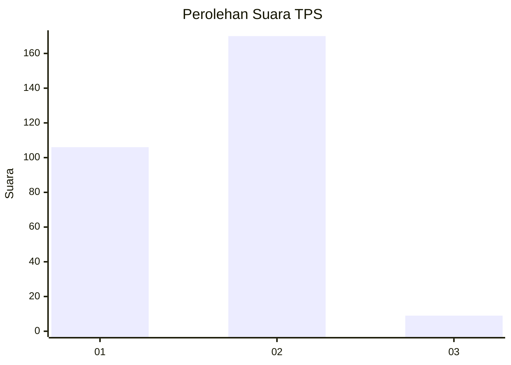
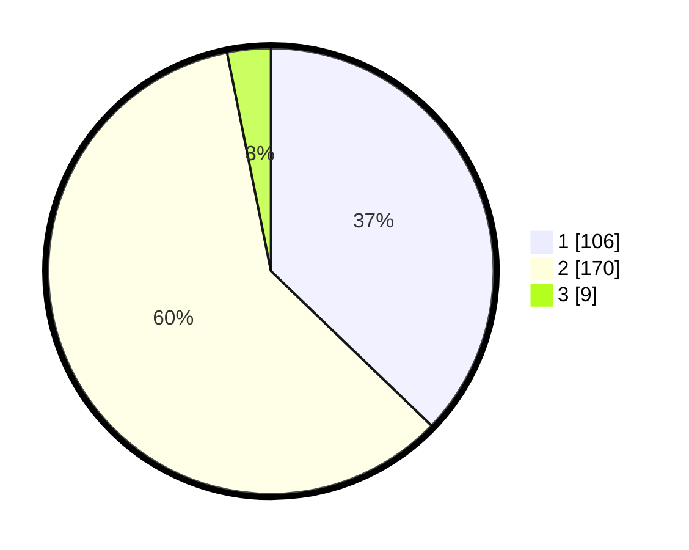

# Hasil

## Grafik

## Tabel

| No. | Nama Paslon    | Suara | Suara (raw) | Persentase |
|:--- |:-------------- | -----:| -----------:| ----------:|
| 1   | ANIES MUHAIMIN | 106   | [106][p-1]  | 37,19      |
| 2   | PRABOWO GIBRAN | 170   | [170][p-2]  | 59,65      |
| 3   | GANJAR MAHFUD  | 9     | [9][p-3]    | 3,16       |

[p-1]: https://github.com/gigit-pemilu/pemilu-2024-11-aceh/blob/main/pilpres/hitung-suara/sub/11-aceh/sub/02-aceh-tenggara/sub/04-babussalam/sub/2001-kota-kutacane/sub/901-tps/sub/paslon-1.txt
[p-2]: https://github.com/gigit-pemilu/pemilu-2024-11-aceh/blob/main/pilpres/hitung-suara/sub/11-aceh/sub/02-aceh-tenggara/sub/04-babussalam/sub/2001-kota-kutacane/sub/901-tps/sub/paslon-2.txt
[p-3]: https://github.com/gigit-pemilu/pemilu-2024-11-aceh/blob/main/pilpres/hitung-suara/sub/11-aceh/sub/02-aceh-tenggara/sub/04-babussalam/sub/2001-kota-kutacane/sub/901-tps/sub/paslon-3.txt

## Foto C Plano

https://sirekap-obj-formc.kpu.go.id/afc4/pemilu/ppwp/11/02/04/20/01/1102042001901-20240217-120947--7c0796be-871b-415c-a39b-ab7ec09880f9.jpg

https://sirekap-obj-formc.kpu.go.id/afc4/pemilu/ppwp/11/02/04/20/01/1102042001901-20240217-121339--9d267168-c85e-414d-ba10-0cbca19ceeb1.jpg

https://sirekap-obj-formc.kpu.go.id/afc4/pemilu/ppwp/11/02/04/20/01/1102042001901-20240217-121527--0e5e69dc-43a7-4014-bad8-def1a528f45f.jpg

## Metadata

| Key        | Value               |
| ---------- | ------------------- |
| Time Stamp | 2024-02-19 06:16:00 |

## DATA PEMILIH TETAP

Jumlah pemilih dalam DPT: **287**.
 * L: **282**.
 * P: **5**.

## DATA PENGGUNA HAK PILIH

Jumlah pengguna hak pilih dalam DPT: **173**.
 * L: **172**.
 * P: **1**.

Jumlah pengguna hak pilih dalam DPTb: **120**.
 * L: **118**.
 * P: **2**.

Jumlah pengguna hak pilih dalam DPK: **0**.
 * L: **0**.
 * P: **0**.

Jumlah pengguna hak pilih: **293**.
 * L: **290**.
 * P: **3**.

## JUMLAH SUARA SAH DAN TIDAK SAH

JUMLAH SELURUH SUARA SAH: **285**.

JUMLAH SUARA TIDAK SAH: **8**.

JUMLAH SELURUH SUARA SAH DAN SUARA TIDAK SAH: **293**.

