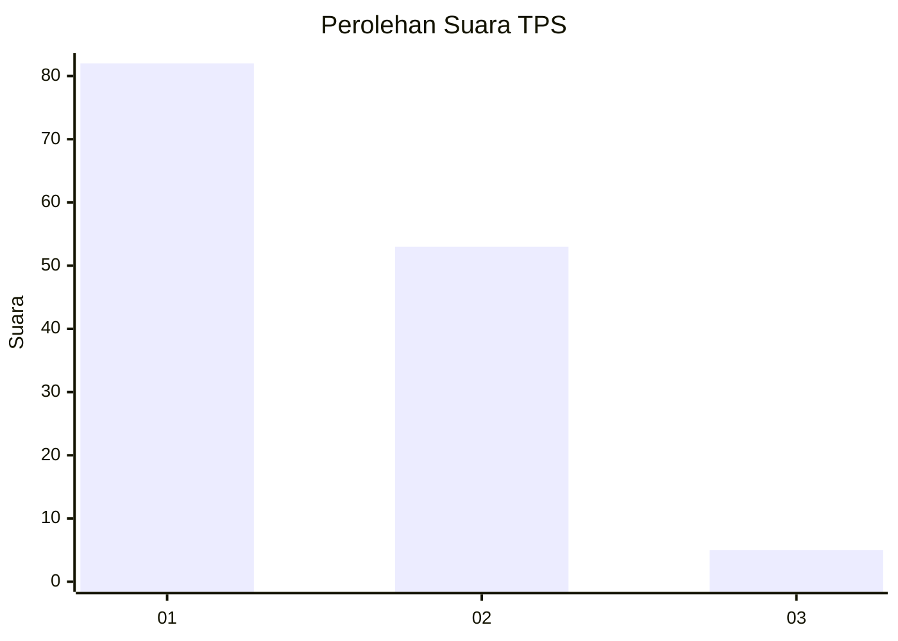
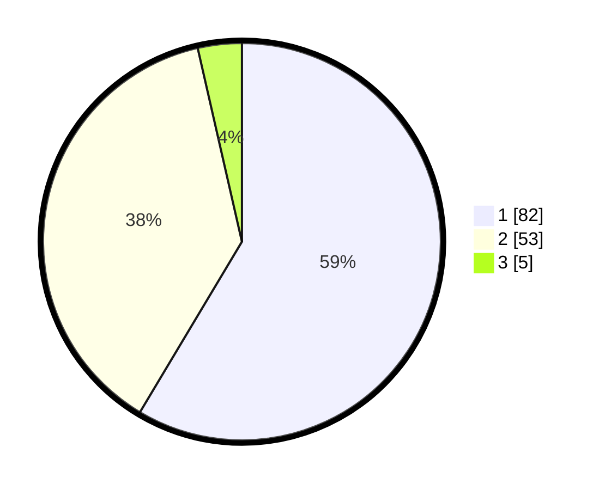

# Hasil

## Grafik

## Tabel

| No. | Nama Paslon    | Suara | Suara (raw) | Persentase |
|:--- |:-------------- | -----:| -----------:| ----------:|
| 1   | ANIES MUHAIMIN | 82    | [82][p-1]   | 58,57      |
| 2   | PRABOWO GIBRAN | 53    | [53][p-2]   | 37,86      |
| 3   | GANJAR MAHFUD  | 5     | [5][p-3]    | 3,57       |

[p-1]: https://github.com/gigit-pemilu/pemilu-2024-11-aceh/blob/main/pilpres/hitung-suara/sub/11-aceh/sub/02-aceh-tenggara/sub/04-babussalam/sub/2003-perapat-hulu/sub/003-tps/sub/paslon-1.txt
[p-2]: https://github.com/gigit-pemilu/pemilu-2024-11-aceh/blob/main/pilpres/hitung-suara/sub/11-aceh/sub/02-aceh-tenggara/sub/04-babussalam/sub/2003-perapat-hulu/sub/003-tps/sub/paslon-2.txt
[p-3]: https://github.com/gigit-pemilu/pemilu-2024-11-aceh/blob/main/pilpres/hitung-suara/sub/11-aceh/sub/02-aceh-tenggara/sub/04-babussalam/sub/2003-perapat-hulu/sub/003-tps/sub/paslon-3.txt

## Foto C Plano

https://sirekap-obj-formc.kpu.go.id/4e8d/pemilu/ppwp/11/02/04/20/03/1102042003003-20240217-125330--17f3128f-7f1e-4d2b-b42b-5e5bb2513e7b.jpg

https://sirekap-obj-formc.kpu.go.id/4e8d/pemilu/ppwp/11/02/04/20/03/1102042003003-20240217-125900--e2346200-9424-47c9-9dd6-045fb472b81b.jpg

https://sirekap-obj-formc.kpu.go.id/4e8d/pemilu/ppwp/11/02/04/20/03/1102042003003-20240217-130848--412b7e5d-7ec4-4fdd-94f1-06368162e8c6.jpg

## Metadata

| Key        | Value               |
| ---------- | ------------------- |
| Time Stamp | 2024-02-21 10:00:00 |

