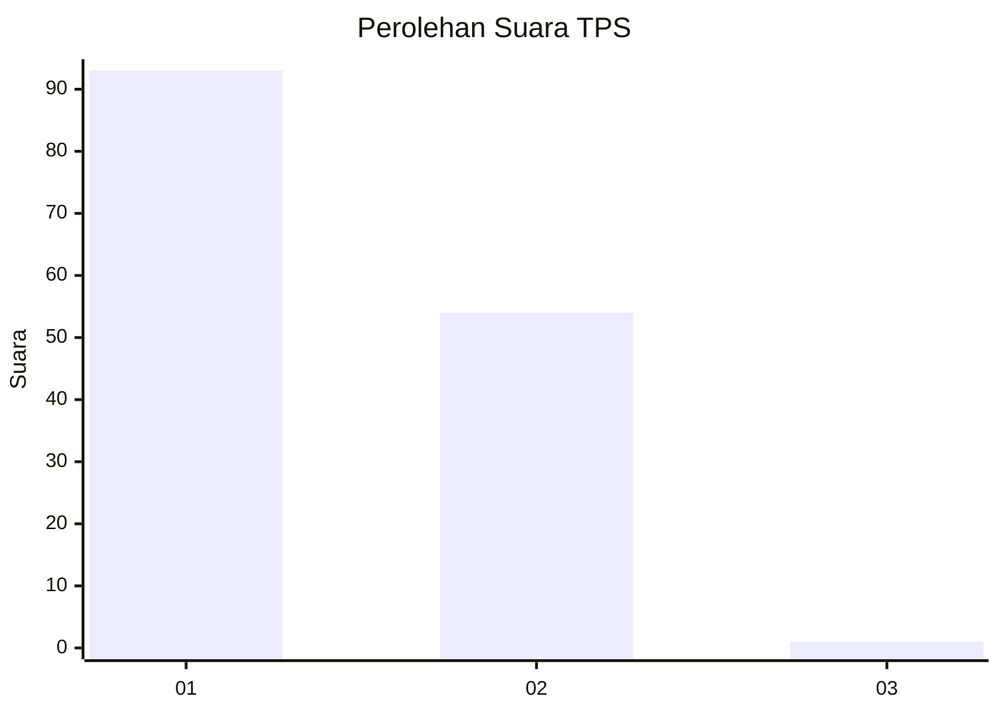
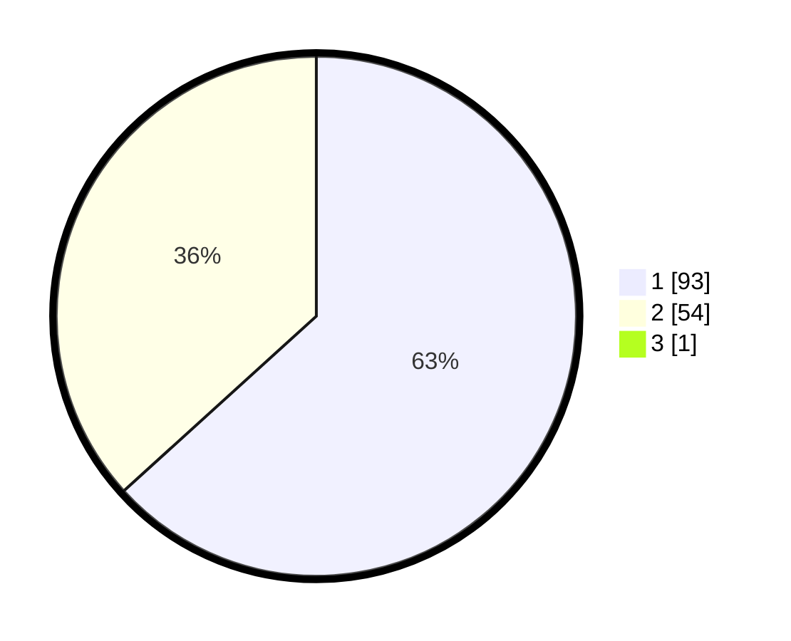

# Hasil

## Grafik

## Tabel

| No. | Nama Paslon    | Suara | Suara (raw) | Persentase |
|:--- |:-------------- | -----:| -----------:| ----------:|
| 1   | ANIES MUHAIMIN | 93    | [93][p-1]   | 62,84      |
| 2   | PRABOWO GIBRAN | 54    | [54][p-2]   | 36,49      |
| 3   | GANJAR MAHFUD  | 1     | [1][p-3]    | 0,68       |

[p-1]: https://github.com/gigit-pemilu/pemilu-2024-11-aceh/blob/main/pilpres/hitung-suara/sub/11-aceh/sub/02-aceh-tenggara/sub/04-babussalam/sub/2003-perapat-hulu/sub/004-tps/sub/paslon-1.txt
[p-2]: https://github.com/gigit-pemilu/pemilu-2024-11-aceh/blob/main/pilpres/hitung-suara/sub/11-aceh/sub/02-aceh-tenggara/sub/04-babussalam/sub/2003-perapat-hulu/sub/004-tps/sub/paslon-2.txt
[p-3]: https://github.com/gigit-pemilu/pemilu-2024-11-aceh/blob/main/pilpres/hitung-suara/sub/11-aceh/sub/02-aceh-tenggara/sub/04-babussalam/sub/2003-perapat-hulu/sub/004-tps/sub/paslon-3.txt

## Foto C Plano

https://sirekap-obj-formc.kpu.go.id/99ba/pemilu/ppwp/11/02/04/20/03/1102042003004-20240215-052341--c7106faf-66be-49ea-9184-9b2cca0ee052.jpg

https://sirekap-obj-formc.kpu.go.id/99ba/pemilu/ppwp/11/02/04/20/03/1102042003004-20240215-052101--1d5561b6-3f2c-4df7-89d8-0469c1297ef2.jpg

https://sirekap-obj-formc.kpu.go.id/99ba/pemilu/ppwp/11/02/04/20/03/1102042003004-20240215-052247--9b76fca5-8193-4ca9-9ad8-0631c24a6002.jpg

## Metadata

| Key        | Value               |
| ---------- | ------------------- |
| Time Stamp | 2024-02-21 23:00:00 |

## DATA PEMILIH TETAP

Jumlah pemilih dalam DPT: **174**.
 * L: **79**.
 * P: **95**.

## DATA PENGGUNA HAK PILIH

Jumlah pengguna hak pilih dalam DPT: **755**.
 * L: **76**.
 * P: **85**.

Jumlah pengguna hak pilih dalam DPTb: **0**.
 * L: **80**.
 * P: **800**.

Jumlah pengguna hak pilih dalam DPK: **0**.
 * L: **0**.
 * P: **0**.

Jumlah pengguna hak pilih: **156**.
 * L: **71**.
 * P: **85**.

## JUMLAH SUARA SAH DAN TIDAK SAH

JUMLAH SELURUH SUARA SAH: **150**.

JUMLAH SUARA TIDAK SAH: **6**.

JUMLAH SELURUH SUARA SAH DAN SUARA TIDAK SAH: **156**.

