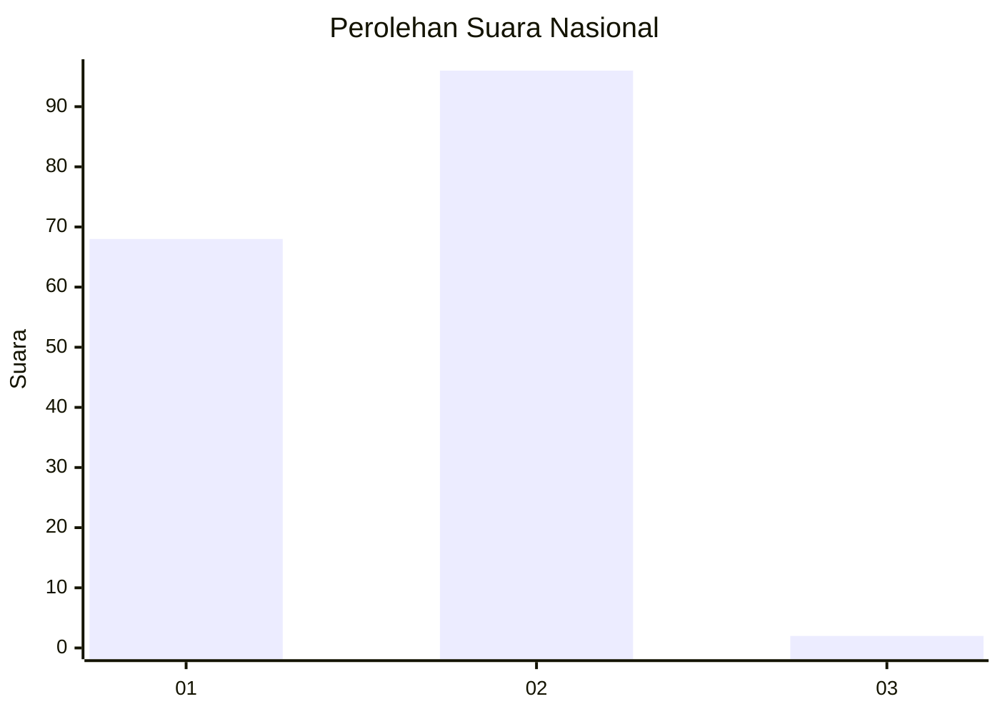
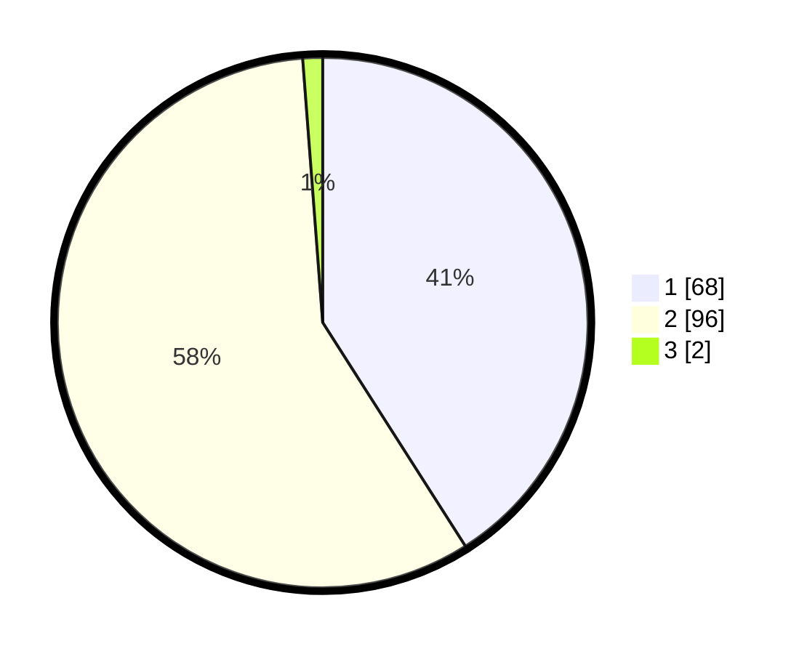

# Hasil

## Grafik

## Tabel

| No. | Nama Paslon    | Suara | Suara (raw) | Persentase |
|:--- |:-------------- | -----:| -----------:| ----------:|
| 1   | ANIES MUHAIMIN | 68    | [68][p-1]   | 40,96      |
| 2   | PRABOWO GIBRAN | 96    | [96][p-2]   | 57,83      |
| 3   | GANJAR MAHFUD  | 2     | [2][p-3]    | 1,20       |

[p-1]: https://github.com/gigit-pemilu/pemilu-2024/blob/main/pilpres/hitung-suara/sub/11-aceh/sub/02-aceh-tenggara/sub/04-babussalam/sub/2005-mbarung/sub/003-tps/sub/paslon-1.txt
[p-2]: https://github.com/gigit-pemilu/pemilu-2024/blob/main/pilpres/hitung-suara/sub/11-aceh/sub/02-aceh-tenggara/sub/04-babussalam/sub/2005-mbarung/sub/003-tps/sub/paslon-2.txt
[p-3]: https://github.com/gigit-pemilu/pemilu-2024/blob/main/pilpres/hitung-suara/sub/11-aceh/sub/02-aceh-tenggara/sub/04-babussalam/sub/2005-mbarung/sub/003-tps/sub/paslon-3.txt

## Foto C Plano

https://sirekap-obj-formc.kpu.go.id/90ca/pemilu/ppwp/11/02/04/20/05/1102042005003-20240215-015455--92ded0b7-0002-45e3-a7b9-997bc3a50fc8.jpg

https://sirekap-obj-formc.kpu.go.id/90ca/pemilu/ppwp/11/02/04/20/05/1102042005003-20240215-021150--3b05c0d8-968e-4b35-8885-5d4b37515848.jpg

https://sirekap-obj-formc.kpu.go.id/90ca/pemilu/ppwp/11/02/04/20/05/1102042005003-20240215-021348--4e463f79-38bb-409f-9669-6664913c4e2f.jpg

## Metadata

| Key        | Value               |
| ---------- | ------------------- |
| Time Stamp | 2024-02-15 21:30:27 |

