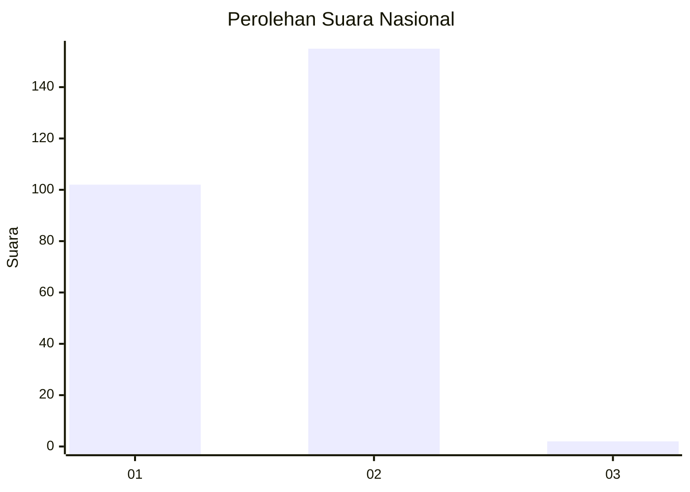
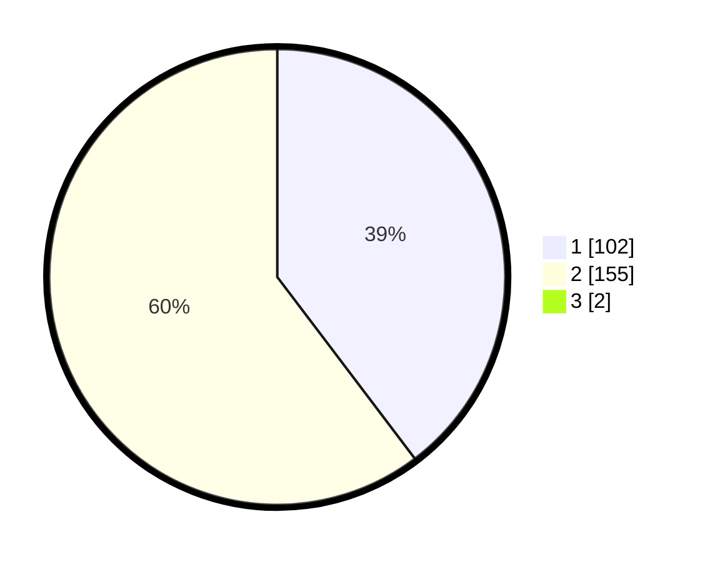

# Hasil

## Grafik

## Tabel

| No. | Nama Paslon    | Suara | Suara (raw) | Persentase |
|:--- |:-------------- | -----:| -----------:| ----------:|
| 1   | ANIES MUHAIMIN | 102   | [102][p-1]  | 39,38      |
| 2   | PRABOWO GIBRAN | 155   | [155][p-2]  | 59,85      |
| 3   | GANJAR MAHFUD  | 2     | [2][p-3]    | 0,77       |

[p-1]: https://github.com/gigit-pemilu/pemilu-2024/blob/main/pilpres/hitung-suara/sub/11-aceh/sub/02-aceh-tenggara/sub/04-babussalam/sub/2006-batu-mbulan-asli/sub/001-tps/sub/paslon-1.txt
[p-2]: https://github.com/gigit-pemilu/pemilu-2024/blob/main/pilpres/hitung-suara/sub/11-aceh/sub/02-aceh-tenggara/sub/04-babussalam/sub/2006-batu-mbulan-asli/sub/001-tps/sub/paslon-2.txt
[p-3]: https://github.com/gigit-pemilu/pemilu-2024/blob/main/pilpres/hitung-suara/sub/11-aceh/sub/02-aceh-tenggara/sub/04-babussalam/sub/2006-batu-mbulan-asli/sub/001-tps/sub/paslon-3.txt

## Foto C Plano

https://sirekap-obj-formc.kpu.go.id/b2b3/pemilu/ppwp/11/02/04/20/06/1102042006001-20240215-033547--1b1fb002-17b9-44a9-b474-d7b332dd9da9.jpg

https://sirekap-obj-formc.kpu.go.id/b2b3/pemilu/ppwp/11/02/04/20/06/1102042006001-20240215-061536--caeee71b-f582-4a78-8bca-d1d7b506632f.jpg

https://sirekap-obj-formc.kpu.go.id/b2b3/pemilu/ppwp/11/02/04/20/06/1102042006001-20240215-061653--8ba05a6e-f396-46f6-b42a-25ae648410a4.jpg

## Metadata

| Key        | Value               |
| ---------- | ------------------- |
| Time Stamp | 2024-02-15 21:30:27 |

