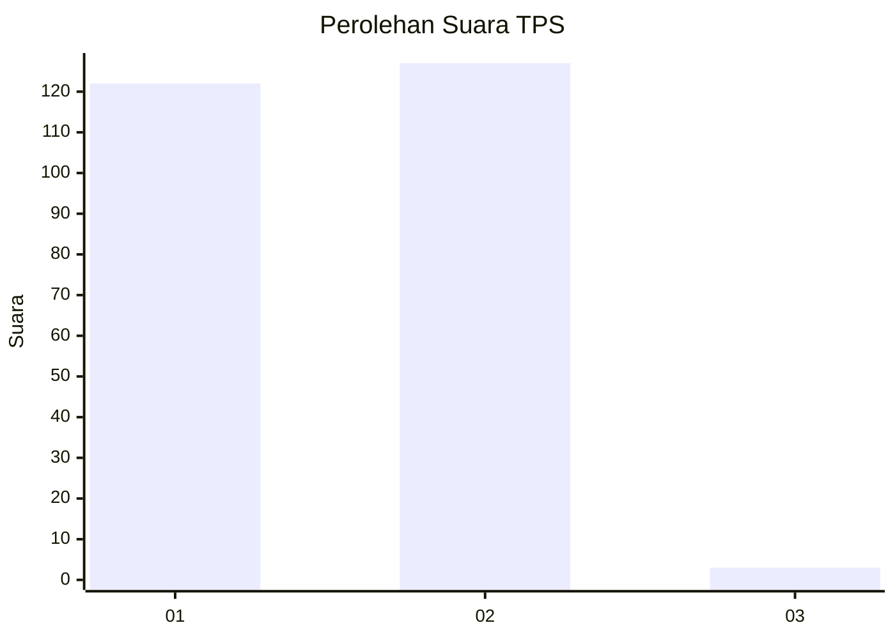
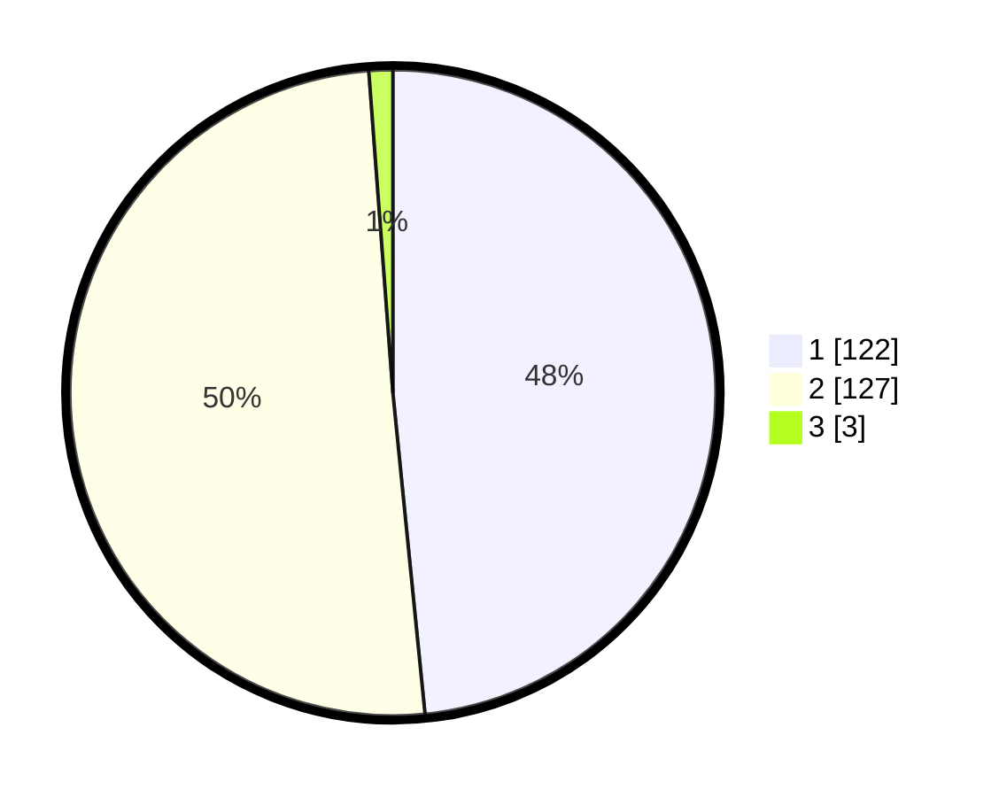

# Hasil

## Grafik

## Tabel

| No. | Nama Paslon    | Suara | Suara (raw) | Persentase |
|:--- |:-------------- | -----:| -----------:| ----------:|
| 1   | ANIES MUHAIMIN | 122   | [122][p-1]  | 48,41      |
| 2   | PRABOWO GIBRAN | 127   | [127][p-2]  | 50,40      |
| 3   | GANJAR MAHFUD  | 3     | [3][p-3]    | 1,19       |

[p-1]: https://github.com/gigit-pemilu/pemilu-2024-11-aceh/blob/main/pilpres/hitung-suara/sub/11-aceh/sub/02-aceh-tenggara/sub/04-babussalam/sub/2006-batu-mbulan-asli/sub/002-tps/sub/paslon-1.txt
[p-2]: https://github.com/gigit-pemilu/pemilu-2024-11-aceh/blob/main/pilpres/hitung-suara/sub/11-aceh/sub/02-aceh-tenggara/sub/04-babussalam/sub/2006-batu-mbulan-asli/sub/002-tps/sub/paslon-2.txt
[p-3]: https://github.com/gigit-pemilu/pemilu-2024-11-aceh/blob/main/pilpres/hitung-suara/sub/11-aceh/sub/02-aceh-tenggara/sub/04-babussalam/sub/2006-batu-mbulan-asli/sub/002-tps/sub/paslon-3.txt

## Foto C Plano

https://sirekap-obj-formc.kpu.go.id/4277/pemilu/ppwp/11/02/04/20/06/1102042006002-20240215-035321--5f9b798f-30ab-4502-889b-5b4dc6ddd852.jpg

https://sirekap-obj-formc.kpu.go.id/4277/pemilu/ppwp/11/02/04/20/06/1102042006002-20240215-035520--cdf1f6bb-3e78-4af6-97ec-8cad9a1a8cfc.jpg

https://sirekap-obj-formc.kpu.go.id/4277/pemilu/ppwp/11/02/04/20/06/1102042006002-20240215-035810--31da58f7-0368-4d99-8aba-89e436d3588c.jpg

## Metadata

| Key        | Value               |
| ---------- | ------------------- |
| Time Stamp | 2024-02-24 22:31:28 |

