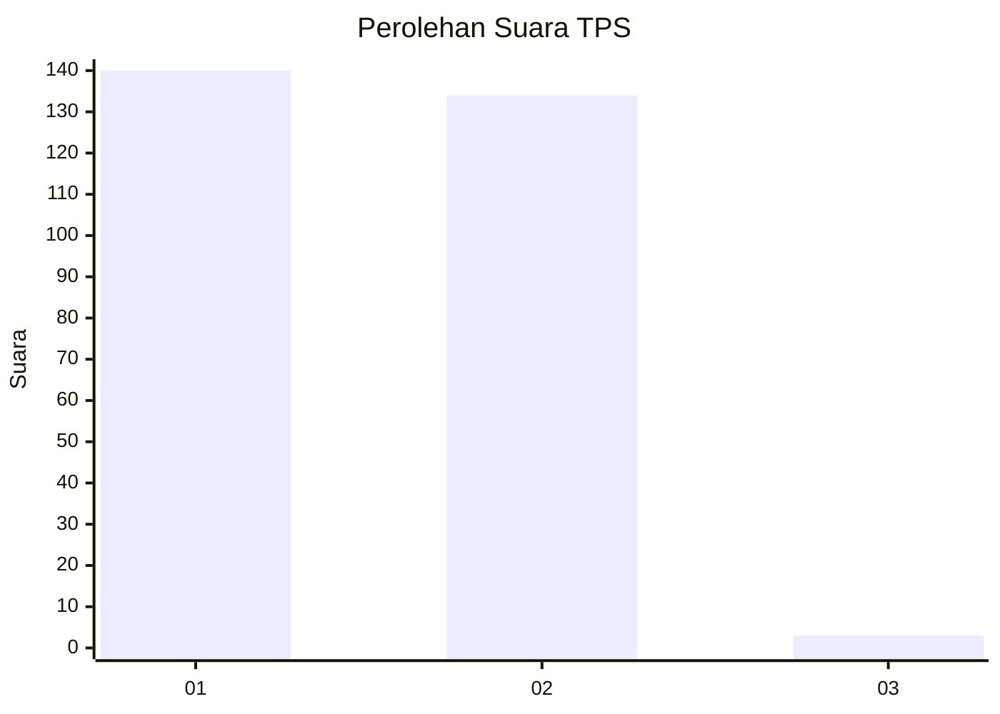
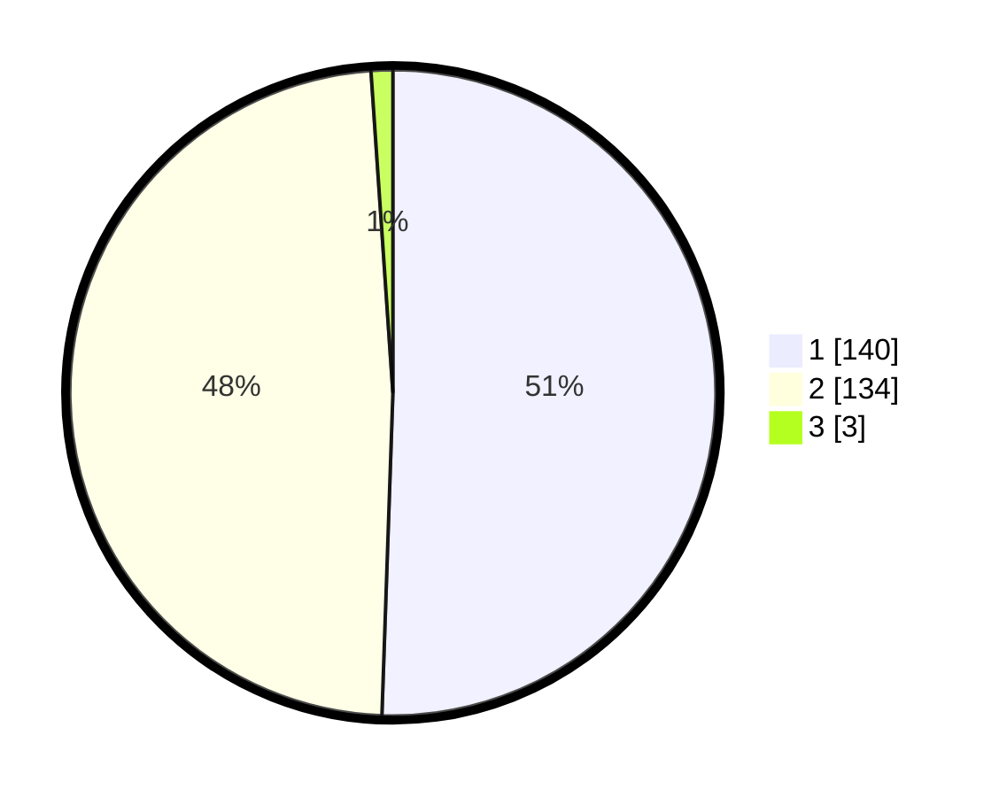

# Hasil

## Grafik

## Tabel

| No. | Nama Paslon    | Suara | Suara (raw) | Persentase |
|:--- |:-------------- | -----:| -----------:| ----------:|
| 1   | ANIES MUHAIMIN | 140   | [140][p-1]  | 50,54      |
| 2   | PRABOWO GIBRAN | 134   | [134][p-2]  | 48,38      |
| 3   | GANJAR MAHFUD  | 3     | [3][p-3]    | 1,08       |

[p-1]: https://github.com/gigit-pemilu/pemilu-2024-11-aceh/blob/main/pilpres/hitung-suara/sub/11-aceh/sub/02-aceh-tenggara/sub/04-babussalam/sub/2006-batu-mbulan-asli/sub/003-tps/sub/paslon-1.txt
[p-2]: https://github.com/gigit-pemilu/pemilu-2024-11-aceh/blob/main/pilpres/hitung-suara/sub/11-aceh/sub/02-aceh-tenggara/sub/04-babussalam/sub/2006-batu-mbulan-asli/sub/003-tps/sub/paslon-2.txt
[p-3]: https://github.com/gigit-pemilu/pemilu-2024-11-aceh/blob/main/pilpres/hitung-suara/sub/11-aceh/sub/02-aceh-tenggara/sub/04-babussalam/sub/2006-batu-mbulan-asli/sub/003-tps/sub/paslon-3.txt

## Foto C Plano

https://sirekap-obj-formc.kpu.go.id/21d3/pemilu/ppwp/11/02/04/20/06/1102042006003-20240218-172954--63304d60-64a0-4872-b8ff-e0d5e3ef92bd.jpg

https://sirekap-obj-formc.kpu.go.id/21d3/pemilu/ppwp/11/02/04/20/06/1102042006003-20240218-173153--2a291f3f-6686-4095-95f9-0f2c28ee1bb6.jpg

https://sirekap-obj-formc.kpu.go.id/21d3/pemilu/ppwp/11/02/04/20/06/1102042006003-20240218-173241--b9bdd2d3-1bf9-4397-8c95-70d444658a30.jpg

## Metadata

| Key        | Value               |
| ---------- | ------------------- |
| Time Stamp | 2024-02-19 06:16:00 |

## DATA PEMILIH TETAP

Jumlah pemilih dalam DPT: **272**.
 * L: **140**.
 * P: **132**.

## DATA PENGGUNA HAK PILIH

Jumlah pengguna hak pilih dalam DPT: **272**.
 * L: **140**.
 * P: **132**.

Jumlah pengguna hak pilih dalam DPTb: **0**.
 * L: **0**.
 * P: **0**.

Jumlah pengguna hak pilih dalam DPK: **5**.
 * L: **3**.
 * P: **2**.

Jumlah pengguna hak pilih: **277**.
 * L: **143**.
 * P: **134**.

## JUMLAH SUARA SAH DAN TIDAK SAH

JUMLAH SELURUH SUARA SAH: **277**.

JUMLAH SUARA TIDAK SAH: **0**.

JUMLAH SELURUH SUARA SAH DAN SUARA TIDAK SAH: **277**.

