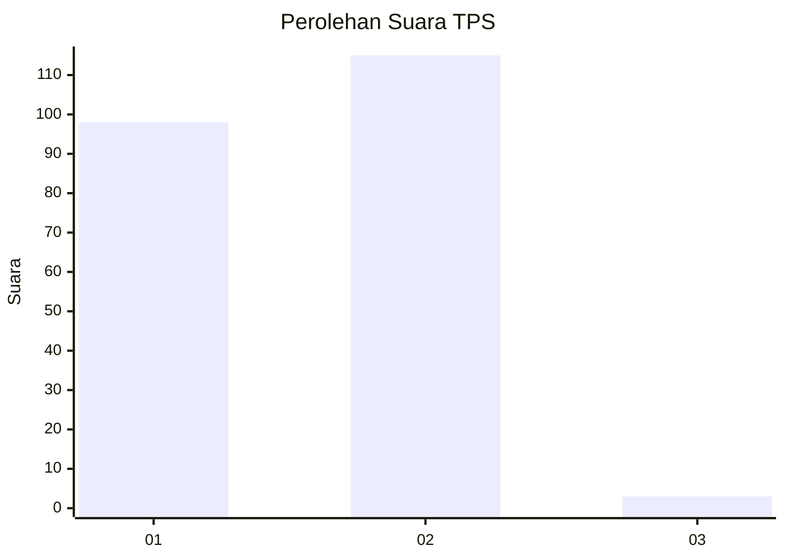
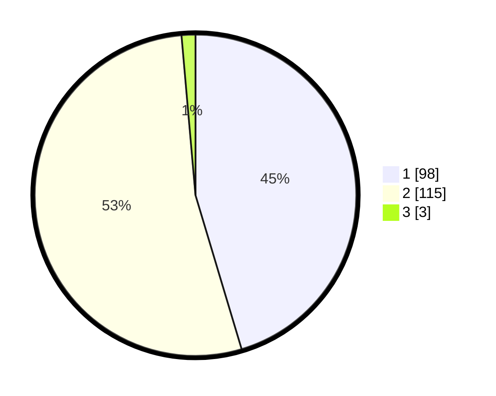

# Hasil

## Grafik

## Tabel

| No. | Nama Paslon    | Suara | Suara (raw) | Persentase |
|:--- |:-------------- | -----:| -----------:| ----------:|
| 1   | ANIES MUHAIMIN | 98    | [98][p-1]   | 45,37      |
| 2   | PRABOWO GIBRAN | 115   | [115][p-2]  | 53,24      |
| 3   | GANJAR MAHFUD  | 3     | [3][p-3]    | 1,39       |

[p-1]: https://github.com/gigit-pemilu/pemilu-2024-11-aceh/blob/main/pilpres/hitung-suara/sub/11-aceh/sub/02-aceh-tenggara/sub/04-babussalam/sub/2006-batu-mbulan-asli/sub/005-tps/sub/paslon-1.txt
[p-2]: https://github.com/gigit-pemilu/pemilu-2024-11-aceh/blob/main/pilpres/hitung-suara/sub/11-aceh/sub/02-aceh-tenggara/sub/04-babussalam/sub/2006-batu-mbulan-asli/sub/005-tps/sub/paslon-2.txt
[p-3]: https://github.com/gigit-pemilu/pemilu-2024-11-aceh/blob/main/pilpres/hitung-suara/sub/11-aceh/sub/02-aceh-tenggara/sub/04-babussalam/sub/2006-batu-mbulan-asli/sub/005-tps/sub/paslon-3.txt

## Foto C Plano

https://sirekap-obj-formc.kpu.go.id/2127/pemilu/ppwp/11/02/04/20/06/1102042006005-20240215-031821--7c67957d-f817-4839-9011-5c5bd46d8b4a.jpg

https://sirekap-obj-formc.kpu.go.id/2127/pemilu/ppwp/11/02/04/20/06/1102042006005-20240215-042225--edb95f79-879b-42df-8f21-a5e4b583b25c.jpg

https://sirekap-obj-formc.kpu.go.id/2127/pemilu/ppwp/11/02/04/20/06/1102042006005-20240215-031219--ef021afa-5e5c-4719-ad9c-34d1b39d5cd5.jpg

## Metadata

| Key        | Value               |
| ---------- | ------------------- |
| Time Stamp | 2024-02-24 22:31:28 |

