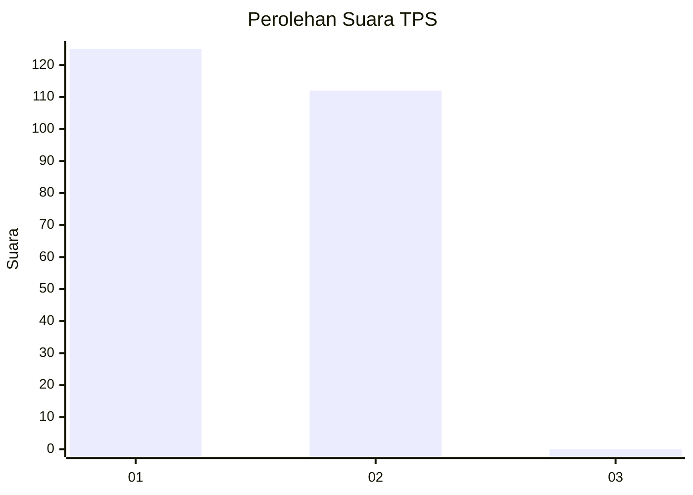
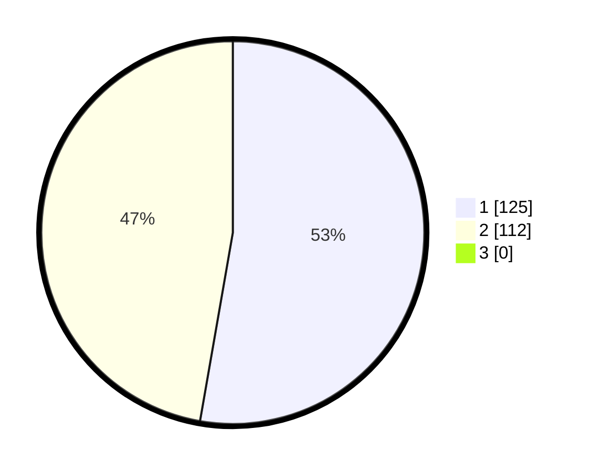

# Hasil

## Grafik

## Tabel

| No. | Nama Paslon    | Suara | Suara (raw) | Persentase |
|:--- |:-------------- | -----:| -----------:| ----------:|
| 1   | ANIES MUHAIMIN | 125   | [125][p-1]  | 52,74      |
| 2   | PRABOWO GIBRAN | 112   | [112][p-2]  | 47,26      |
| 3   | GANJAR MAHFUD  | 0     | [0][p-3]    | 0,00       |

[p-1]: https://github.com/gigit-pemilu/pemilu-2024-11-aceh/blob/main/pilpres/hitung-suara/sub/11-aceh/sub/02-aceh-tenggara/sub/04-babussalam/sub/2007-batu-mbulan-i/sub/001-tps/sub/paslon-1.txt
[p-2]: https://github.com/gigit-pemilu/pemilu-2024-11-aceh/blob/main/pilpres/hitung-suara/sub/11-aceh/sub/02-aceh-tenggara/sub/04-babussalam/sub/2007-batu-mbulan-i/sub/001-tps/sub/paslon-2.txt
[p-3]: https://github.com/gigit-pemilu/pemilu-2024-11-aceh/blob/main/pilpres/hitung-suara/sub/11-aceh/sub/02-aceh-tenggara/sub/04-babussalam/sub/2007-batu-mbulan-i/sub/001-tps/sub/paslon-3.txt

## Foto C Plano

https://sirekap-obj-formc.kpu.go.id/5987/pemilu/ppwp/11/02/04/20/07/1102042007001-20240217-112043--f0604fcf-8abe-4a44-b9d0-14b0798b3db4.jpg

https://sirekap-obj-formc.kpu.go.id/5987/pemilu/ppwp/11/02/04/20/07/1102042007001-20240217-112046--2a170a3a-590b-43bf-be45-3e5ff246ceb6.jpg

https://sirekap-obj-formc.kpu.go.id/5987/pemilu/ppwp/11/02/04/20/07/1102042007001-20240217-112050--3077bf30-28d0-4a06-8fde-2f7c739a0791.jpg

## Metadata

| Key        | Value               |
| ---------- | ------------------- |
| Time Stamp | 2024-02-24 22:31:28 |

