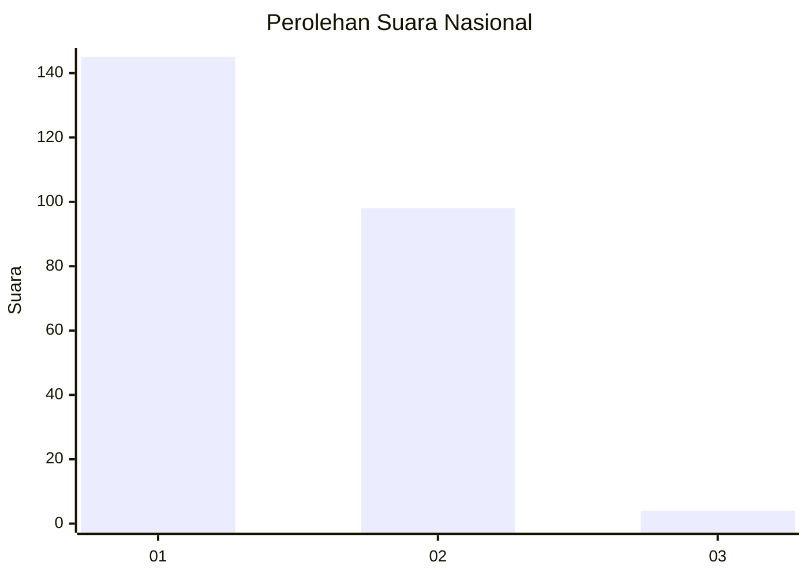
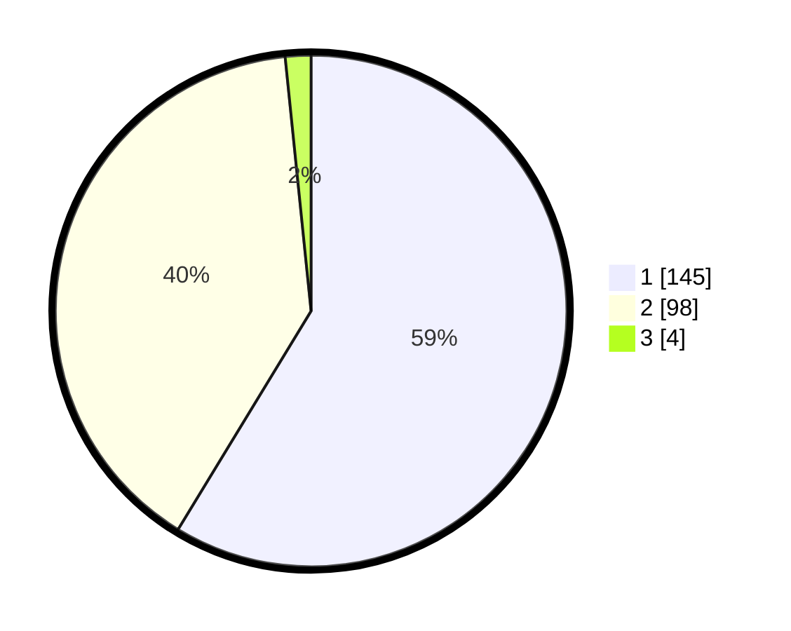

# Hasil

## Grafik

## Tabel

| No. | Nama Paslon    | Suara | Suara (raw) | Persentase |
|:--- |:-------------- | -----:| -----------:| ----------:|
| 1   | ANIES MUHAIMIN | 145   | [145][p-1]  | 58,70      |
| 2   | PRABOWO GIBRAN | 98    | [98][p-2]   | 39,68      |
| 3   | GANJAR MAHFUD  | 4     | [4][p-3]    | 1,62       |

[p-1]: https://github.com/gigit-pemilu/pemilu-2024/blob/main/pilpres/hitung-suara/sub/11-aceh/sub/02-aceh-tenggara/sub/04-babussalam/sub/2007-batu-mbulan-i/sub/002-tps/sub/paslon-1.txt
[p-2]: https://github.com/gigit-pemilu/pemilu-2024/blob/main/pilpres/hitung-suara/sub/11-aceh/sub/02-aceh-tenggara/sub/04-babussalam/sub/2007-batu-mbulan-i/sub/002-tps/sub/paslon-2.txt
[p-3]: https://github.com/gigit-pemilu/pemilu-2024/blob/main/pilpres/hitung-suara/sub/11-aceh/sub/02-aceh-tenggara/sub/04-babussalam/sub/2007-batu-mbulan-i/sub/002-tps/sub/paslon-3.txt

## Foto C Plano

https://sirekap-obj-formc.kpu.go.id/d8a8/pemilu/ppwp/11/02/04/20/07/1102042007002-20240218-163324--89debc1d-6828-4691-aea6-c5f9dbd6f8d0.jpg

https://sirekap-obj-formc.kpu.go.id/d8a8/pemilu/ppwp/11/02/04/20/07/1102042007002-20240218-163630--af8e47ec-b165-4c4b-80c7-6a29b8590957.jpg

https://sirekap-obj-formc.kpu.go.id/d8a8/pemilu/ppwp/11/02/04/20/07/1102042007002-20240218-163515--80e42d22-29bc-462c-af73-1e761c3a74a6.jpg

## Metadata

| Key        | Value               |
| ---------- | ------------------- |
| Time Stamp | 2024-02-21 18:00:00 |

## DATA PEMILIH TETAP

Jumlah pemilih dalam DPT: **268**.
 * L: **123**.
 * P: **145**.

## DATA PENGGUNA HAK PILIH

Jumlah pengguna hak pilih dalam DPT: **245**.
 * L: **110**.
 * P: **135**.

Jumlah pengguna hak pilih dalam DPTb: **0**.
 * L: **0**.
 * P: **0**.

Jumlah pengguna hak pilih dalam DPK: **4**.
 * L: **0**.
 * P: **4**.

Jumlah pengguna hak pilih: **249**.
 * L: **110**.
 * P: **139**.

## JUMLAH SUARA SAH DAN TIDAK SAH

JUMLAH SELURUH SUARA SAH: **247**.

JUMLAH SUARA TIDAK SAH: **2**.

JUMLAH SELURUH SUARA SAH DAN SUARA TIDAK SAH: **249**.

