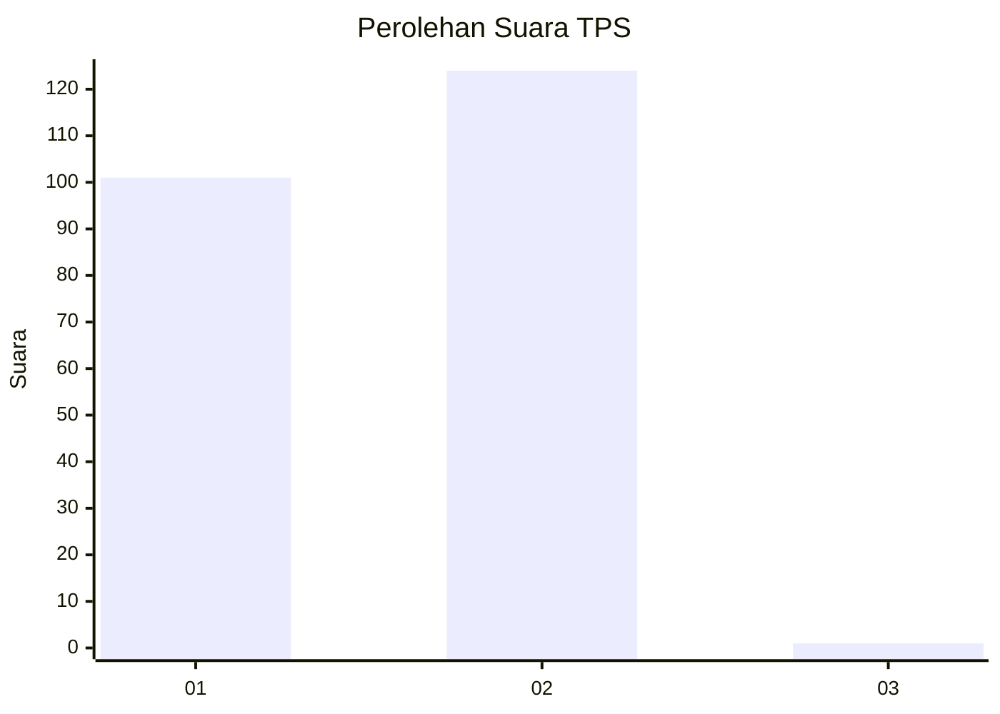
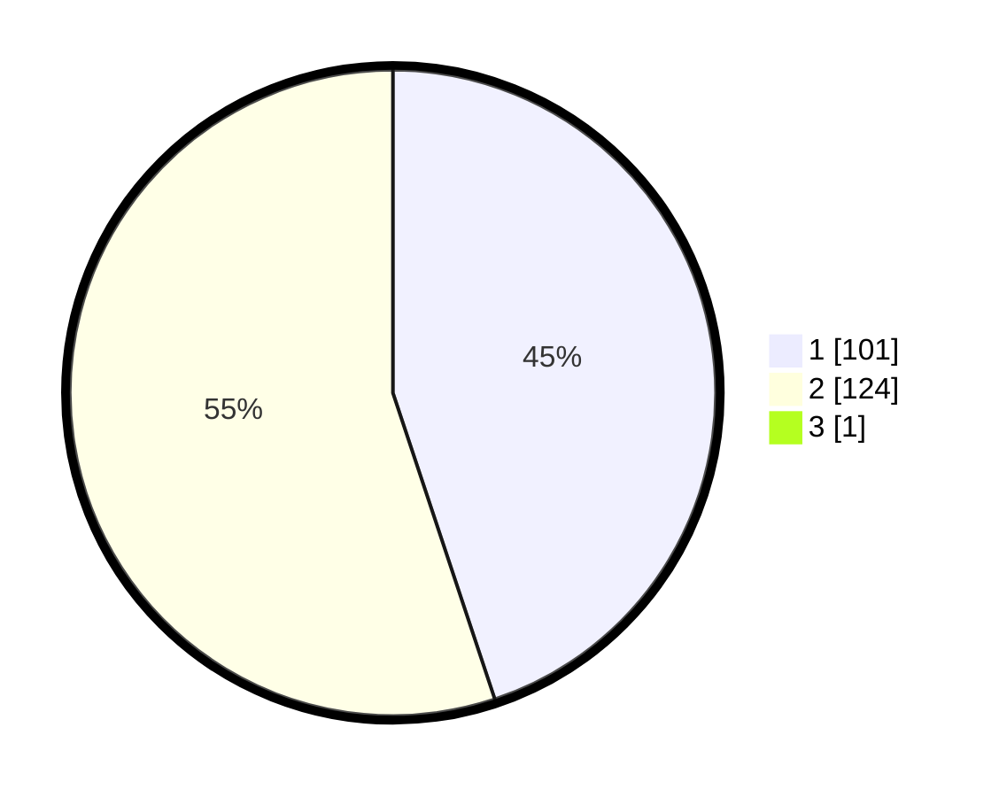

# Hasil

## Grafik

## Tabel

| No. | Nama Paslon    | Suara | Suara (raw) | Persentase |
|:--- |:-------------- | -----:| -----------:| ----------:|
| 1   | ANIES MUHAIMIN | 101   | [101][p-1]  | 44,69      |
| 2   | PRABOWO GIBRAN | 124   | [124][p-2]  | 54,87      |
| 3   | GANJAR MAHFUD  | 1     | [1][p-3]    | 0,44       |

[p-1]: https://github.com/gigit-pemilu/pemilu-2024-11-aceh/blob/main/pilpres/hitung-suara/sub/11-aceh/sub/02-aceh-tenggara/sub/04-babussalam/sub/2008-batu-mbulan-ii/sub/001-tps/sub/paslon-1.txt
[p-2]: https://github.com/gigit-pemilu/pemilu-2024-11-aceh/blob/main/pilpres/hitung-suara/sub/11-aceh/sub/02-aceh-tenggara/sub/04-babussalam/sub/2008-batu-mbulan-ii/sub/001-tps/sub/paslon-2.txt
[p-3]: https://github.com/gigit-pemilu/pemilu-2024-11-aceh/blob/main/pilpres/hitung-suara/sub/11-aceh/sub/02-aceh-tenggara/sub/04-babussalam/sub/2008-batu-mbulan-ii/sub/001-tps/sub/paslon-3.txt

## Foto C Plano

https://sirekap-obj-formc.kpu.go.id/026b/pemilu/ppwp/11/02/04/20/08/1102042008001-20240215-124505--9ac0f3ed-b974-434a-82d9-f828dbbbd3e8.jpg

https://sirekap-obj-formc.kpu.go.id/026b/pemilu/ppwp/11/02/04/20/08/1102042008001-20240214-230004--56eb1376-1243-4355-acaa-c149395fe7c1.jpg

https://sirekap-obj-formc.kpu.go.id/026b/pemilu/ppwp/11/02/04/20/08/1102042008001-20240215-101059--add504ba-e699-47cd-b25b-91ff2be7f45c.jpg

## Metadata

| Key        | Value               |
| ---------- | ------------------- |
| Time Stamp | 2024-02-25 16:00:00 |

