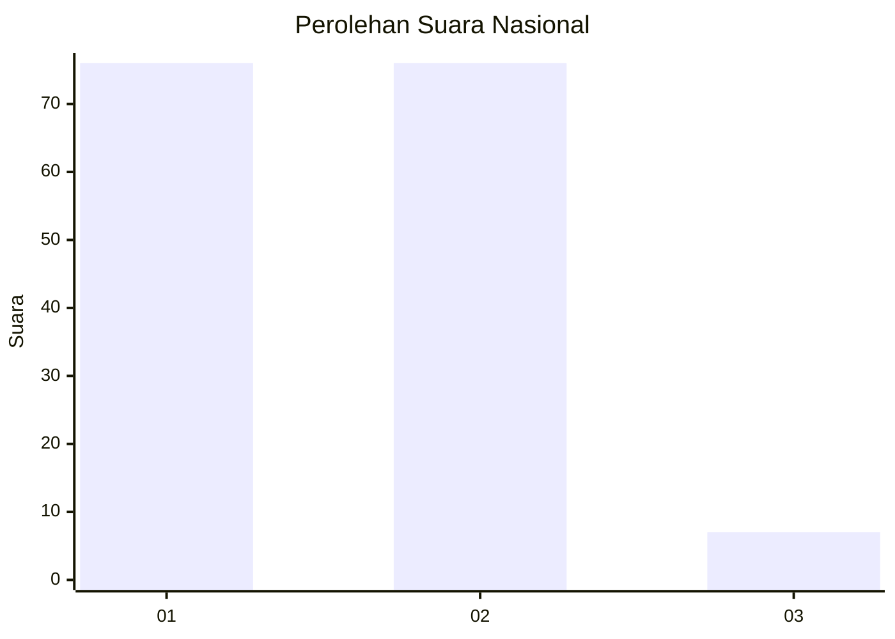
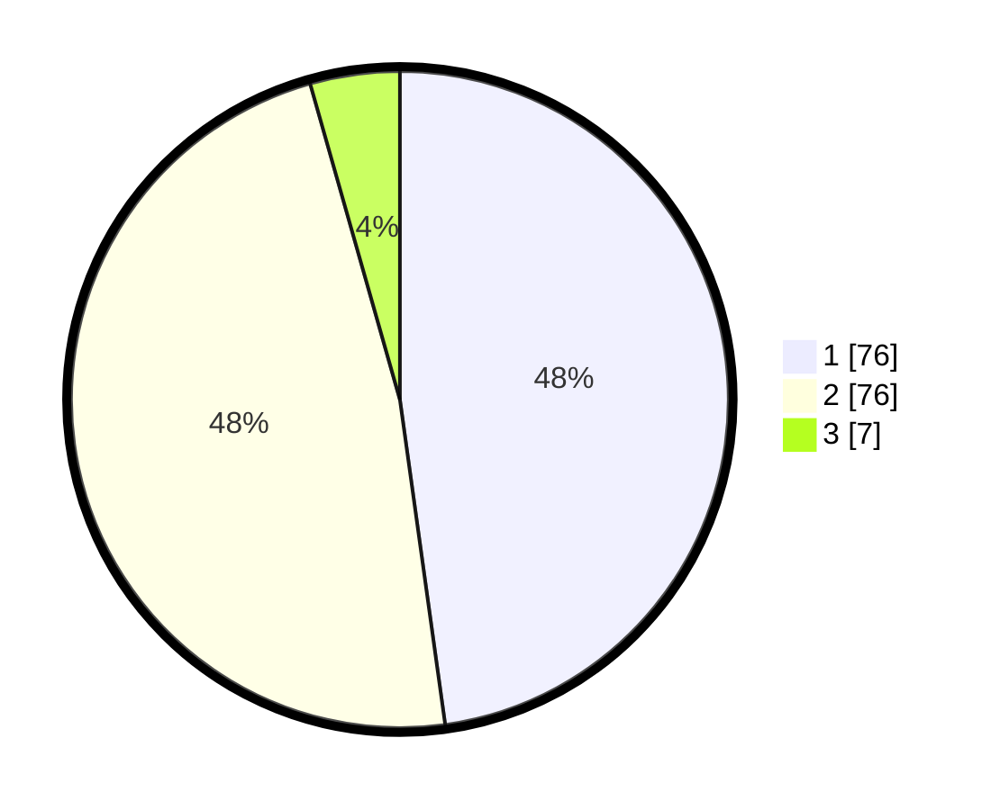

# Hasil

## Grafik

## Tabel

| No. | Nama Paslon    | Suara | Suara (raw) | Persentase |
|:--- |:-------------- | -----:| -----------:| ----------:|
| 1   | ANIES MUHAIMIN | 76    | [76][p-1]   | 47,80      |
| 2   | PRABOWO GIBRAN | 76    | [76][p-2]   | 47,80      |
| 3   | GANJAR MAHFUD  | 7     | [7][p-3]    | 4,40       |

[p-1]: https://github.com/gigit-pemilu/pemilu-2024/blob/main/pilpres/hitung-suara/sub/11-aceh/sub/02-aceh-tenggara/sub/04-babussalam/sub/2010-pulonas/sub/001-tps/sub/paslon-1.txt
[p-2]: https://github.com/gigit-pemilu/pemilu-2024/blob/main/pilpres/hitung-suara/sub/11-aceh/sub/02-aceh-tenggara/sub/04-babussalam/sub/2010-pulonas/sub/001-tps/sub/paslon-2.txt
[p-3]: https://github.com/gigit-pemilu/pemilu-2024/blob/main/pilpres/hitung-suara/sub/11-aceh/sub/02-aceh-tenggara/sub/04-babussalam/sub/2010-pulonas/sub/001-tps/sub/paslon-3.txt

## Foto C Plano

https://sirekap-obj-formc.kpu.go.id/e41f/pemilu/ppwp/11/02/04/20/10/1102042010001-20240215-030451--d9e5cfde-f0c7-4d82-95df-7a4145d1d04b.jpg

https://sirekap-obj-formc.kpu.go.id/e41f/pemilu/ppwp/11/02/04/20/10/1102042010001-20240215-030803--816c8c56-efa1-412e-92fc-98d03b906122.jpg

https://sirekap-obj-formc.kpu.go.id/e41f/pemilu/ppwp/11/02/04/20/10/1102042010001-20240215-030857--6df41701-c266-4dd7-89cf-25a684d5d254.jpg

## Metadata

| Key        | Value               |
| ---------- | ------------------- |
| Time Stamp | 2024-02-24 22:31:28 |

