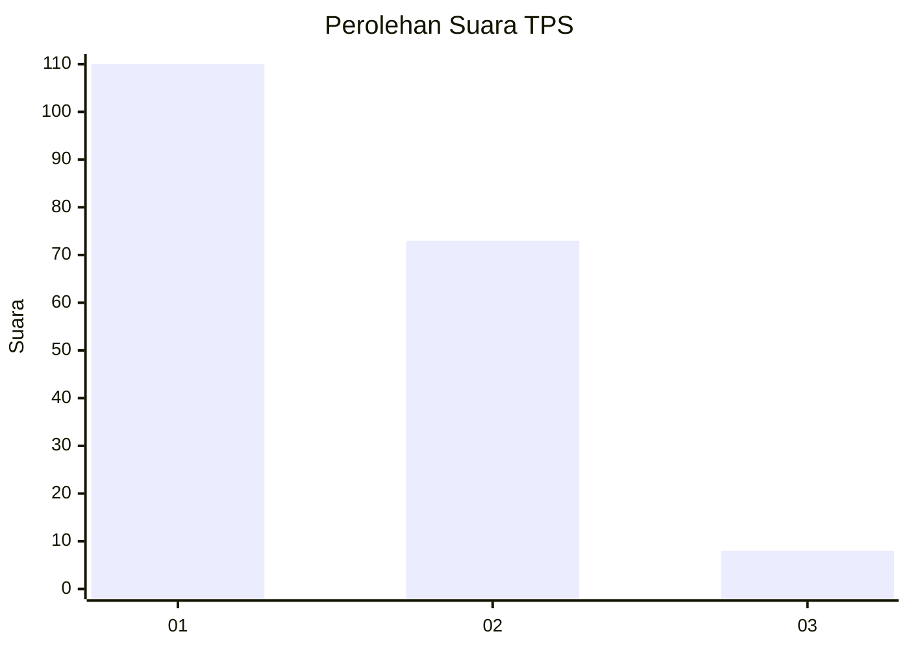
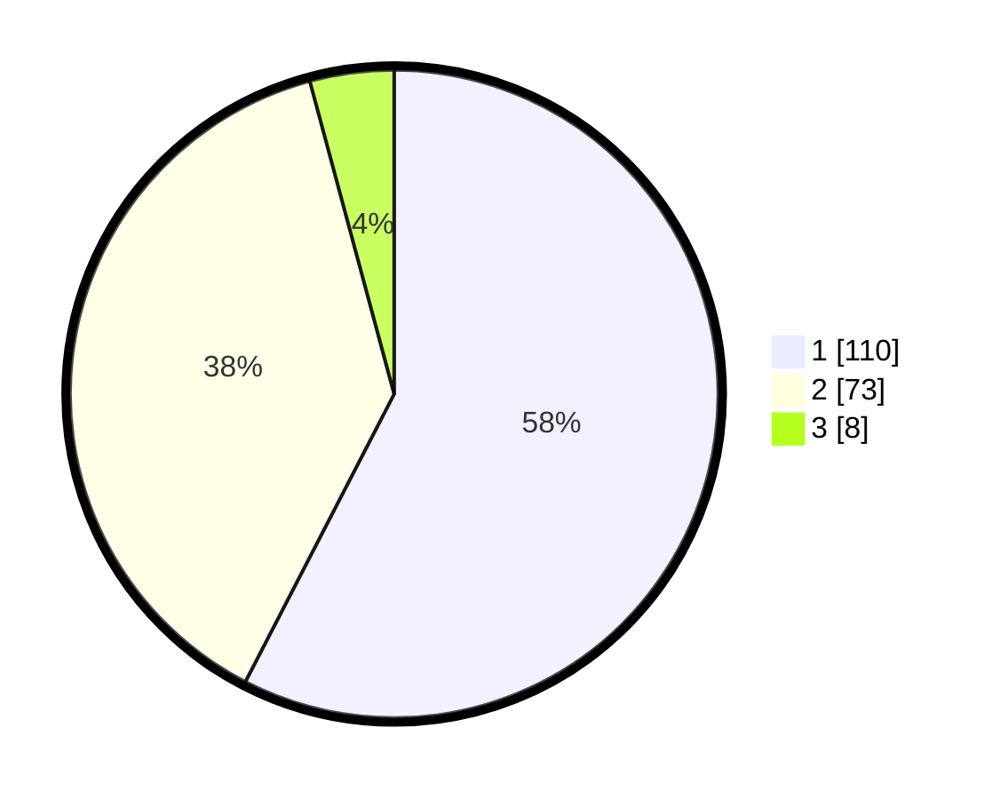

# Hasil

## Grafik

## Tabel

| No. | Nama Paslon    | Suara | Suara (raw) | Persentase |
|:--- |:-------------- | -----:| -----------:| ----------:|
| 1   | ANIES MUHAIMIN | 110   | [110][p-1]  | 57,59      |
| 2   | PRABOWO GIBRAN | 73    | [73][p-2]   | 38,22      |
| 3   | GANJAR MAHFUD  | 8     | [8][p-3]    | 4,19       |

[p-1]: https://github.com/gigit-pemilu/pemilu-2024-11-aceh/blob/main/pilpres/hitung-suara/sub/11-aceh/sub/02-aceh-tenggara/sub/04-babussalam/sub/2015-pulo-latong/sub/001-tps/sub/paslon-1.txt
[p-2]: https://github.com/gigit-pemilu/pemilu-2024-11-aceh/blob/main/pilpres/hitung-suara/sub/11-aceh/sub/02-aceh-tenggara/sub/04-babussalam/sub/2015-pulo-latong/sub/001-tps/sub/paslon-2.txt
[p-3]: https://github.com/gigit-pemilu/pemilu-2024-11-aceh/blob/main/pilpres/hitung-suara/sub/11-aceh/sub/02-aceh-tenggara/sub/04-babussalam/sub/2015-pulo-latong/sub/001-tps/sub/paslon-3.txt

## Foto C Plano

https://sirekap-obj-formc.kpu.go.id/f35b/pemilu/ppwp/11/02/04/20/15/1102042015001-20240215-030600--495810c8-7002-45dc-972a-109cd571481b.jpg

https://sirekap-obj-formc.kpu.go.id/f35b/pemilu/ppwp/11/02/04/20/15/1102042015001-20240215-030711--61b756b0-2704-4d19-909a-34eb85345881.jpg

https://sirekap-obj-formc.kpu.go.id/f35b/pemilu/ppwp/11/02/04/20/15/1102042015001-20240215-030912--51fbab89-5e19-4a29-9e2e-3dc1a1d4f50f.jpg

## Metadata

| Key        | Value               |
| ---------- | ------------------- |
| Time Stamp | 2024-02-15 21:30:27 |

