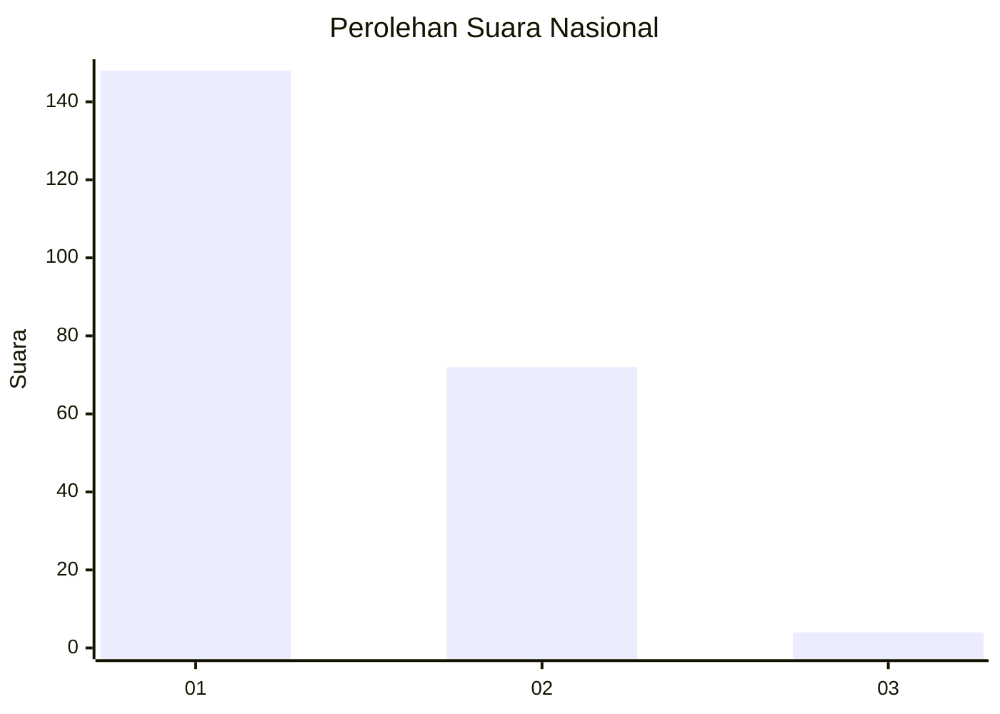
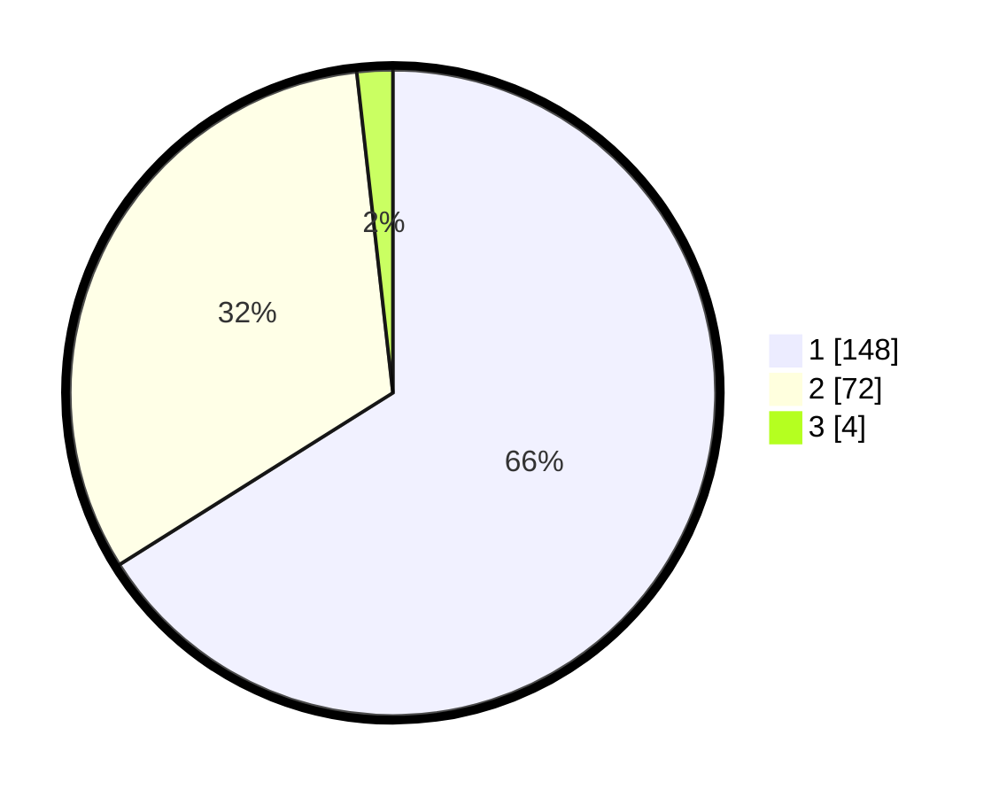

# Hasil

## Grafik

## Tabel

| No. | Nama Paslon    | Suara | Suara (raw) | Persentase |
|:--- |:-------------- | -----:| -----------:| ----------:|
| 1   | ANIES MUHAIMIN | 148   | [148][p-1]  | 66,07      |
| 2   | PRABOWO GIBRAN | 72    | [72][p-2]   | 32,14      |
| 3   | GANJAR MAHFUD  | 4     | [4][p-3]    | 1,79       |

[p-1]: https://github.com/gigit-pemilu/pemilu-2024/blob/main/pilpres/hitung-suara/sub/11-aceh/sub/02-aceh-tenggara/sub/04-babussalam/sub/2016-kutacane-lama/sub/002-tps/sub/paslon-1.txt
[p-2]: https://github.com/gigit-pemilu/pemilu-2024/blob/main/pilpres/hitung-suara/sub/11-aceh/sub/02-aceh-tenggara/sub/04-babussalam/sub/2016-kutacane-lama/sub/002-tps/sub/paslon-2.txt
[p-3]: https://github.com/gigit-pemilu/pemilu-2024/blob/main/pilpres/hitung-suara/sub/11-aceh/sub/02-aceh-tenggara/sub/04-babussalam/sub/2016-kutacane-lama/sub/002-tps/sub/paslon-3.txt

## Foto C Plano

https://sirekap-obj-formc.kpu.go.id/02c2/pemilu/ppwp/11/02/04/20/16/1102042016002-20240215-154207--ebca93d3-10d7-4791-acf7-1289204d7101.jpg

https://sirekap-obj-formc.kpu.go.id/02c2/pemilu/ppwp/11/02/04/20/16/1102042016002-20240215-154239--81eeb27a-ae7c-4458-98a5-d725066e8d3f.jpg

https://sirekap-obj-formc.kpu.go.id/02c2/pemilu/ppwp/11/02/04/20/16/1102042016002-20240215-154317--dc29cfe4-e398-4edf-ab6b-7b67a8cdf686.jpg

## Metadata

| Key        | Value               |
| ---------- | ------------------- |
| Time Stamp | 2024-02-24 22:31:28 |

