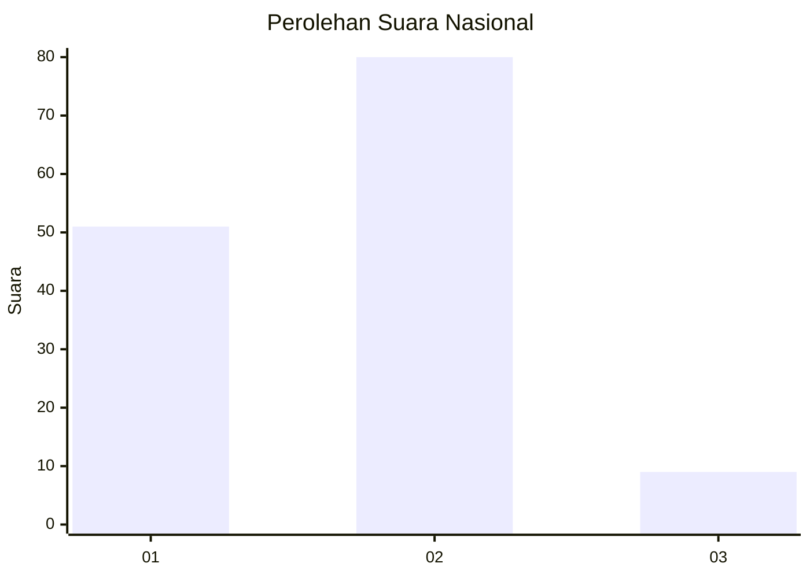
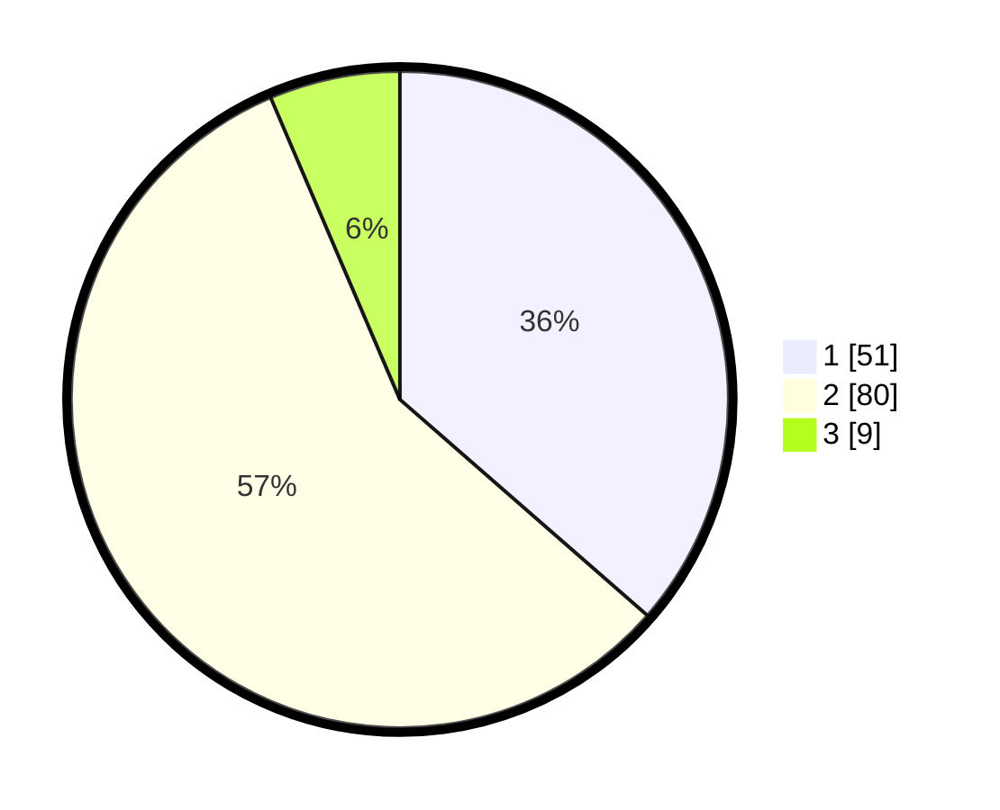

# Hasil

## Grafik

## Tabel

| No. | Nama Paslon    | Suara | Suara (raw) | Persentase |
|:--- |:-------------- | -----:| -----------:| ----------:|
| 1   | ANIES MUHAIMIN | 51    | [51][p-1]   | 36,43      |
| 2   | PRABOWO GIBRAN | 80    | [80][p-2]   | 57,14      |
| 3   | GANJAR MAHFUD  | 9     | [9][p-3]    | 6,43       |

[p-1]: https://github.com/gigit-pemilu/pemilu-2024/blob/main/pilpres/hitung-suara/sub/11-aceh/sub/02-aceh-tenggara/sub/04-babussalam/sub/2021-pekhapat-titi-panjang/sub/002-tps/sub/paslon-1.txt
[p-2]: https://github.com/gigit-pemilu/pemilu-2024/blob/main/pilpres/hitung-suara/sub/11-aceh/sub/02-aceh-tenggara/sub/04-babussalam/sub/2021-pekhapat-titi-panjang/sub/002-tps/sub/paslon-2.txt
[p-3]: https://github.com/gigit-pemilu/pemilu-2024/blob/main/pilpres/hitung-suara/sub/11-aceh/sub/02-aceh-tenggara/sub/04-babussalam/sub/2021-pekhapat-titi-panjang/sub/002-tps/sub/paslon-3.txt

## Foto C Plano

https://sirekap-obj-formc.kpu.go.id/bc40/pemilu/ppwp/11/02/04/20/21/1102042021002-20240217-165555--65c83381-b348-41f3-bb17-f1661a54173a.jpg

https://sirekap-obj-formc.kpu.go.id/bc40/pemilu/ppwp/11/02/04/20/21/1102042021002-20240217-165735--b9ebba0e-9df4-4a5c-b25f-76780b8c6030.jpg

https://sirekap-obj-formc.kpu.go.id/bc40/pemilu/ppwp/11/02/04/20/21/1102042021002-20240217-165918--17e91109-196e-4bc1-8e47-c48d18de62e0.jpg

## Metadata

| Key        | Value               |
| ---------- | ------------------- |
| Time Stamp | 2024-02-17 17:00:04 |

## DATA PEMILIH TETAP

Jumlah pemilih dalam DPT: **181**.
 * L: **89**.
 * P: **92**.

## DATA PENGGUNA HAK PILIH

Jumlah pengguna hak pilih dalam DPT: **139**.
 * L: **65**.
 * P: **74**.

Jumlah pengguna hak pilih dalam DPTb: **0**.
 * L: **0**.
 * P: **0**.

Jumlah pengguna hak pilih dalam DPK: **3**.
 * L: **1**.
 * P: **2**.

Jumlah pengguna hak pilih: **142**.
 * L: **66**.
 * P: **76**.

## JUMLAH SUARA SAH DAN TIDAK SAH

JUMLAH SELURUH SUARA SAH: **140**.

JUMLAH SUARA TIDAK SAH: **2**.

JUMLAH SELURUH SUARA SAH DAN SUARA TIDAK SAH: **142**.

