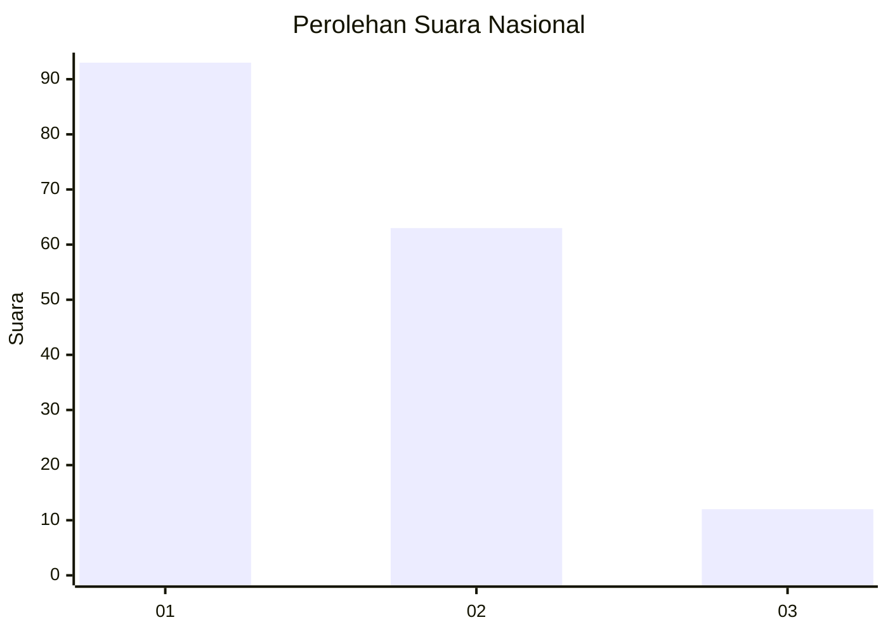
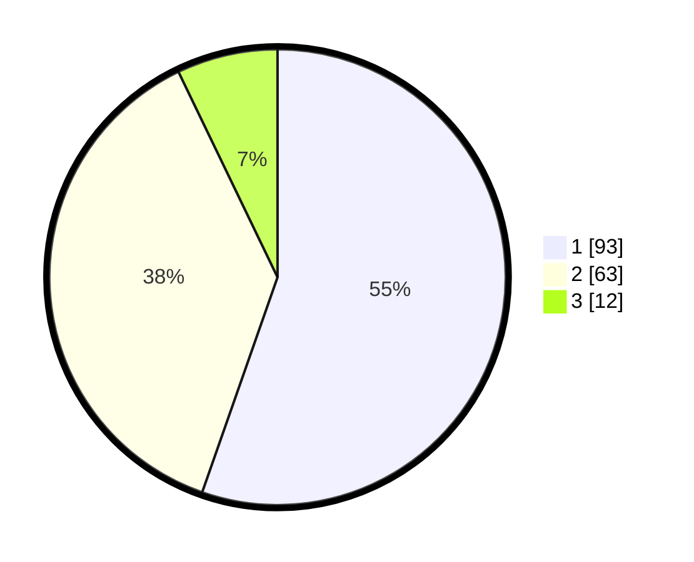

# Hasil

## Grafik

## Tabel

| No. | Nama Paslon    | Suara | Suara (raw) | Persentase |
|:--- |:-------------- | -----:| -----------:| ----------:|
| 1   | ANIES MUHAIMIN | 93    | [93][p-1]   | 55,36      |
| 2   | PRABOWO GIBRAN | 63    | [63][p-2]   | 37,50      |
| 3   | GANJAR MAHFUD  | 12    | [12][p-3]   | 7,14       |

[p-1]: https://github.com/gigit-pemilu/pemilu-2024/blob/main/pilpres/hitung-suara/sub/11-aceh/sub/02-aceh-tenggara/sub/04-babussalam/sub/2021-pekhapat-titi-panjang/sub/003-tps/sub/paslon-1.txt
[p-2]: https://github.com/gigit-pemilu/pemilu-2024/blob/main/pilpres/hitung-suara/sub/11-aceh/sub/02-aceh-tenggara/sub/04-babussalam/sub/2021-pekhapat-titi-panjang/sub/003-tps/sub/paslon-2.txt
[p-3]: https://github.com/gigit-pemilu/pemilu-2024/blob/main/pilpres/hitung-suara/sub/11-aceh/sub/02-aceh-tenggara/sub/04-babussalam/sub/2021-pekhapat-titi-panjang/sub/003-tps/sub/paslon-3.txt

## Foto C Plano

https://sirekap-obj-formc.kpu.go.id/3a0e/pemilu/ppwp/11/02/04/20/21/1102042021003-20240217-171346--34080708-2d41-4430-bdcc-f6fb1a40bd48.jpg

https://sirekap-obj-formc.kpu.go.id/3a0e/pemilu/ppwp/11/02/04/20/21/1102042021003-20240217-171446--b6a39d28-d84f-49ef-970c-f67390f0d821.jpg

https://sirekap-obj-formc.kpu.go.id/3a0e/pemilu/ppwp/11/02/04/20/21/1102042021003-20240217-171712--4ff4c4c7-e8f1-442a-aae9-d6a272b48787.jpg

## Metadata

| Key        | Value               |
| ---------- | ------------------- |
| Time Stamp | 2024-02-17 17:30:00 |

## DATA PEMILIH TETAP

Jumlah pemilih dalam DPT: **192**.
 * L: **99**.
 * P: **93**.

## DATA PENGGUNA HAK PILIH

Jumlah pengguna hak pilih dalam DPT: **166**.
 * L: **82**.
 * P: **84**.

Jumlah pengguna hak pilih dalam DPTb: **0**.
 * L: **0**.
 * P: **0**.

Jumlah pengguna hak pilih dalam DPK: **3**.
 * L: **1**.
 * P: **2**.

Jumlah pengguna hak pilih: **169**.
 * L: **83**.
 * P: **86**.

## JUMLAH SUARA SAH DAN TIDAK SAH

JUMLAH SELURUH SUARA SAH: **168**.

JUMLAH SUARA TIDAK SAH: **1**.

JUMLAH SELURUH SUARA SAH DAN SUARA TIDAK SAH: **169**.

