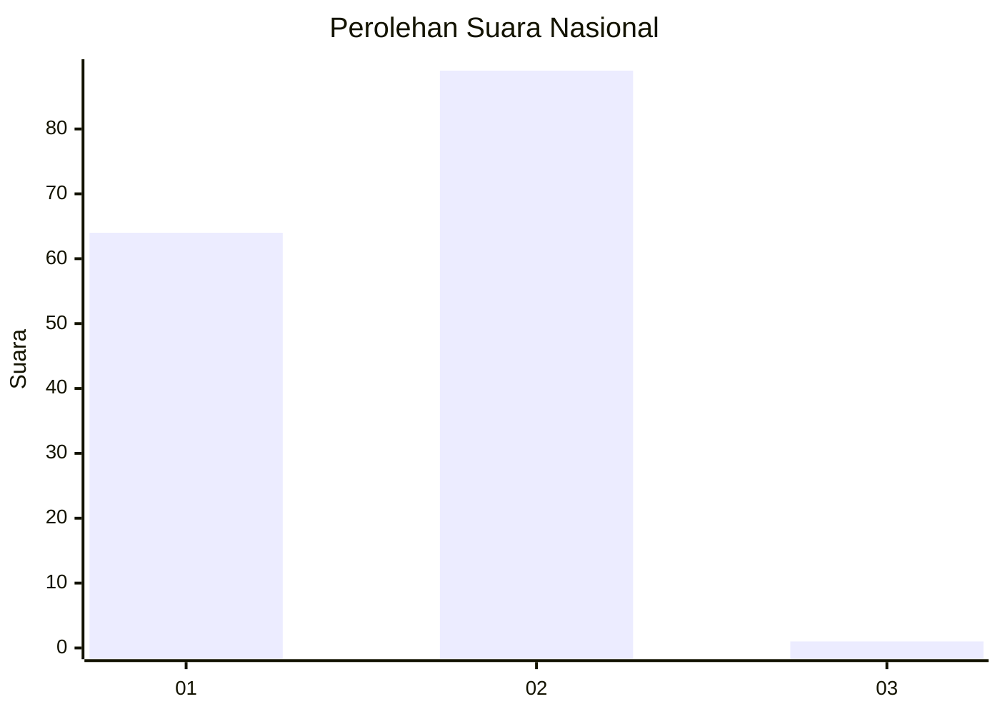
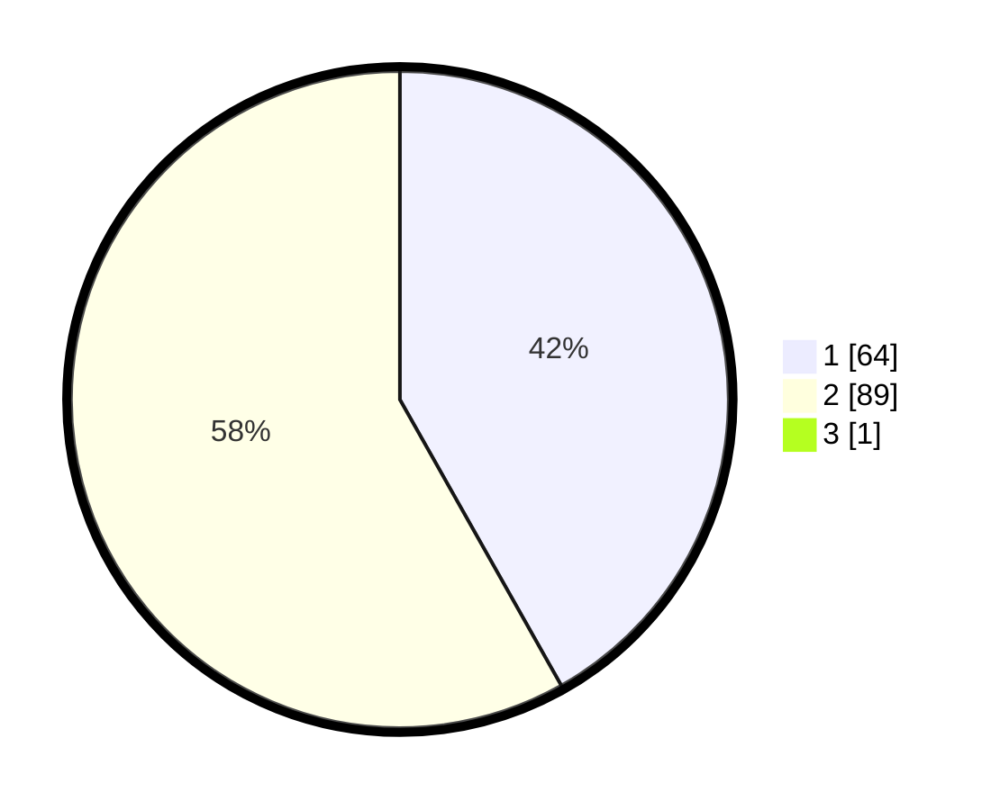

# Hasil

## Grafik

## Tabel

| No. | Nama Paslon    | Suara | Suara (raw) | Persentase |
|:--- |:-------------- | -----:| -----------:| ----------:|
| 1   | ANIES MUHAIMIN | 64    | [64][p-1]   | 41,56      |
| 2   | PRABOWO GIBRAN | 89    | [89][p-2]   | 57,79      |
| 3   | GANJAR MAHFUD  | 1     | [1][p-3]    | 0,65       |

[p-1]: https://github.com/gigit-pemilu/pemilu-2024/blob/main/pilpres/hitung-suara/sub/11-aceh/sub/02-aceh-tenggara/sub/04-babussalam/sub/2024-batu-mbulan-sepakat/sub/001-tps/sub/paslon-1.txt
[p-2]: https://github.com/gigit-pemilu/pemilu-2024/blob/main/pilpres/hitung-suara/sub/11-aceh/sub/02-aceh-tenggara/sub/04-babussalam/sub/2024-batu-mbulan-sepakat/sub/001-tps/sub/paslon-2.txt
[p-3]: https://github.com/gigit-pemilu/pemilu-2024/blob/main/pilpres/hitung-suara/sub/11-aceh/sub/02-aceh-tenggara/sub/04-babussalam/sub/2024-batu-mbulan-sepakat/sub/001-tps/sub/paslon-3.txt

## Foto C Plano

https://sirekap-obj-formc.kpu.go.id/9c8a/pemilu/ppwp/11/02/04/20/24/1102042024001-20240217-145712--9cc89fe1-39b9-4613-9655-22d0deda0313.jpg

https://sirekap-obj-formc.kpu.go.id/9c8a/pemilu/ppwp/11/02/04/20/24/1102042024001-20240217-145854--41ef3f68-dfe4-46f9-b269-2f7accca0957.jpg

https://sirekap-obj-formc.kpu.go.id/9c8a/pemilu/ppwp/11/02/04/20/24/1102042024001-20240217-150021--452b2d27-0f82-40a8-ab80-dd024f0952eb.jpg

## Metadata

| Key        | Value               |
| ---------- | ------------------- |
| Time Stamp | 2024-02-25 17:00:00 |

