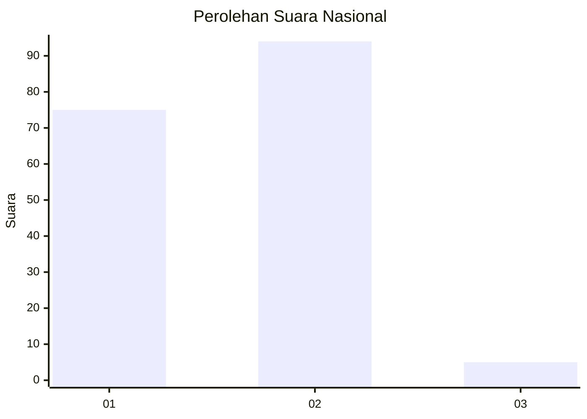
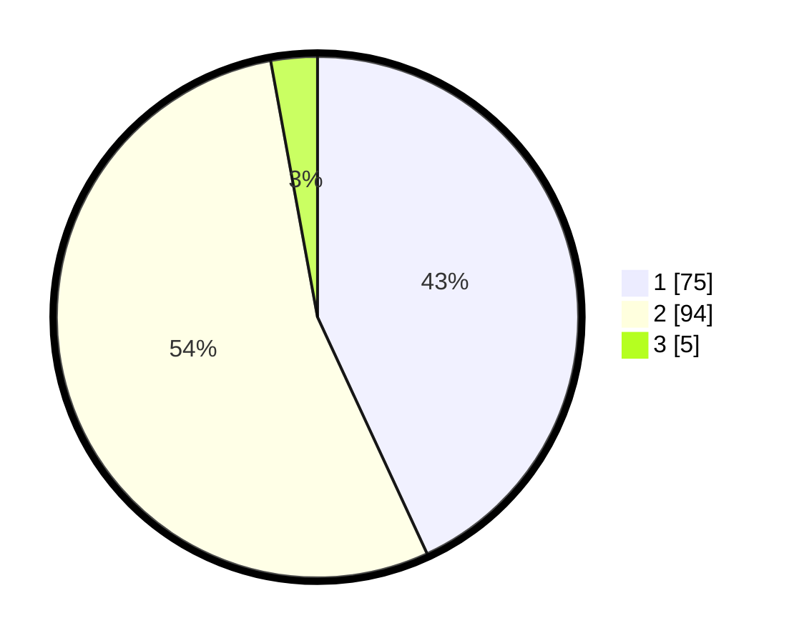

# Hasil

## Grafik

## Tabel

| No. | Nama Paslon    | Suara | Suara (raw) | Persentase |
|:--- |:-------------- | -----:| -----------:| ----------:|
| 1   | ANIES MUHAIMIN | 75    | [75][p-1]   | 43,10      |
| 2   | PRABOWO GIBRAN | 94    | [94][p-2]   | 54,02      |
| 3   | GANJAR MAHFUD  | 5     | [5][p-3]    | 2,87       |

[p-1]: https://github.com/gigit-pemilu/pemilu-2024/blob/main/pilpres/hitung-suara/sub/11-aceh/sub/02-aceh-tenggara/sub/05-badar/sub/2009-kuta-pasir/sub/001-tps/sub/paslon-1.txt
[p-2]: https://github.com/gigit-pemilu/pemilu-2024/blob/main/pilpres/hitung-suara/sub/11-aceh/sub/02-aceh-tenggara/sub/05-badar/sub/2009-kuta-pasir/sub/001-tps/sub/paslon-2.txt
[p-3]: https://github.com/gigit-pemilu/pemilu-2024/blob/main/pilpres/hitung-suara/sub/11-aceh/sub/02-aceh-tenggara/sub/05-badar/sub/2009-kuta-pasir/sub/001-tps/sub/paslon-3.txt

## Foto C Plano

https://sirekap-obj-formc.kpu.go.id/364b/pemilu/ppwp/11/02/05/20/09/1102052009001-20240215-214147--97e8dc89-270c-4903-8746-05437e33c245.jpg

https://sirekap-obj-formc.kpu.go.id/364b/pemilu/ppwp/11/02/05/20/09/1102052009001-20240215-040119--ad5b66a9-6c2f-4e38-984c-7bdd4ec1d0df.jpg

https://sirekap-obj-formc.kpu.go.id/364b/pemilu/ppwp/11/02/05/20/09/1102052009001-20240215-040217--d2155c44-cacb-444a-9ea6-a3f244168f69.jpg

## Metadata

| Key        | Value               |
| ---------- | ------------------- |
| Time Stamp | 2024-02-15 22:40:13 |

## DATA PEMILIH TETAP

Jumlah pemilih dalam DPT: **197**.
 * L: **96**.
 * P: **101**.

## DATA PENGGUNA HAK PILIH

Jumlah pengguna hak pilih dalam DPT: **174**.
 * L: **86**.
 * P: **88**.

Jumlah pengguna hak pilih dalam DPTb: **0**.
 * L: **0**.
 * P: **0**.

Jumlah pengguna hak pilih dalam DPK: **0**.
 * L: **0**.
 * P: **0**.

Jumlah pengguna hak pilih: **174**.
 * L: **86**.
 * P: **88**.

## JUMLAH SUARA SAH DAN TIDAK SAH

JUMLAH SELURUH SUARA SAH: **174**.

JUMLAH SUARA TIDAK SAH: **0**.

JUMLAH SELURUH SUARA SAH DAN SUARA TIDAK SAH: **174**.

