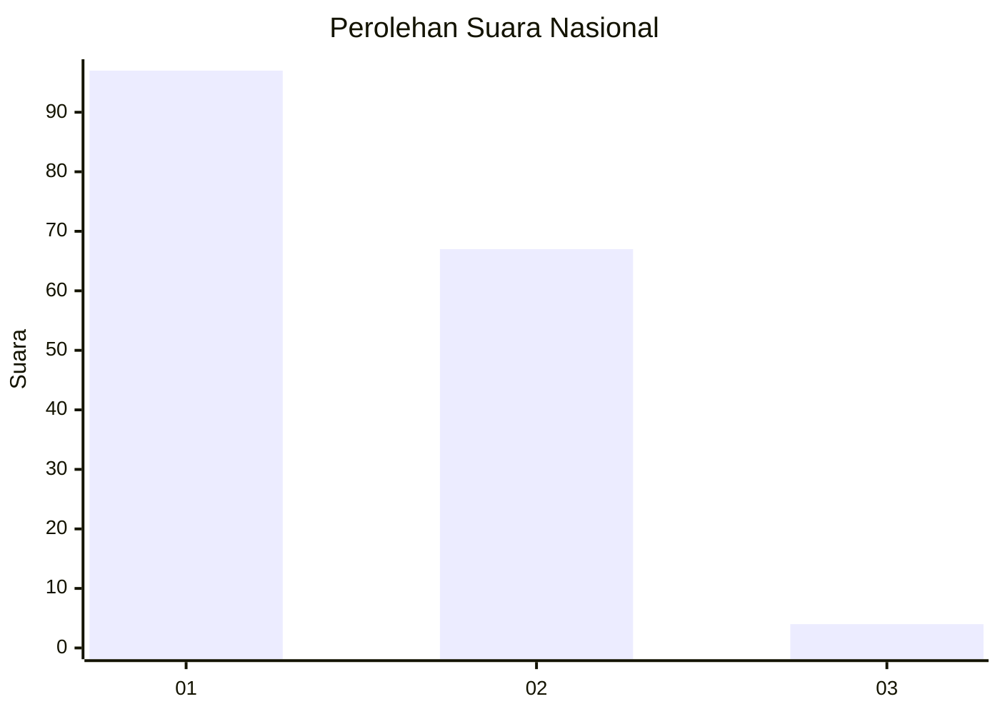
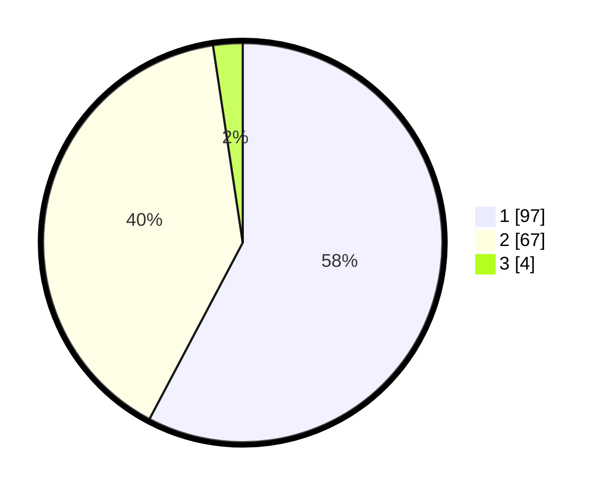

# Hasil

## Grafik

## Tabel

| No. | Nama Paslon    | Suara | Suara (raw) | Persentase |
|:--- |:-------------- | -----:| -----------:| ----------:|
| 1   | ANIES MUHAIMIN | 97    | [97][p-1]   | 57,74      |
| 2   | PRABOWO GIBRAN | 67    | [67][p-2]   | 39,88      |
| 3   | GANJAR MAHFUD  | 4     | [4][p-3]    | 2,38       |

[p-1]: https://github.com/gigit-pemilu/pemilu-2024/blob/main/pilpres/hitung-suara/sub/11-aceh/sub/02-aceh-tenggara/sub/05-badar/sub/2009-kuta-pasir/sub/002-tps/sub/paslon-1.txt
[p-2]: https://github.com/gigit-pemilu/pemilu-2024/blob/main/pilpres/hitung-suara/sub/11-aceh/sub/02-aceh-tenggara/sub/05-badar/sub/2009-kuta-pasir/sub/002-tps/sub/paslon-2.txt
[p-3]: https://github.com/gigit-pemilu/pemilu-2024/blob/main/pilpres/hitung-suara/sub/11-aceh/sub/02-aceh-tenggara/sub/05-badar/sub/2009-kuta-pasir/sub/002-tps/sub/paslon-3.txt

## Foto C Plano

https://sirekap-obj-formc.kpu.go.id/89cd/pemilu/ppwp/11/02/05/20/09/1102052009002-20240215-054624--8c963fd6-d8b0-428e-9e90-8bd9773efffb.jpg

https://sirekap-obj-formc.kpu.go.id/89cd/pemilu/ppwp/11/02/05/20/09/1102052009002-20240215-054809--c273976b-b5dc-49fd-9247-ed0109cf586c.jpg

https://sirekap-obj-formc.kpu.go.id/89cd/pemilu/ppwp/11/02/05/20/09/1102052009002-20240215-054937--d19ee8ea-d636-48cf-b0af-01f3c9a56726.jpg

## Metadata

| Key        | Value               |
| ---------- | ------------------- |
| Time Stamp | 2024-02-15 21:01:18 |

## DATA PEMILIH TETAP

Jumlah pemilih dalam DPT: **180**.
 * L: **90**.
 * P: **90**.

## DATA PENGGUNA HAK PILIH

Jumlah pengguna hak pilih dalam DPT: **163**.
 * L: **83**.
 * P: **80**.

Jumlah pengguna hak pilih dalam DPTb: **2**.
 * L: **0**.
 * P: **2**.

Jumlah pengguna hak pilih dalam DPK: **5**.
 * L: **1**.
 * P: **4**.

Jumlah pengguna hak pilih: **170**.
 * L: **84**.
 * P: **86**.

## JUMLAH SUARA SAH DAN TIDAK SAH

JUMLAH SELURUH SUARA SAH: **168**.

JUMLAH SUARA TIDAK SAH: **2**.

JUMLAH SELURUH SUARA SAH DAN SUARA TIDAK SAH: **170**.

