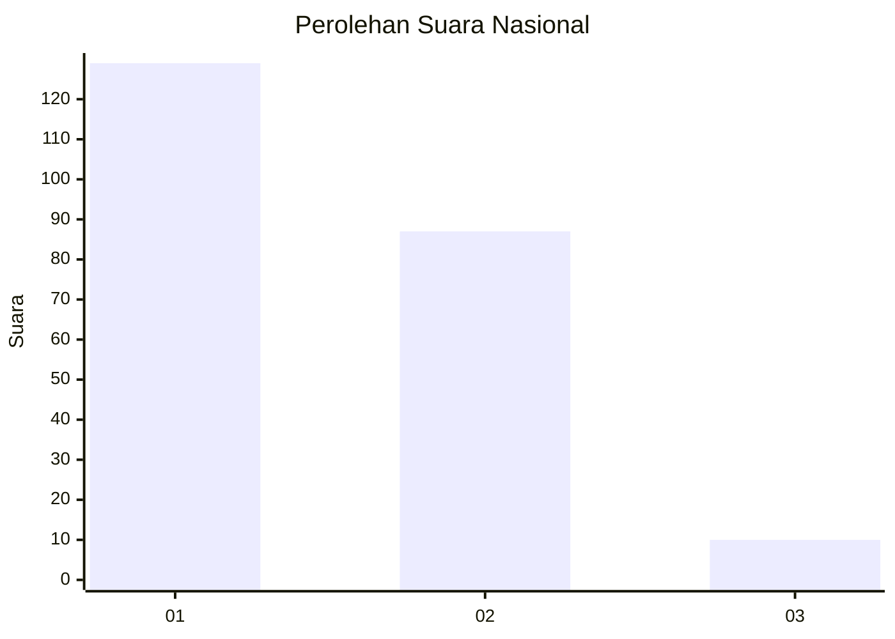
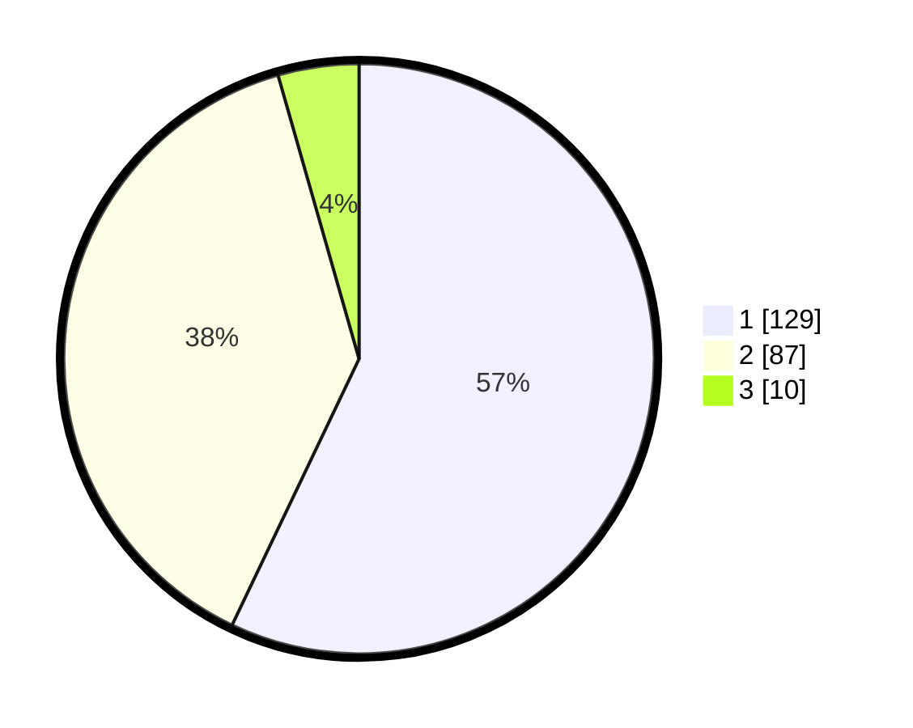

# Hasil

## Grafik

## Tabel

| No. | Nama Paslon    | Suara | Suara (raw) | Persentase |
|:--- |:-------------- | -----:| -----------:| ----------:|
| 1   | ANIES MUHAIMIN | 129   | [129][p-1]  | 57,08      |
| 2   | PRABOWO GIBRAN | 87    | [87][p-2]   | 38,50      |
| 3   | GANJAR MAHFUD  | 10    | [10][p-3]   | 4,42       |

[p-1]: https://github.com/gigit-pemilu/pemilu-2024/blob/main/pilpres/hitung-suara/sub/11-aceh/sub/02-aceh-tenggara/sub/05-badar/sub/2011-purwodadi/sub/003-tps/sub/paslon-1.txt
[p-2]: https://github.com/gigit-pemilu/pemilu-2024/blob/main/pilpres/hitung-suara/sub/11-aceh/sub/02-aceh-tenggara/sub/05-badar/sub/2011-purwodadi/sub/003-tps/sub/paslon-2.txt
[p-3]: https://github.com/gigit-pemilu/pemilu-2024/blob/main/pilpres/hitung-suara/sub/11-aceh/sub/02-aceh-tenggara/sub/05-badar/sub/2011-purwodadi/sub/003-tps/sub/paslon-3.txt

## Foto C Plano

https://sirekap-obj-formc.kpu.go.id/c5b6/pemilu/ppwp/11/02/05/20/11/1102052011003-20240214-203620--3410b98f-7ae2-48dd-b3ae-fbb9254b5cb2.jpg

https://sirekap-obj-formc.kpu.go.id/c5b6/pemilu/ppwp/11/02/05/20/11/1102052011003-20240214-202839--38bbfede-cb63-4585-821e-7c975c6f6c94.jpg

https://sirekap-obj-formc.kpu.go.id/c5b6/pemilu/ppwp/11/02/05/20/11/1102052011003-20240214-202932--61c60803-a4a4-4aa3-8b38-479f7e3630e1.jpg

## Metadata

| Key        | Value               |
| ---------- | ------------------- |
| Time Stamp | 2024-02-16 21:01:00 |

## DATA PEMILIH TETAP

Jumlah pemilih dalam DPT: **757**.
 * L: **124**.
 * P: **137**.

## DATA PENGGUNA HAK PILIH

Jumlah pengguna hak pilih dalam DPT: **557**.
 * L: **115**.
 * P: **107**.

Jumlah pengguna hak pilih dalam DPTb: **777**.
 * L: **7**.
 * P: **777**.

Jumlah pengguna hak pilih dalam DPK: **551**.
 * L: **2**.
 * P: **77**.

Jumlah pengguna hak pilih: **531**.
 * L: **119**.
 * P: **324**.

## JUMLAH SUARA SAH DAN TIDAK SAH

JUMLAH SELURUH SUARA SAH: **226**.

JUMLAH SUARA TIDAK SAH: **7**.

JUMLAH SELURUH SUARA SAH DAN SUARA TIDAK SAH: **233**.

