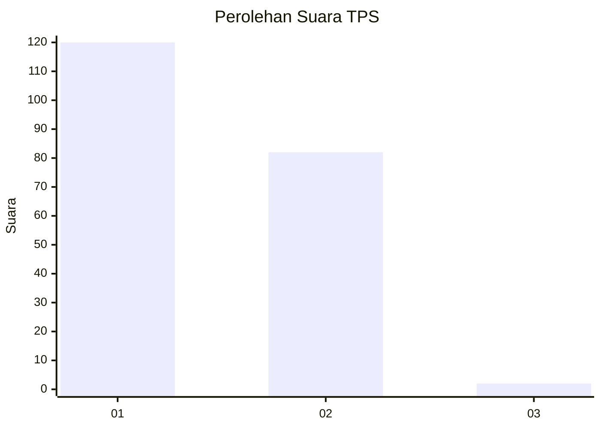
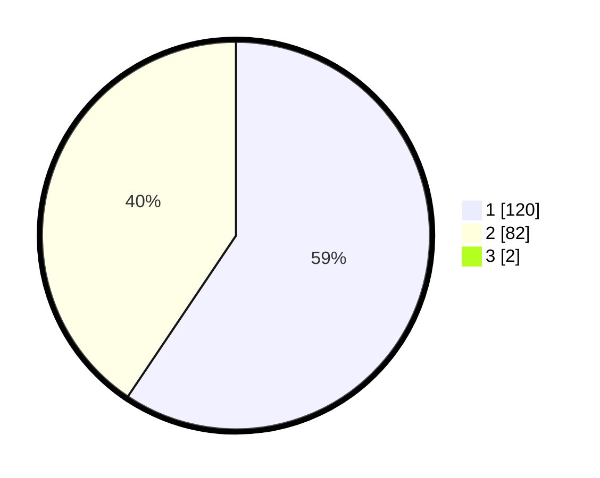

# Hasil

## Grafik

## Tabel

| No. | Nama Paslon    | Suara | Suara (raw) | Persentase |
|:--- |:-------------- | -----:| -----------:| ----------:|
| 1   | ANIES MUHAIMIN | 120   | [120][p-1]  | 58,82      |
| 2   | PRABOWO GIBRAN | 82    | [82][p-2]   | 40,20      |
| 3   | GANJAR MAHFUD  | 2     | [2][p-3]    | 0,98       |

[p-1]: https://github.com/gigit-pemilu/pemilu-2024-11-aceh/blob/main/pilpres/hitung-suara/sub/11-aceh/sub/02-aceh-tenggara/sub/05-badar/sub/2013-kampung-baru/sub/001-tps/sub/paslon-1.txt
[p-2]: https://github.com/gigit-pemilu/pemilu-2024-11-aceh/blob/main/pilpres/hitung-suara/sub/11-aceh/sub/02-aceh-tenggara/sub/05-badar/sub/2013-kampung-baru/sub/001-tps/sub/paslon-2.txt
[p-3]: https://github.com/gigit-pemilu/pemilu-2024-11-aceh/blob/main/pilpres/hitung-suara/sub/11-aceh/sub/02-aceh-tenggara/sub/05-badar/sub/2013-kampung-baru/sub/001-tps/sub/paslon-3.txt

## Foto C Plano

https://sirekap-obj-formc.kpu.go.id/9623/pemilu/ppwp/11/02/05/20/13/1102052013001-20240214-234843--a493e17d-bac2-4ade-8a22-8bfaccbdfdcd.jpg

https://sirekap-obj-formc.kpu.go.id/9623/pemilu/ppwp/11/02/05/20/13/1102052013001-20240221-160154--78e84d82-40d7-4ccd-a708-b6c25bd29e77.jpg

https://sirekap-obj-formc.kpu.go.id/9623/pemilu/ppwp/11/02/05/20/13/1102052013001-20240214-235030--fb664695-1a28-40cd-8340-b168a39780cb.jpg

## Metadata

| Key        | Value               |
| ---------- | ------------------- |
| Time Stamp | 2024-02-21 17:00:00 |

## DATA PEMILIH TETAP

Jumlah pemilih dalam DPT: **225**.
 * L: **108**.
 * P: **117**.

## DATA PENGGUNA HAK PILIH

Jumlah pengguna hak pilih dalam DPT: **192**.
 * L: **87**.
 * P: **105**.

Jumlah pengguna hak pilih dalam DPTb: **0**.
 * L: **0**.
 * P: **0**.

Jumlah pengguna hak pilih dalam DPK: **9**.
 * L: **1**.
 * P: **8**.

Jumlah pengguna hak pilih: **201**.
 * L: **88**.
 * P: **113**.

## JUMLAH SUARA SAH DAN TIDAK SAH

JUMLAH SELURUH SUARA SAH: **194**.

JUMLAH SUARA TIDAK SAH: **7**.

JUMLAH SELURUH SUARA SAH DAN SUARA TIDAK SAH: **201**.

