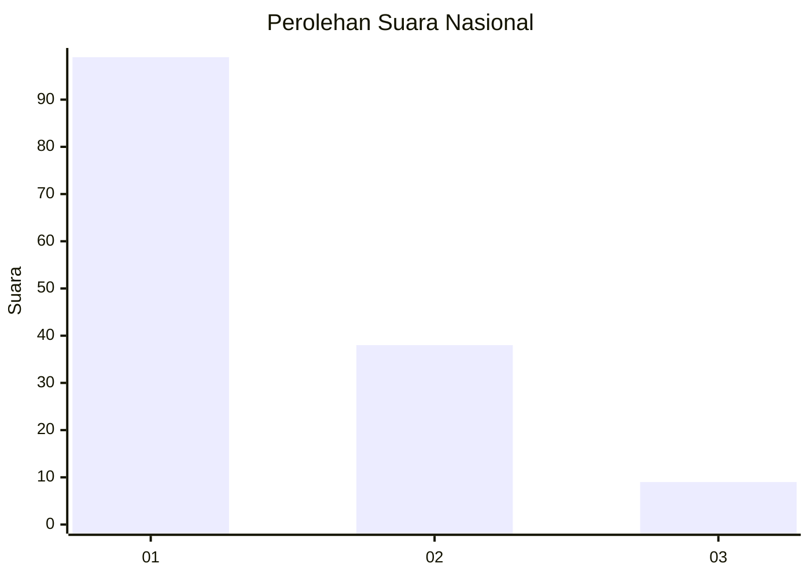
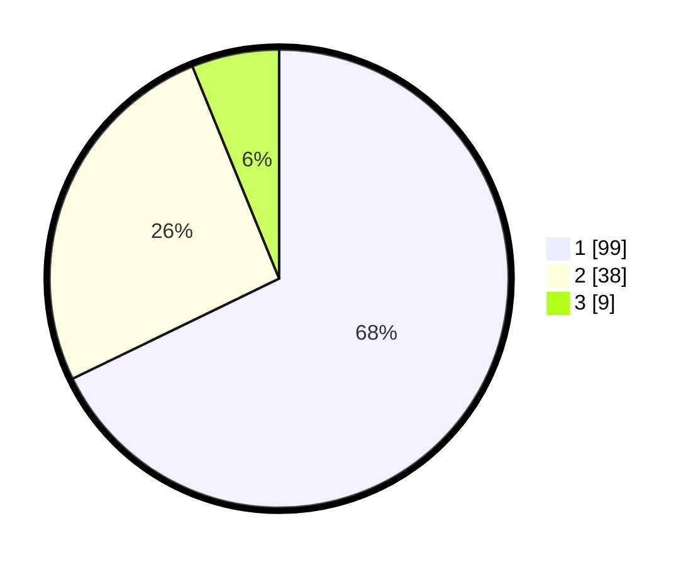

# Hasil

## Grafik

## Tabel

| No. | Nama Paslon    | Suara | Suara (raw) | Persentase |
|:--- |:-------------- | -----:| -----------:| ----------:|
| 1   | ANIES MUHAIMIN | 99    | [99][p-1]   | 67,81      |
| 2   | PRABOWO GIBRAN | 38    | [38][p-2]   | 26,03      |
| 3   | GANJAR MAHFUD  | 9     | [9][p-3]    | 6,16       |

[p-1]: https://github.com/gigit-pemilu/pemilu-2024/blob/main/pilpres/hitung-suara/sub/11-aceh/sub/02-aceh-tenggara/sub/05-badar/sub/2013-kampung-baru/sub/002-tps/sub/paslon-1.txt
[p-2]: https://github.com/gigit-pemilu/pemilu-2024/blob/main/pilpres/hitung-suara/sub/11-aceh/sub/02-aceh-tenggara/sub/05-badar/sub/2013-kampung-baru/sub/002-tps/sub/paslon-2.txt
[p-3]: https://github.com/gigit-pemilu/pemilu-2024/blob/main/pilpres/hitung-suara/sub/11-aceh/sub/02-aceh-tenggara/sub/05-badar/sub/2013-kampung-baru/sub/002-tps/sub/paslon-3.txt

## Foto C Plano

https://sirekap-obj-formc.kpu.go.id/0a84/pemilu/ppwp/11/02/05/20/13/1102052013002-20240221-162654--5950329c-21f4-48e5-8f77-ad1f28aca444.jpg

https://sirekap-obj-formc.kpu.go.id/0a84/pemilu/ppwp/11/02/05/20/13/1102052013002-20240221-163151--2fec4cc8-adcb-4976-aded-51c713e80853.jpg

https://sirekap-obj-formc.kpu.go.id/0a84/pemilu/ppwp/11/02/05/20/13/1102052013002-20240214-235338--b23eec0c-2b9a-4acd-99d7-c4bb097fe192.jpg

## Metadata

| Key        | Value               |
| ---------- | ------------------- |
| Time Stamp | 2024-02-21 17:00:00 |

