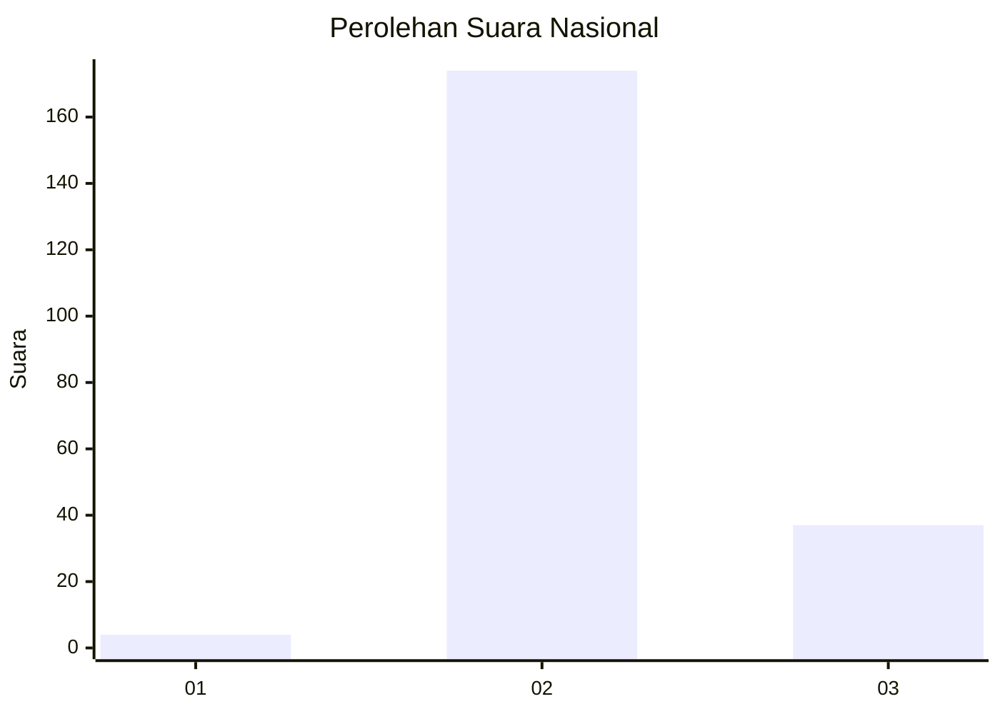
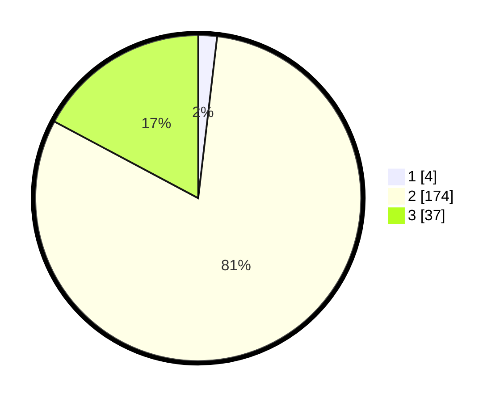

# Hasil

## Grafik

## Tabel

| No. | Nama Paslon    | Suara | Suara (raw) | Persentase |
|:--- |:-------------- | -----:| -----------:| ----------:|
| 1   | ANIES MUHAIMIN | 4     | [4][p-1]    | 1,86       |
| 2   | PRABOWO GIBRAN | 174   | [174][p-2]  | 80,93      |
| 3   | GANJAR MAHFUD  | 37    | [37][p-3]   | 17,21      |

[p-1]: https://github.com/gigit-pemilu/pemilu-2024/blob/main/pilpres/hitung-suara/sub/11-aceh/sub/02-aceh-tenggara/sub/05-badar/sub/2014-peranginan/sub/001-tps/sub/paslon-1.txt
[p-2]: https://github.com/gigit-pemilu/pemilu-2024/blob/main/pilpres/hitung-suara/sub/11-aceh/sub/02-aceh-tenggara/sub/05-badar/sub/2014-peranginan/sub/001-tps/sub/paslon-2.txt
[p-3]: https://github.com/gigit-pemilu/pemilu-2024/blob/main/pilpres/hitung-suara/sub/11-aceh/sub/02-aceh-tenggara/sub/05-badar/sub/2014-peranginan/sub/001-tps/sub/paslon-3.txt

## Foto C Plano

https://sirekap-obj-formc.kpu.go.id/f18e/pemilu/ppwp/11/02/05/20/14/1102052014001-20240215-031527--64dd7814-2277-482a-bf4d-2ba6aae4a391.jpg

https://sirekap-obj-formc.kpu.go.id/f18e/pemilu/ppwp/11/02/05/20/14/1102052014001-20240215-031642--81824b77-0c07-411f-8dc0-8e026a4aa5b0.jpg

https://sirekap-obj-formc.kpu.go.id/f18e/pemilu/ppwp/11/02/05/20/14/1102052014001-20240214-211957--3ddbf621-7e78-45ce-bebc-81f05237b4f6.jpg

## Metadata

| Key        | Value               |
| ---------- | ------------------- |
| Time Stamp | 2024-02-15 12:00:28 |

