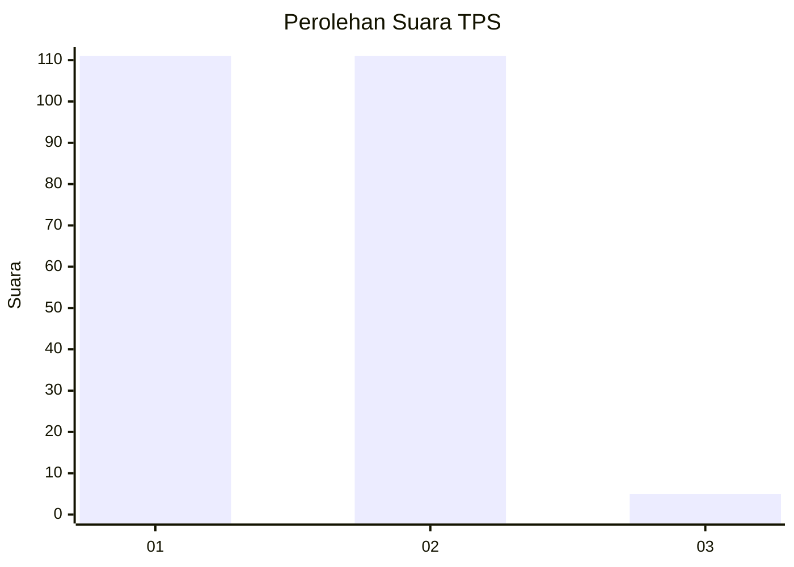
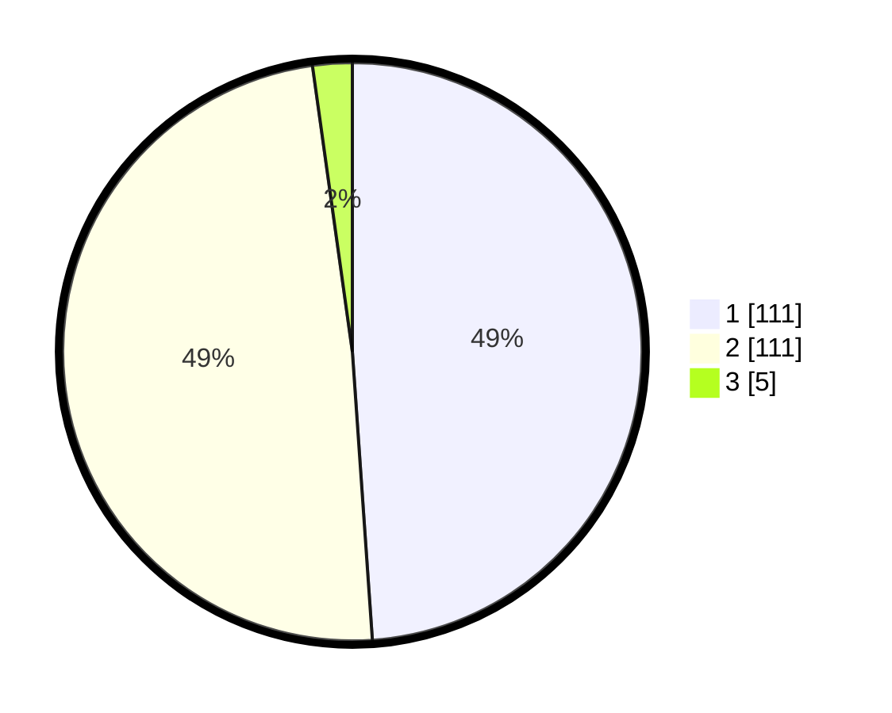

# Hasil

## Grafik

## Tabel

| No. | Nama Paslon    | Suara | Suara (raw) | Persentase |
|:--- |:-------------- | -----:| -----------:| ----------:|
| 1   | ANIES MUHAIMIN | 111   | [111][p-1]  | 48,90      |
| 2   | PRABOWO GIBRAN | 111   | [111][p-2]  | 48,90      |
| 3   | GANJAR MAHFUD  | 5     | [5][p-3]    | 2,20       |

[p-1]: https://github.com/gigit-pemilu/pemilu-2024-11-aceh/blob/main/pilpres/hitung-suara/sub/11-aceh/sub/02-aceh-tenggara/sub/05-badar/sub/2025-kumbang-jaya/sub/001-tps/sub/paslon-1.txt
[p-2]: https://github.com/gigit-pemilu/pemilu-2024-11-aceh/blob/main/pilpres/hitung-suara/sub/11-aceh/sub/02-aceh-tenggara/sub/05-badar/sub/2025-kumbang-jaya/sub/001-tps/sub/paslon-2.txt
[p-3]: https://github.com/gigit-pemilu/pemilu-2024-11-aceh/blob/main/pilpres/hitung-suara/sub/11-aceh/sub/02-aceh-tenggara/sub/05-badar/sub/2025-kumbang-jaya/sub/001-tps/sub/paslon-3.txt

## Foto C Plano

https://sirekap-obj-formc.kpu.go.id/a519/pemilu/ppwp/11/02/05/20/25/1102052025001-20240215-123828--0ec4056d-27ed-4206-a09d-952a61c4435a.jpg

https://sirekap-obj-formc.kpu.go.id/a519/pemilu/ppwp/11/02/05/20/25/1102052025001-20240215-123940--b944ef55-bf0f-493c-845d-a913b876375c.jpg

https://sirekap-obj-formc.kpu.go.id/a519/pemilu/ppwp/11/02/05/20/25/1102052025001-20240215-124052--7d19866c-aed8-49a3-8d0c-41dbb44a8673.jpg

## Metadata

| Key        | Value               |
| ---------- | ------------------- |
| Time Stamp | 2024-02-16 08:30:27 |

## DATA PEMILIH TETAP

Jumlah pemilih dalam DPT: **252**.
 * L: **124**.
 * P: **128**.

## DATA PENGGUNA HAK PILIH

Jumlah pengguna hak pilih dalam DPT: **234**.
 * L: **100**.
 * P: **134**.

Jumlah pengguna hak pilih dalam DPTb: **0**.
 * L: **0**.
 * P: **0**.

Jumlah pengguna hak pilih dalam DPK: **16**.
 * L: **7**.
 * P: **9**.

Jumlah pengguna hak pilih: **250**.
 * L: **107**.
 * P: **143**.

## JUMLAH SUARA SAH DAN TIDAK SAH

JUMLAH SELURUH SUARA SAH: **227**.

JUMLAH SUARA TIDAK SAH: **7**.

JUMLAH SELURUH SUARA SAH DAN SUARA TIDAK SAH: **234**.

