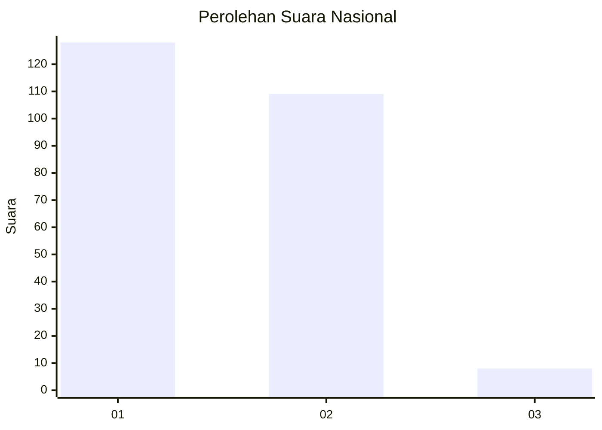
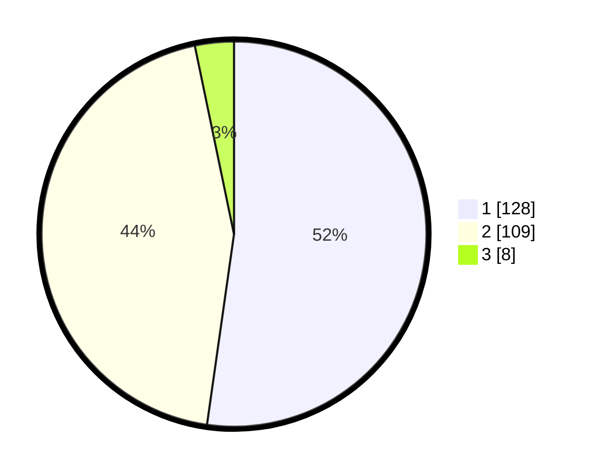

# Hasil

## Grafik

## Tabel

| No. | Nama Paslon    | Suara | Suara (raw) | Persentase |
|:--- |:-------------- | -----:| -----------:| ----------:|
| 1   | ANIES MUHAIMIN | 128   | [128][p-1]  | 52,24      |
| 2   | PRABOWO GIBRAN | 109   | [109][p-2]  | 44,49      |
| 3   | GANJAR MAHFUD  | 8     | [8][p-3]    | 3,27       |

[p-1]: https://github.com/gigit-pemilu/pemilu-2024/blob/main/pilpres/hitung-suara/sub/11-aceh/sub/02-aceh-tenggara/sub/05-badar/sub/2025-kumbang-jaya/sub/004-tps/sub/paslon-1.txt
[p-2]: https://github.com/gigit-pemilu/pemilu-2024/blob/main/pilpres/hitung-suara/sub/11-aceh/sub/02-aceh-tenggara/sub/05-badar/sub/2025-kumbang-jaya/sub/004-tps/sub/paslon-2.txt
[p-3]: https://github.com/gigit-pemilu/pemilu-2024/blob/main/pilpres/hitung-suara/sub/11-aceh/sub/02-aceh-tenggara/sub/05-badar/sub/2025-kumbang-jaya/sub/004-tps/sub/paslon-3.txt

## Foto C Plano

https://sirekap-obj-formc.kpu.go.id/edbf/pemilu/ppwp/11/02/05/20/25/1102052025004-20240215-004709--39a98245-f0f8-4fa5-99ed-32d777720fd7.jpg

https://sirekap-obj-formc.kpu.go.id/edbf/pemilu/ppwp/11/02/05/20/25/1102052025004-20240215-004544--6c8455e5-419b-4386-93f5-3a43dce97b70.jpg

https://sirekap-obj-formc.kpu.go.id/edbf/pemilu/ppwp/11/02/05/20/25/1102052025004-20240215-004901--2c359259-737a-4f8c-885c-05264869a810.jpg

## Metadata

| Key        | Value               |
| ---------- | ------------------- |
| Time Stamp | 2024-02-15 12:00:28 |

## DATA PEMILIH TETAP

Jumlah pemilih dalam DPT: **257**.
 * L: **137**.
 * P: **120**.

## DATA PENGGUNA HAK PILIH

Jumlah pengguna hak pilih dalam DPT: **250**.
 * L: **134**.
 * P: **116**.

Jumlah pengguna hak pilih dalam DPTb: **1**.
 * L: **1**.
 * P: **0**.

Jumlah pengguna hak pilih dalam DPK: **8**.
 * L: **1**.
 * P: **7**.

Jumlah pengguna hak pilih: **259**.
 * L: **136**.
 * P: **123**.

## JUMLAH SUARA SAH DAN TIDAK SAH

JUMLAH SELURUH SUARA SAH: **245**.

JUMLAH SUARA TIDAK SAH: **5**.

JUMLAH SELURUH SUARA SAH DAN SUARA TIDAK SAH: **250**.

