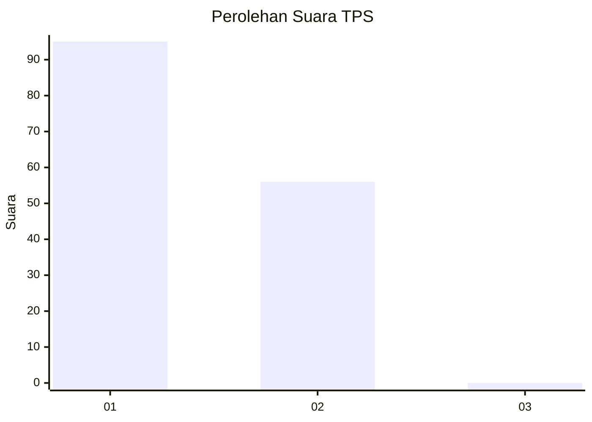
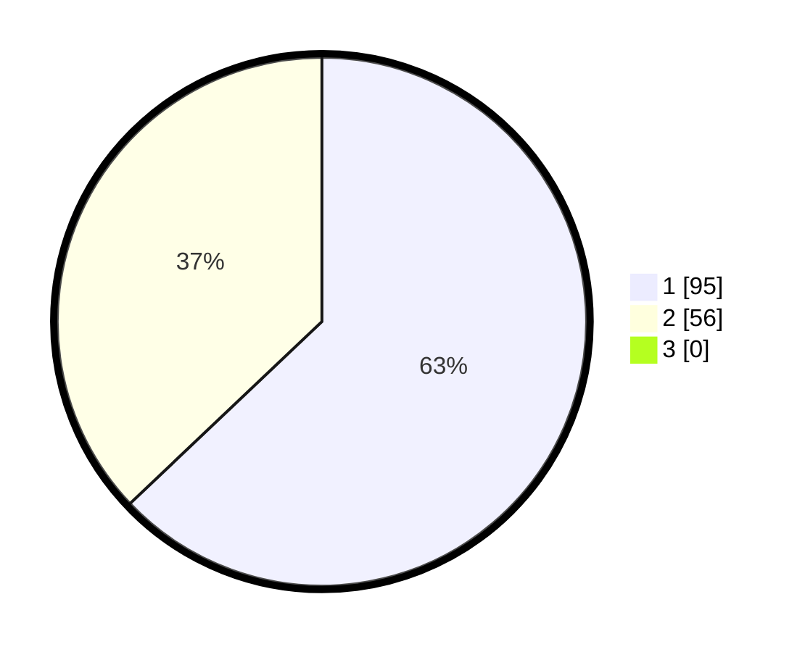

# Hasil

## Grafik

## Tabel

| No. | Nama Paslon    | Suara | Suara (raw) | Persentase |
|:--- |:-------------- | -----:| -----------:| ----------:|
| 1   | ANIES MUHAIMIN | 95    | [95][p-1]   | 62,91      |
| 2   | PRABOWO GIBRAN | 56    | [56][p-2]   | 37,09      |
| 3   | GANJAR MAHFUD  | 0     | [0][p-3]    | 0,00       |

[p-1]: https://github.com/gigit-pemilu/pemilu-2024-11-aceh/blob/main/pilpres/hitung-suara/sub/11-aceh/sub/02-aceh-tenggara/sub/05-badar/sub/2026-kumbang-indah/sub/005-tps/sub/paslon-1.txt
[p-2]: https://github.com/gigit-pemilu/pemilu-2024-11-aceh/blob/main/pilpres/hitung-suara/sub/11-aceh/sub/02-aceh-tenggara/sub/05-badar/sub/2026-kumbang-indah/sub/005-tps/sub/paslon-2.txt
[p-3]: https://github.com/gigit-pemilu/pemilu-2024-11-aceh/blob/main/pilpres/hitung-suara/sub/11-aceh/sub/02-aceh-tenggara/sub/05-badar/sub/2026-kumbang-indah/sub/005-tps/sub/paslon-3.txt

## Foto C Plano

https://sirekap-obj-formc.kpu.go.id/c12e/pemilu/ppwp/11/02/05/20/26/1102052026005-20240214-224958--c44c6da4-e582-47df-b46c-ab4f7d5b36b4.jpg

https://sirekap-obj-formc.kpu.go.id/c12e/pemilu/ppwp/11/02/05/20/26/1102052026005-20240214-225116--3749efa5-e727-40c3-af53-250e0207b15e.jpg

https://sirekap-obj-formc.kpu.go.id/c12e/pemilu/ppwp/11/02/05/20/26/1102052026005-20240214-225306--6b092565-739a-4654-bafb-d878a5f8ab99.jpg

## Metadata

| Key        | Value               |
| ---------- | ------------------- |
| Time Stamp | 2024-02-15 21:01:18 |

