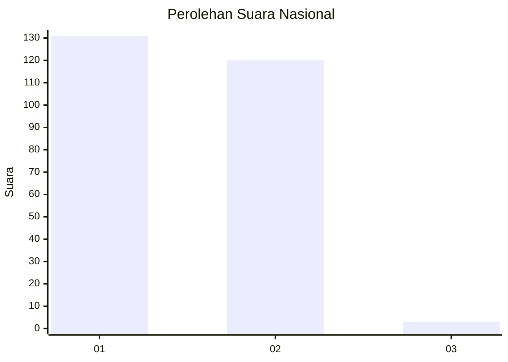
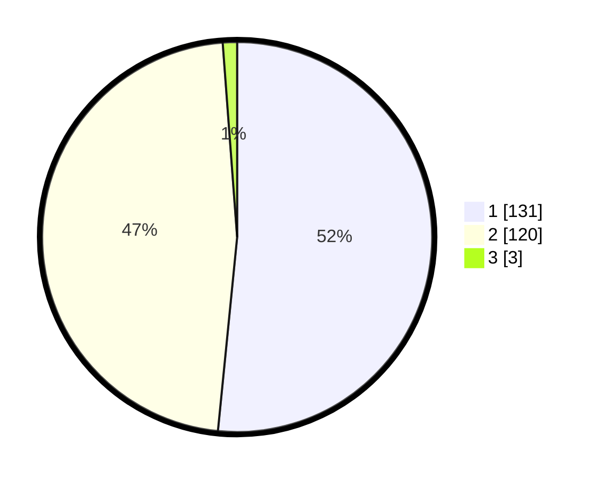

# Hasil

## Grafik

## Tabel

| No. | Nama Paslon    | Suara | Suara (raw) | Persentase |
|:--- |:-------------- | -----:| -----------:| ----------:|
| 1   | ANIES MUHAIMIN | 131   | [131][p-1]  | 51,57      |
| 2   | PRABOWO GIBRAN | 120   | [120][p-2]  | 47,24      |
| 3   | GANJAR MAHFUD  | 3     | [3][p-3]    | 1,18       |

[p-1]: https://github.com/gigit-pemilu/pemilu-2024/blob/main/pilpres/hitung-suara/sub/11-aceh/sub/02-aceh-tenggara/sub/05-badar/sub/2027-natam-baru/sub/001-tps/sub/paslon-1.txt
[p-2]: https://github.com/gigit-pemilu/pemilu-2024/blob/main/pilpres/hitung-suara/sub/11-aceh/sub/02-aceh-tenggara/sub/05-badar/sub/2027-natam-baru/sub/001-tps/sub/paslon-2.txt
[p-3]: https://github.com/gigit-pemilu/pemilu-2024/blob/main/pilpres/hitung-suara/sub/11-aceh/sub/02-aceh-tenggara/sub/05-badar/sub/2027-natam-baru/sub/001-tps/sub/paslon-3.txt

## Foto C Plano

https://sirekap-obj-formc.kpu.go.id/2dee/pemilu/ppwp/11/02/05/20/27/1102052027001-20240214-185136--4aa805ca-5fc6-4a6b-b607-a8c7aa88fcfc.jpg

https://sirekap-obj-formc.kpu.go.id/2dee/pemilu/ppwp/11/02/05/20/27/1102052027001-20240214-184541--6e085469-afb2-4783-a26f-ee91505c8035.jpg

https://sirekap-obj-formc.kpu.go.id/2dee/pemilu/ppwp/11/02/05/20/27/1102052027001-20240214-184545--23bef03d-544a-4169-8f38-e3c8eceb351c.jpg

## Metadata

| Key        | Value               |
| ---------- | ------------------- |
| Time Stamp | 2024-02-21 17:00:00 |

## DATA PEMILIH TETAP

Jumlah pemilih dalam DPT: **286**.
 * L: **134**.
 * P: **152**.

## DATA PENGGUNA HAK PILIH

Jumlah pengguna hak pilih dalam DPT: **237**.
 * L: **113**.
 * P: **124**.

Jumlah pengguna hak pilih dalam DPTb: **4**.
 * L: **3**.
 * P: **1**.

Jumlah pengguna hak pilih dalam DPK: **15**.
 * L: **4**.
 * P: **11**.

Jumlah pengguna hak pilih: **256**.
 * L: **120**.
 * P: **136**.

## JUMLAH SUARA SAH DAN TIDAK SAH

JUMLAH SELURUH SUARA SAH: **254**.

JUMLAH SUARA TIDAK SAH: **2**.

JUMLAH SELURUH SUARA SAH DAN SUARA TIDAK SAH: **256**.

