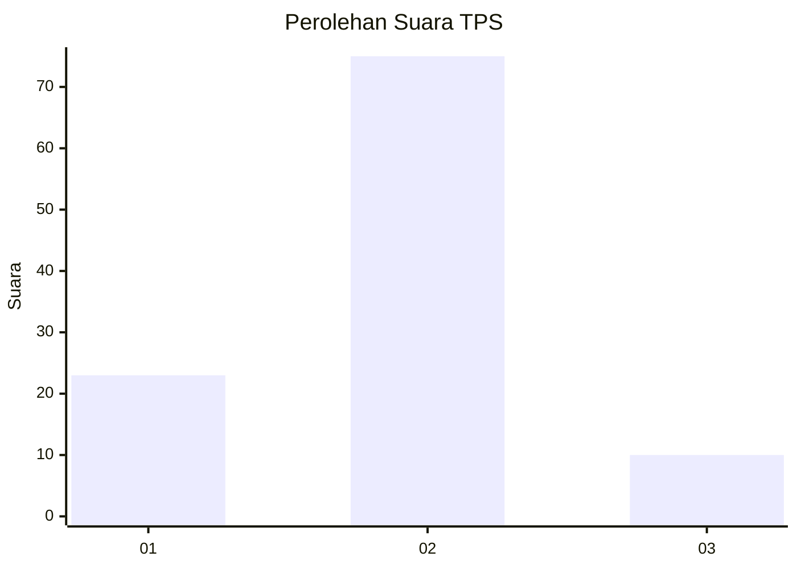

# Hasil

## Grafik

## Tabel

| No. | Nama Paslon    | Suara | Suara (raw) | Persentase |
|:--- |:-------------- | -----:| -----------:| ----------:|
| 1   | ANIES MUHAIMIN | 23    | [23][p-1]   | 21,30      |
| 2   | PRABOWO GIBRAN | 75    | [75][p-2]   | 69,44      |
| 3   | GANJAR MAHFUD  | 10    | [10][p-3]   | 9,26       |

[p-1]: https://github.com/gigit-pemilu/pemilu-2024-11-aceh/blob/main/pilpres/hitung-suara/sub/11-aceh/sub/02-aceh-tenggara/sub/05-badar/sub/2029-deleng-megakhe/sub/003-tps/sub/paslon-1.txt
[p-2]: https://github.com/gigit-pemilu/pemilu-2024-11-aceh/blob/main/pilpres/hitung-suara/sub/11-aceh/sub/02-aceh-tenggara/sub/05-badar/sub/2029-deleng-megakhe/sub/003-tps/sub/paslon-2.txt
[p-3]: https://github.com/gigit-pemilu/pemilu-2024-11-aceh/blob/main/pilpres/hitung-suara/sub/11-aceh/sub/02-aceh-tenggara/sub/05-badar/sub/2029-deleng-megakhe/sub/003-tps/sub/paslon-3.txt

## Foto C Plano

https://sirekap-obj-formc.kpu.go.id/5d04/pemilu/ppwp/11/02/05/20/29/1102052029003-20240214-155407--4697bc61-5e2e-45a2-8b57-5c75d225fdb1.jpg

https://sirekap-obj-formc.kpu.go.id/5d04/pemilu/ppwp/11/02/05/20/29/1102052029003-20240214-192723--a107d5d5-3c7f-40b2-b0f7-26b4316b1ef9.jpg

https://sirekap-obj-formc.kpu.go.id/5d04/pemilu/ppwp/11/02/05/20/29/1102052029003-20240214-192805--b826c496-d51c-49aa-8de7-6336c836517f.jpg

## Metadata

| Key        | Value               |
| ---------- | ------------------- |
| Time Stamp | 2024-02-15 00:41:44 |

## DATA PEMILIH TETAP

Jumlah pemilih dalam DPT: **124**.
 * L: **58**.
 * P: **66**.

## DATA PENGGUNA HAK PILIH

Jumlah pengguna hak pilih dalam DPT: **98**.
 * L: **46**.
 * P: **52**.

Jumlah pengguna hak pilih dalam DPTb: **7**.
 * L: **4**.
 * P: **3**.

Jumlah pengguna hak pilih dalam DPK: **7**.
 * L: **3**.
 * P: **4**.

Jumlah pengguna hak pilih: **112**.
 * L: **53**.
 * P: **59**.

## JUMLAH SUARA SAH DAN TIDAK SAH

JUMLAH SELURUH SUARA SAH: **108**.

JUMLAH SUARA TIDAK SAH: **4**.

JUMLAH SELURUH SUARA SAH DAN SUARA TIDAK SAH: **112**.

