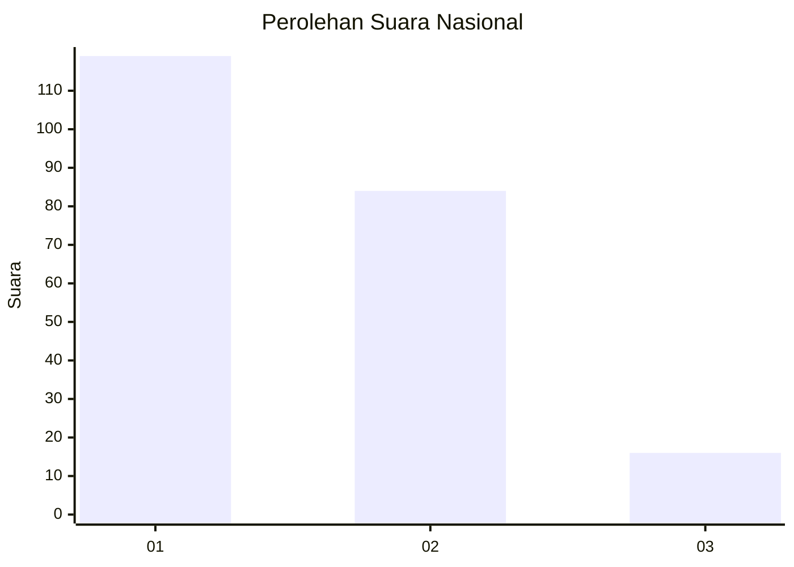
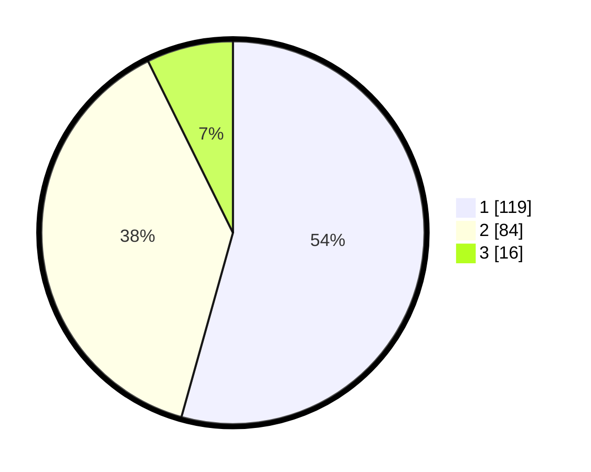

# Hasil

## Grafik

## Tabel

| No. | Nama Paslon    | Suara | Suara (raw) | Persentase |
|:--- |:-------------- | -----:| -----------:| ----------:|
| 1   | ANIES MUHAIMIN | 119   | [119][p-1]  | 54,34      |
| 2   | PRABOWO GIBRAN | 84    | [84][p-2]   | 38,36      |
| 3   | GANJAR MAHFUD  | 16    | [16][p-3]   | 7,31       |

[p-1]: https://github.com/gigit-pemilu/pemilu-2024/blob/main/pilpres/hitung-suara/sub/11-aceh/sub/02-aceh-tenggara/sub/05-badar/sub/2034-tanah-merah/sub/001-tps/sub/paslon-1.txt
[p-2]: https://github.com/gigit-pemilu/pemilu-2024/blob/main/pilpres/hitung-suara/sub/11-aceh/sub/02-aceh-tenggara/sub/05-badar/sub/2034-tanah-merah/sub/001-tps/sub/paslon-2.txt
[p-3]: https://github.com/gigit-pemilu/pemilu-2024/blob/main/pilpres/hitung-suara/sub/11-aceh/sub/02-aceh-tenggara/sub/05-badar/sub/2034-tanah-merah/sub/001-tps/sub/paslon-3.txt

## Foto C Plano

https://sirekap-obj-formc.kpu.go.id/27ae/pemilu/ppwp/11/02/05/20/34/1102052034001-20240221-110636--64ac997d-dfcc-4183-a289-0d2e8e75e630.jpg

https://sirekap-obj-formc.kpu.go.id/27ae/pemilu/ppwp/11/02/05/20/34/1102052034001-20240221-111100--749790f2-f1ff-4c18-b313-651d20042c26.jpg

https://sirekap-obj-formc.kpu.go.id/27ae/pemilu/ppwp/11/02/05/20/34/1102052034001-20240221-112451--7975a93c-e786-48c3-9f0f-83d5db6d374d.jpg

## Metadata

| Key        | Value               |
| ---------- | ------------------- |
| Time Stamp | 2024-02-21 12:00:00 |

## DATA PEMILIH TETAP

Jumlah pemilih dalam DPT: **252**.
 * L: **112**.
 * P: **140**.

## DATA PENGGUNA HAK PILIH

Jumlah pengguna hak pilih dalam DPT: **208**.
 * L: **89**.
 * P: **119**.

Jumlah pengguna hak pilih dalam DPTb: **11**.
 * L: **8**.
 * P: **3**.

Jumlah pengguna hak pilih dalam DPK: **1**.
 * L: **0**.
 * P: **1**.

Jumlah pengguna hak pilih: **220**.
 * L: **97**.
 * P: **123**.

## JUMLAH SUARA SAH DAN TIDAK SAH

JUMLAH SELURUH SUARA SAH: **219**.

JUMLAH SUARA TIDAK SAH: **1**.

JUMLAH SELURUH SUARA SAH DAN SUARA TIDAK SAH: **220**.

