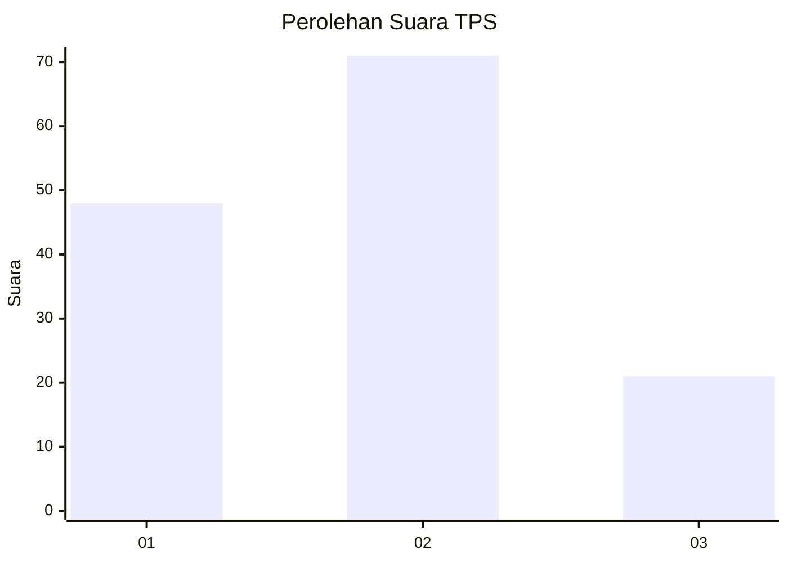
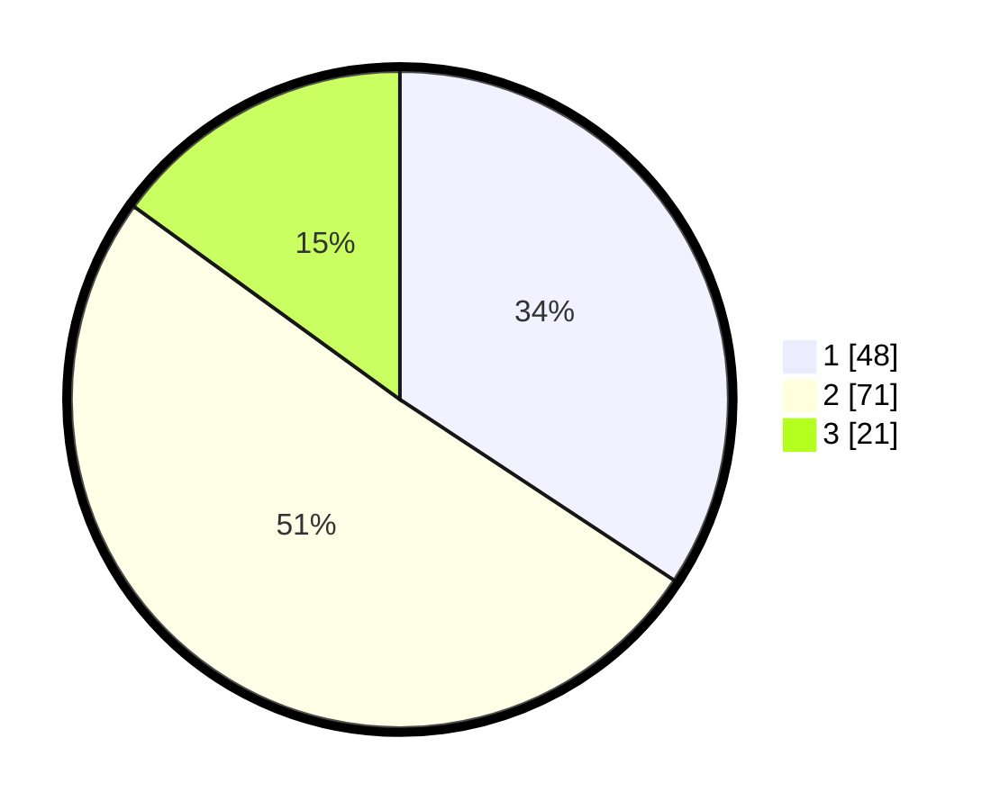

# Hasil

## Grafik

## Tabel

| No. | Nama Paslon    | Suara | Suara (raw) | Persentase |
|:--- |:-------------- | -----:| -----------:| ----------:|
| 1   | ANIES MUHAIMIN | 48    | [48][p-1]   | 34,29      |
| 2   | PRABOWO GIBRAN | 71    | [71][p-2]   | 50,71      |
| 3   | GANJAR MAHFUD  | 21    | [21][p-3]   | 15,00      |

[p-1]: https://github.com/gigit-pemilu/pemilu-2024-11-aceh/blob/main/pilpres/hitung-suara/sub/11-aceh/sub/02-aceh-tenggara/sub/05-badar/sub/2035-tanoh-megakhe/sub/003-tps/sub/paslon-1.txt
[p-2]: https://github.com/gigit-pemilu/pemilu-2024-11-aceh/blob/main/pilpres/hitung-suara/sub/11-aceh/sub/02-aceh-tenggara/sub/05-badar/sub/2035-tanoh-megakhe/sub/003-tps/sub/paslon-2.txt
[p-3]: https://github.com/gigit-pemilu/pemilu-2024-11-aceh/blob/main/pilpres/hitung-suara/sub/11-aceh/sub/02-aceh-tenggara/sub/05-badar/sub/2035-tanoh-megakhe/sub/003-tps/sub/paslon-3.txt

## Foto C Plano

https://sirekap-obj-formc.kpu.go.id/a76f/pemilu/ppwp/11/02/05/20/35/1102052035003-20240216-014140--4c37b20a-5e45-4462-873d-0f6672a1972b.jpg

https://sirekap-obj-formc.kpu.go.id/a76f/pemilu/ppwp/11/02/05/20/35/1102052035003-20240216-013748--1aad66b4-8577-4de8-9a83-28326dec2be3.jpg

https://sirekap-obj-formc.kpu.go.id/a76f/pemilu/ppwp/11/02/05/20/35/1102052035003-20240216-013747--e3450da0-e26a-41b6-b580-71634ad76605.jpg

## Metadata

| Key        | Value               |
| ---------- | ------------------- |
| Time Stamp | 2024-02-21 10:00:00 |

## DATA PEMILIH TETAP

Jumlah pemilih dalam DPT: **164**.
 * L: **77**.
 * P: **87**.

## DATA PENGGUNA HAK PILIH

Jumlah pengguna hak pilih dalam DPT: **127**.
 * L: **60**.
 * P: **67**.

Jumlah pengguna hak pilih dalam DPTb: **7**.
 * L: **2**.
 * P: **5**.

Jumlah pengguna hak pilih dalam DPK: **6**.
 * L: **2**.
 * P: **4**.

Jumlah pengguna hak pilih: **140**.
 * L: **64**.
 * P: **76**.

## JUMLAH SUARA SAH DAN TIDAK SAH

JUMLAH SELURUH SUARA SAH: **140**.

JUMLAH SUARA TIDAK SAH: **0**.

JUMLAH SELURUH SUARA SAH DAN SUARA TIDAK SAH: **140**.

