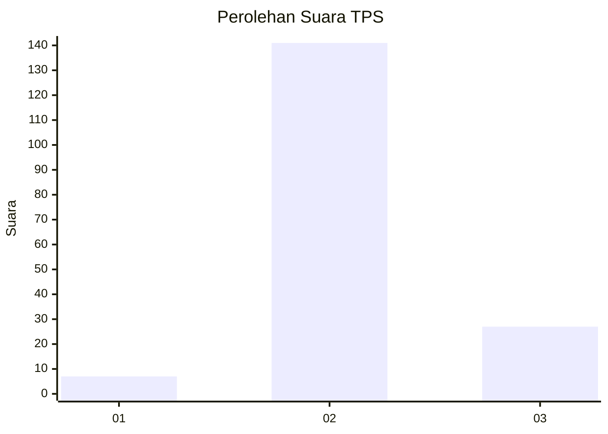
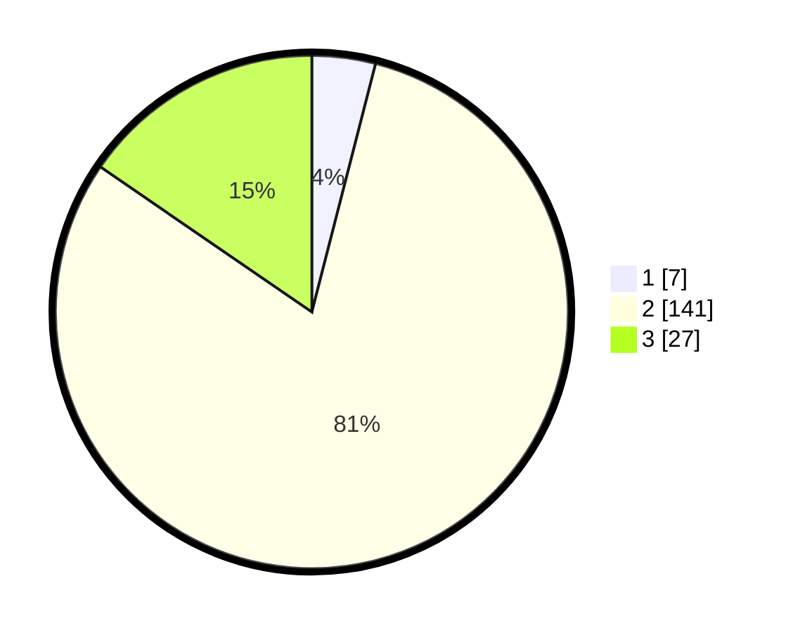

# Hasil

## Grafik

## Tabel

| No. | Nama Paslon    | Suara | Suara (raw) | Persentase |
|:--- |:-------------- | -----:| -----------:| ----------:|
| 1   | ANIES MUHAIMIN | 7     | [7][p-1]    | 4,00       |
| 2   | PRABOWO GIBRAN | 141   | [141][p-2]  | 80,57      |
| 3   | GANJAR MAHFUD  | 27    | [27][p-3]   | 15,43      |

[p-1]: https://github.com/gigit-pemilu/pemilu-2024-11-aceh/blob/main/pilpres/hitung-suara/sub/11-aceh/sub/02-aceh-tenggara/sub/06-babul-makmur/sub/2001-pardomuan-ii/sub/002-tps/sub/paslon-1.txt
[p-2]: https://github.com/gigit-pemilu/pemilu-2024-11-aceh/blob/main/pilpres/hitung-suara/sub/11-aceh/sub/02-aceh-tenggara/sub/06-babul-makmur/sub/2001-pardomuan-ii/sub/002-tps/sub/paslon-2.txt
[p-3]: https://github.com/gigit-pemilu/pemilu-2024-11-aceh/blob/main/pilpres/hitung-suara/sub/11-aceh/sub/02-aceh-tenggara/sub/06-babul-makmur/sub/2001-pardomuan-ii/sub/002-tps/sub/paslon-3.txt

## Foto C Plano

https://sirekap-obj-formc.kpu.go.id/494a/pemilu/ppwp/11/02/06/20/01/1102062001002-20240215-092025--eb1b0fae-306f-4e13-8218-6cb4e96d6fa3.jpg

https://sirekap-obj-formc.kpu.go.id/494a/pemilu/ppwp/11/02/06/20/01/1102062001002-20240214-233513--48776286-77ae-4eb8-8543-4bd743a996f5.jpg

https://sirekap-obj-formc.kpu.go.id/494a/pemilu/ppwp/11/02/06/20/01/1102062001002-20240214-233514--0457ff9c-17e9-442c-9db6-f80a305e6adf.jpg

## Metadata

| Key        | Value               |
| ---------- | ------------------- |
| Time Stamp | 2024-02-22 11:00:00 |

## DATA PEMILIH TETAP

Jumlah pemilih dalam DPT: **234**.
 * L: **109**.
 * P: **125**.

## DATA PENGGUNA HAK PILIH

Jumlah pengguna hak pilih dalam DPT: **179**.
 * L: **81**.
 * P: **98**.

Jumlah pengguna hak pilih dalam DPTb: **1**.
 * L: **0**.
 * P: **1**.

Jumlah pengguna hak pilih dalam DPK: **0**.
 * L: **0**.
 * P: **0**.

Jumlah pengguna hak pilih: **180**.
 * L: **81**.
 * P: **99**.

## JUMLAH SUARA SAH DAN TIDAK SAH

JUMLAH SELURUH SUARA SAH: **175**.

JUMLAH SUARA TIDAK SAH: **5**.

JUMLAH SELURUH SUARA SAH DAN SUARA TIDAK SAH: **180**.

