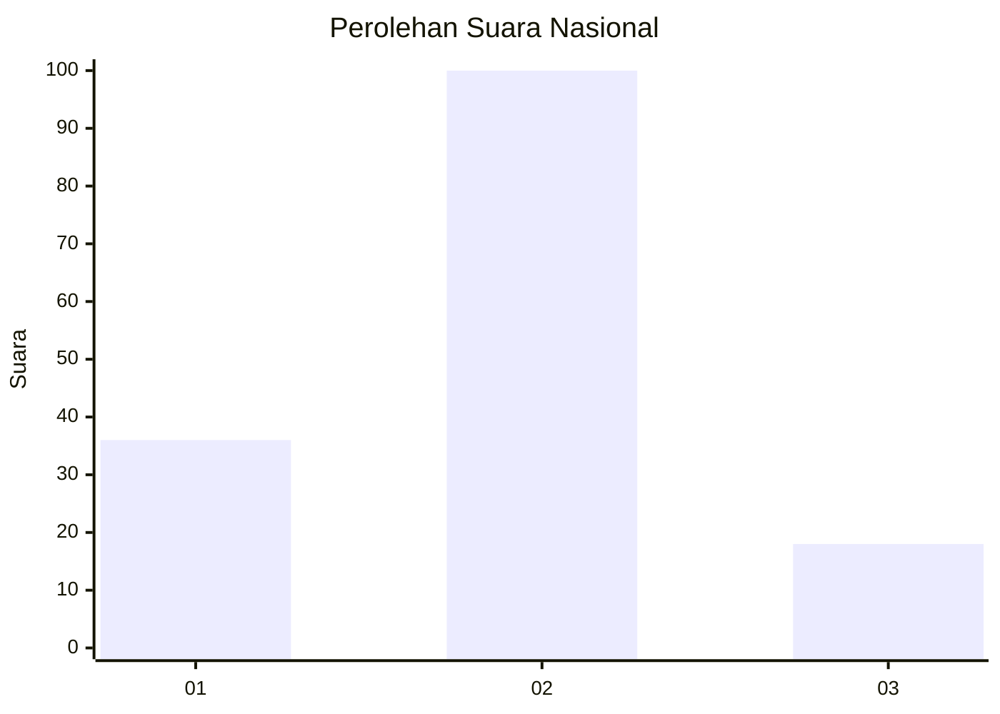
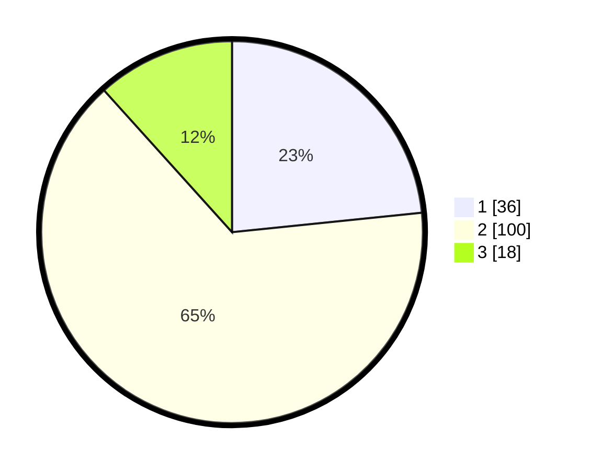

# Hasil

## Grafik

## Tabel

| No. | Nama Paslon    | Suara | Suara (raw) | Persentase |
|:--- |:-------------- | -----:| -----------:| ----------:|
| 1   | ANIES MUHAIMIN | 36    | [36][p-1]   | 23,38      |
| 2   | PRABOWO GIBRAN | 100   | [100][p-2]  | 64,94      |
| 3   | GANJAR MAHFUD  | 18    | [18][p-3]   | 11,69      |

[p-1]: https://github.com/gigit-pemilu/pemilu-2024/blob/main/pilpres/hitung-suara/sub/11-aceh/sub/02-aceh-tenggara/sub/06-babul-makmur/sub/2002-lawe-desky-i/sub/001-tps/sub/paslon-1.txt
[p-2]: https://github.com/gigit-pemilu/pemilu-2024/blob/main/pilpres/hitung-suara/sub/11-aceh/sub/02-aceh-tenggara/sub/06-babul-makmur/sub/2002-lawe-desky-i/sub/001-tps/sub/paslon-2.txt
[p-3]: https://github.com/gigit-pemilu/pemilu-2024/blob/main/pilpres/hitung-suara/sub/11-aceh/sub/02-aceh-tenggara/sub/06-babul-makmur/sub/2002-lawe-desky-i/sub/001-tps/sub/paslon-3.txt

## Foto C Plano

https://sirekap-obj-formc.kpu.go.id/50d9/pemilu/ppwp/11/02/06/20/02/1102062002001-20240214-221627--4fff9f2d-01f9-498a-9050-836ecdf04e02.jpg

https://sirekap-obj-formc.kpu.go.id/50d9/pemilu/ppwp/11/02/06/20/02/1102062002001-20240220-214444--519102ea-2585-4036-a028-7d2ccb4ad1ac.jpg

https://sirekap-obj-formc.kpu.go.id/50d9/pemilu/ppwp/11/02/06/20/02/1102062002001-20240220-214749--3d1b1989-5136-4760-b026-a8611947d684.jpg

## Metadata

| Key        | Value               |
| ---------- | ------------------- |
| Time Stamp | 2024-02-24 22:31:28 |

## DATA PEMILIH TETAP

Jumlah pemilih dalam DPT: **188**.
 * L: **93**.
 * P: **95**.

## DATA PENGGUNA HAK PILIH

Jumlah pengguna hak pilih dalam DPT: **149**.
 * L: **71**.
 * P: **78**.

Jumlah pengguna hak pilih dalam DPTb: **4**.
 * L: **1**.
 * P: **3**.

Jumlah pengguna hak pilih dalam DPK: **2**.
 * L: **1**.
 * P: **1**.

Jumlah pengguna hak pilih: **155**.
 * L: **73**.
 * P: **82**.

## JUMLAH SUARA SAH DAN TIDAK SAH

JUMLAH SELURUH SUARA SAH: **154**.

JUMLAH SUARA TIDAK SAH: **1**.

JUMLAH SELURUH SUARA SAH DAN SUARA TIDAK SAH: **155**.

