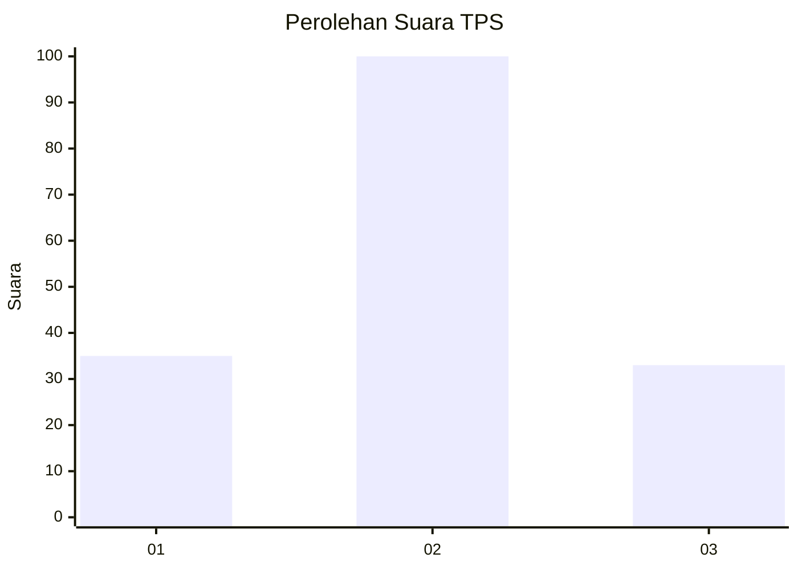
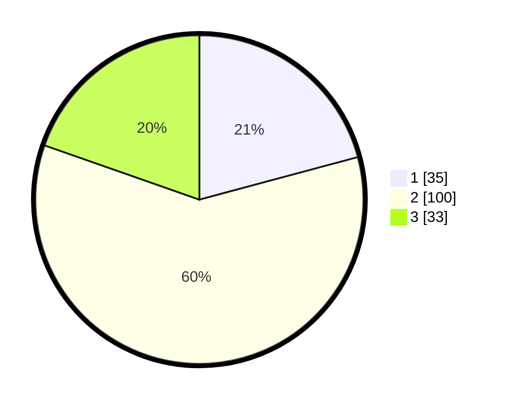

# Hasil

## Grafik

## Tabel

| No. | Nama Paslon    | Suara | Suara (raw) | Persentase |
|:--- |:-------------- | -----:| -----------:| ----------:|
| 1   | ANIES MUHAIMIN | 35    | [35][p-1]   | 20,83      |
| 2   | PRABOWO GIBRAN | 100   | [100][p-2]  | 59,52      |
| 3   | GANJAR MAHFUD  | 33    | [33][p-3]   | 19,64      |

[p-1]: https://github.com/gigit-pemilu/pemilu-2024-11-aceh/blob/main/pilpres/hitung-suara/sub/11-aceh/sub/02-aceh-tenggara/sub/06-babul-makmur/sub/2002-lawe-desky-i/sub/002-tps/sub/paslon-1.txt
[p-2]: https://github.com/gigit-pemilu/pemilu-2024-11-aceh/blob/main/pilpres/hitung-suara/sub/11-aceh/sub/02-aceh-tenggara/sub/06-babul-makmur/sub/2002-lawe-desky-i/sub/002-tps/sub/paslon-2.txt
[p-3]: https://github.com/gigit-pemilu/pemilu-2024-11-aceh/blob/main/pilpres/hitung-suara/sub/11-aceh/sub/02-aceh-tenggara/sub/06-babul-makmur/sub/2002-lawe-desky-i/sub/002-tps/sub/paslon-3.txt

## Foto C Plano

https://sirekap-obj-formc.kpu.go.id/967b/pemilu/ppwp/11/02/06/20/02/1102062002002-20240214-190406--c325a255-8ddc-4603-ac79-0f1fbd218288.jpg

https://sirekap-obj-formc.kpu.go.id/967b/pemilu/ppwp/11/02/06/20/02/1102062002002-20240220-222757--503ed0f3-3544-49f9-a0be-d85e446fb7dd.jpg

https://sirekap-obj-formc.kpu.go.id/967b/pemilu/ppwp/11/02/06/20/02/1102062002002-20240214-210949--be2d306e-a84a-4cea-bc96-7f57a49b6ccb.jpg

## Metadata

| Key        | Value               |
| ---------- | ------------------- |
| Time Stamp | 2024-02-24 22:31:28 |

## DATA PEMILIH TETAP

Jumlah pemilih dalam DPT: **198**.
 * L: **94**.
 * P: **104**.

## DATA PENGGUNA HAK PILIH

Jumlah pengguna hak pilih dalam DPT: **163**.
 * L: **74**.
 * P: **89**.

Jumlah pengguna hak pilih dalam DPTb: **3**.
 * L: **1**.
 * P: **2**.

Jumlah pengguna hak pilih dalam DPK: **2**.
 * L: **2**.
 * P: **0**.

Jumlah pengguna hak pilih: **168**.
 * L: **77**.
 * P: **91**.

## JUMLAH SUARA SAH DAN TIDAK SAH

JUMLAH SELURUH SUARA SAH: **168**.

JUMLAH SUARA TIDAK SAH: **0**.

JUMLAH SELURUH SUARA SAH DAN SUARA TIDAK SAH: **168**.

