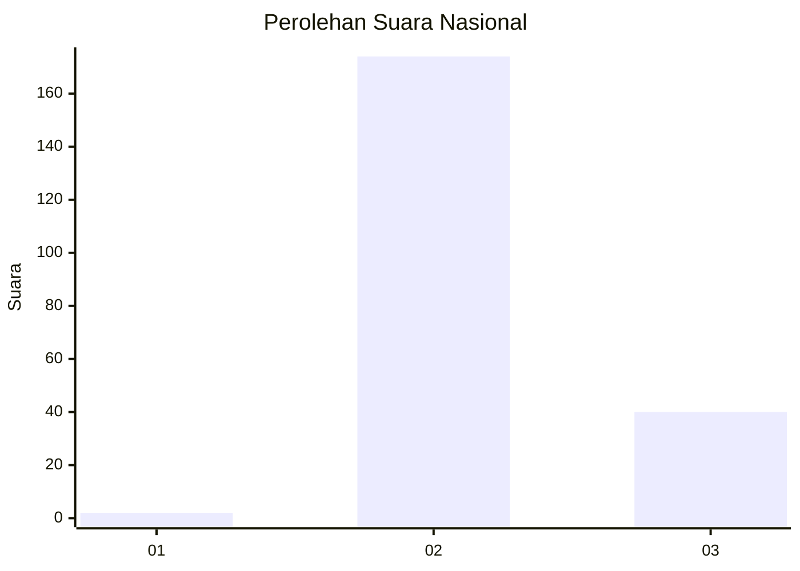
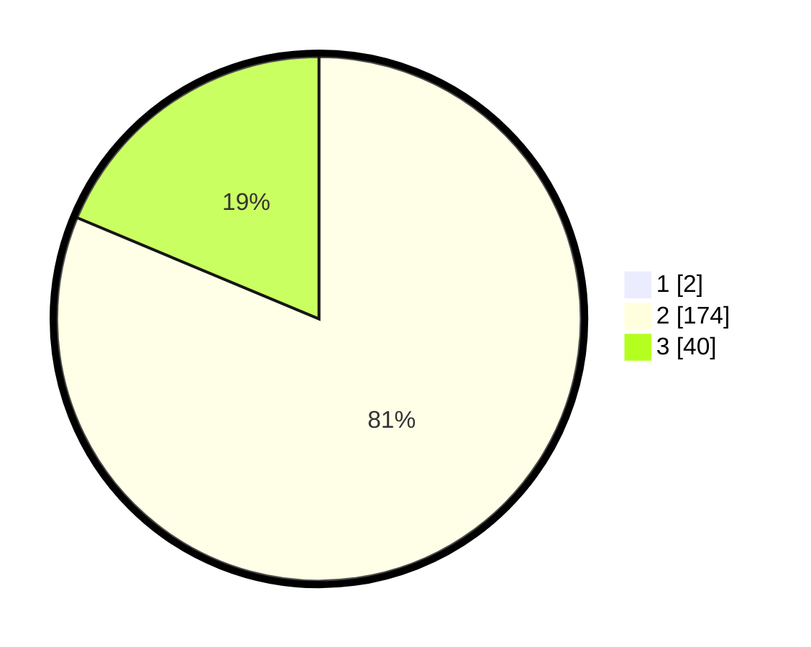

# Hasil

## Grafik

## Tabel

| No. | Nama Paslon    | Suara | Suara (raw) | Persentase |
|:--- |:-------------- | -----:| -----------:| ----------:|
| 1   | ANIES MUHAIMIN | 2     | [2][p-1]    | 0,93       |
| 2   | PRABOWO GIBRAN | 174   | [174][p-2]  | 80,56      |
| 3   | GANJAR MAHFUD  | 40    | [40][p-3]   | 18,52      |

[p-1]: https://github.com/gigit-pemilu/pemilu-2024/blob/main/pilpres/hitung-suara/sub/11-aceh/sub/02-aceh-tenggara/sub/06-babul-makmur/sub/2005-cinta-damai/sub/001-tps/sub/paslon-1.txt
[p-2]: https://github.com/gigit-pemilu/pemilu-2024/blob/main/pilpres/hitung-suara/sub/11-aceh/sub/02-aceh-tenggara/sub/06-babul-makmur/sub/2005-cinta-damai/sub/001-tps/sub/paslon-2.txt
[p-3]: https://github.com/gigit-pemilu/pemilu-2024/blob/main/pilpres/hitung-suara/sub/11-aceh/sub/02-aceh-tenggara/sub/06-babul-makmur/sub/2005-cinta-damai/sub/001-tps/sub/paslon-3.txt

## Foto C Plano

https://sirekap-obj-formc.kpu.go.id/4148/pemilu/ppwp/11/02/06/20/05/1102062005001-20240216-131159--d4275d55-9237-4e24-9d2f-3e3995a4f98a.jpg

https://sirekap-obj-formc.kpu.go.id/4148/pemilu/ppwp/11/02/06/20/05/1102062005001-20240216-131200--3a5492df-5469-461a-83b1-7e61f46e8d81.jpg

https://sirekap-obj-formc.kpu.go.id/4148/pemilu/ppwp/11/02/06/20/05/1102062005001-20240216-131159--7f6027f9-f6bd-4922-b359-eb9216ff3c29.jpg

## Metadata

| Key        | Value               |
| ---------- | ------------------- |
| Time Stamp | 2024-02-21 18:00:00 |

## DATA PEMILIH TETAP

Jumlah pemilih dalam DPT: **270**.
 * L: **127**.
 * P: **143**.

## DATA PENGGUNA HAK PILIH

Jumlah pengguna hak pilih dalam DPT: **197**.
 * L: **84**.
 * P: **113**.

Jumlah pengguna hak pilih dalam DPTb: **12**.
 * L: **6**.
 * P: **6**.

Jumlah pengguna hak pilih dalam DPK: **14**.
 * L: **5**.
 * P: **9**.

Jumlah pengguna hak pilih: **223**.
 * L: **95**.
 * P: **128**.

## JUMLAH SUARA SAH DAN TIDAK SAH

JUMLAH SELURUH SUARA SAH: **216**.

JUMLAH SUARA TIDAK SAH: **7**.

JUMLAH SELURUH SUARA SAH DAN SUARA TIDAK SAH: **223**.

