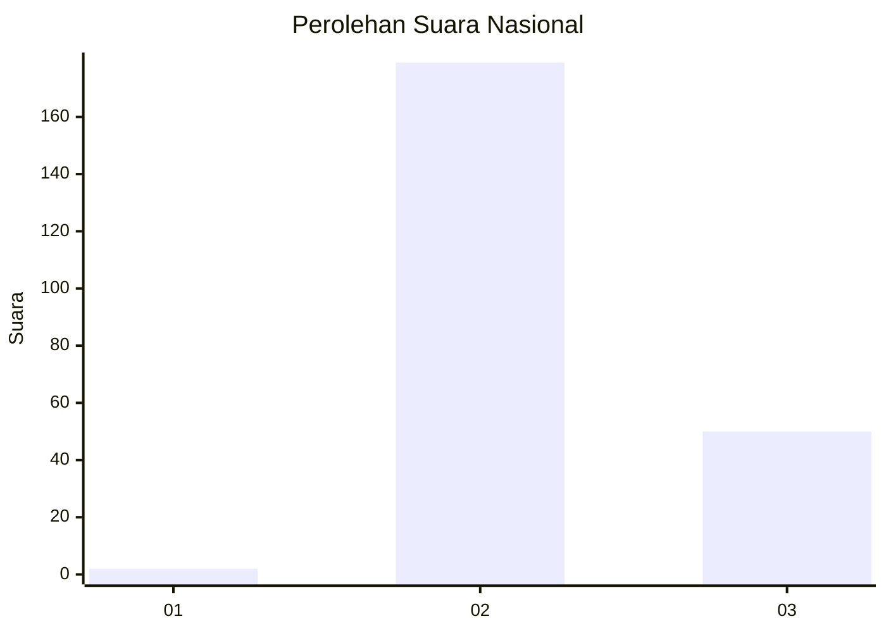
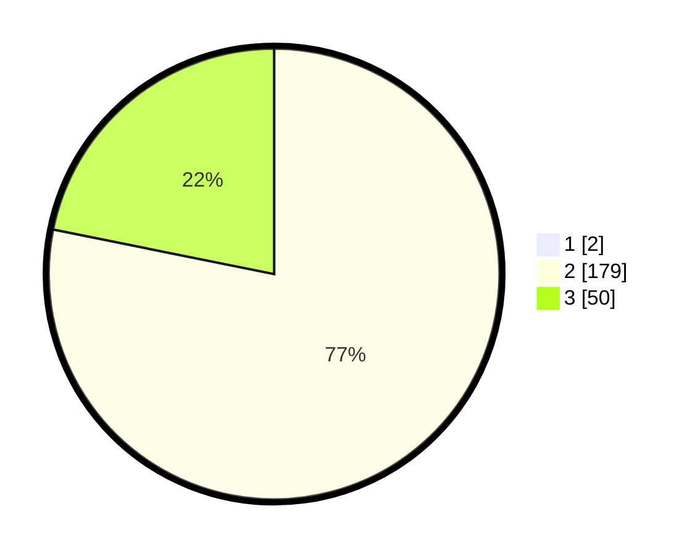

# Hasil

## Grafik

## Tabel

| No. | Nama Paslon    | Suara | Suara (raw) | Persentase |
|:--- |:-------------- | -----:| -----------:| ----------:|
| 1   | ANIES MUHAIMIN | 2     | [2][p-1]    | 0,87       |
| 2   | PRABOWO GIBRAN | 179   | [179][p-2]  | 77,49      |
| 3   | GANJAR MAHFUD  | 50    | [50][p-3]   | 21,65      |

[p-1]: https://github.com/gigit-pemilu/pemilu-2024/blob/main/pilpres/hitung-suara/sub/11-aceh/sub/02-aceh-tenggara/sub/06-babul-makmur/sub/2005-cinta-damai/sub/003-tps/sub/paslon-1.txt
[p-2]: https://github.com/gigit-pemilu/pemilu-2024/blob/main/pilpres/hitung-suara/sub/11-aceh/sub/02-aceh-tenggara/sub/06-babul-makmur/sub/2005-cinta-damai/sub/003-tps/sub/paslon-2.txt
[p-3]: https://github.com/gigit-pemilu/pemilu-2024/blob/main/pilpres/hitung-suara/sub/11-aceh/sub/02-aceh-tenggara/sub/06-babul-makmur/sub/2005-cinta-damai/sub/003-tps/sub/paslon-3.txt

## Foto C Plano

https://sirekap-obj-formc.kpu.go.id/b7ae/pemilu/ppwp/11/02/06/20/05/1102062005003-20240214-162226--df090f6b-b880-461e-9d8a-318b55acf231.jpg

https://sirekap-obj-formc.kpu.go.id/b7ae/pemilu/ppwp/11/02/06/20/05/1102062005003-20240214-204619--a223d927-0139-44e0-837e-36f69c6f987a.jpg

https://sirekap-obj-formc.kpu.go.id/b7ae/pemilu/ppwp/11/02/06/20/05/1102062005003-20240214-205003--b211fbc7-0be1-4c22-a239-274a102545a7.jpg

## Metadata

| Key        | Value               |
| ---------- | ------------------- |
| Time Stamp | 2024-02-15 01:47:43 |

