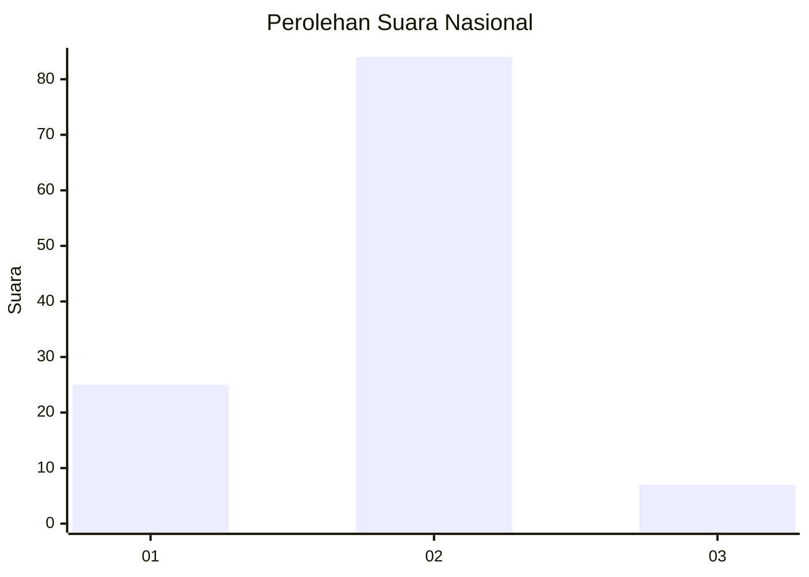
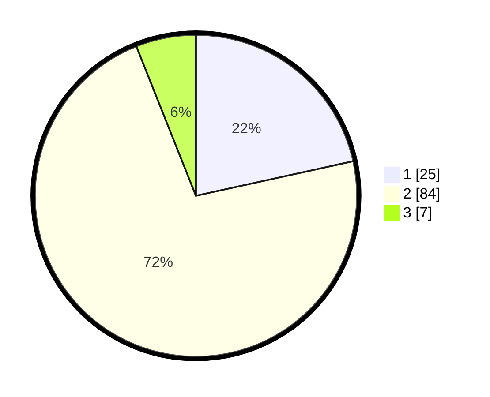

# Hasil

## Grafik

## Tabel

| No. | Nama Paslon    | Suara | Suara (raw) | Persentase |
|:--- |:-------------- | -----:| -----------:| ----------:|
| 1   | ANIES MUHAIMIN | 25    | [25][p-1]   | 21,55      |
| 2   | PRABOWO GIBRAN | 84    | [84][p-2]   | 72,41      |
| 3   | GANJAR MAHFUD  | 7     | [7][p-3]    | 6,03       |

[p-1]: https://github.com/gigit-pemilu/pemilu-2024/blob/main/pilpres/hitung-suara/sub/11-aceh/sub/02-aceh-tenggara/sub/06-babul-makmur/sub/2010-muara-situlen/sub/003-tps/sub/paslon-1.txt
[p-2]: https://github.com/gigit-pemilu/pemilu-2024/blob/main/pilpres/hitung-suara/sub/11-aceh/sub/02-aceh-tenggara/sub/06-babul-makmur/sub/2010-muara-situlen/sub/003-tps/sub/paslon-2.txt
[p-3]: https://github.com/gigit-pemilu/pemilu-2024/blob/main/pilpres/hitung-suara/sub/11-aceh/sub/02-aceh-tenggara/sub/06-babul-makmur/sub/2010-muara-situlen/sub/003-tps/sub/paslon-3.txt

## Foto C Plano

https://sirekap-obj-formc.kpu.go.id/5113/pemilu/ppwp/11/02/06/20/10/1102062010003-20240223-103706--0b9da46a-5df3-41da-b1ae-5b52050d9078.jpg

https://sirekap-obj-formc.kpu.go.id/5113/pemilu/ppwp/11/02/06/20/10/1102062010003-20240223-104011--bd53e2e2-ef8a-407b-a801-a8ea9d635a9a.jpg

https://sirekap-obj-formc.kpu.go.id/5113/pemilu/ppwp/11/02/06/20/10/1102062010003-20240223-104539--01e7ab0a-a43e-448f-800b-810de87f6ca4.jpg

## Metadata

| Key        | Value               |
| ---------- | ------------------- |
| Time Stamp | 2024-02-24 22:31:28 |

## DATA PEMILIH TETAP

Jumlah pemilih dalam DPT: **143**.
 * L: **74**.
 * P: **69**.

## DATA PENGGUNA HAK PILIH

Jumlah pengguna hak pilih dalam DPT: **111**.
 * L: **56**.
 * P: **55**.

Jumlah pengguna hak pilih dalam DPTb: **0**.
 * L: **0**.
 * P: **0**.

Jumlah pengguna hak pilih dalam DPK: **8**.
 * L: **4**.
 * P: **4**.

Jumlah pengguna hak pilih: **119**.
 * L: **60**.
 * P: **59**.

## JUMLAH SUARA SAH DAN TIDAK SAH

JUMLAH SELURUH SUARA SAH: **116**.

JUMLAH SUARA TIDAK SAH: **3**.

JUMLAH SELURUH SUARA SAH DAN SUARA TIDAK SAH: **119**.

