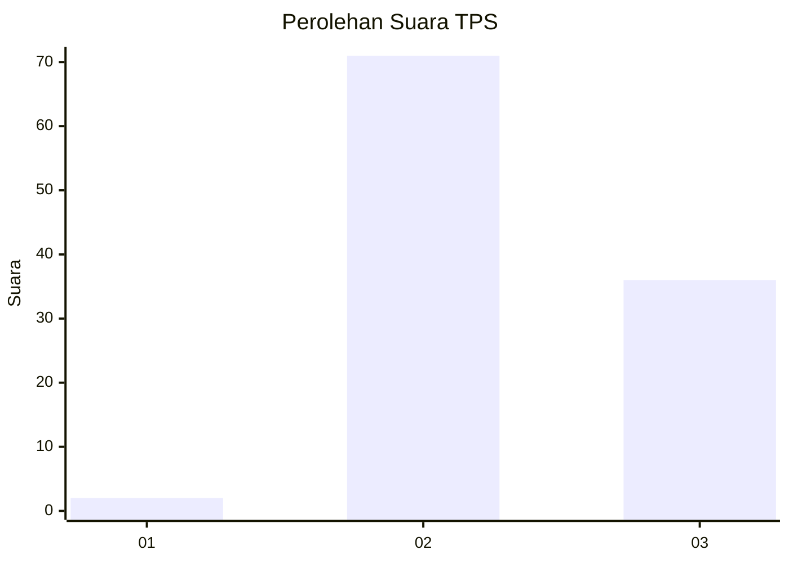
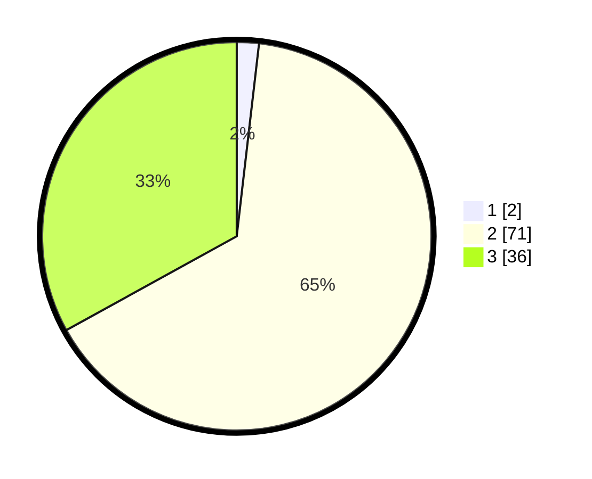

# Hasil

## Grafik

## Tabel

| No. | Nama Paslon    | Suara | Suara (raw) | Persentase |
|:--- |:-------------- | -----:| -----------:| ----------:|
| 1   | ANIES MUHAIMIN | 2     | [2][p-1]    | 1,83       |
| 2   | PRABOWO GIBRAN | 71    | [71][p-2]   | 65,14      |
| 3   | GANJAR MAHFUD  | 36    | [36][p-3]   | 33,03      |

[p-1]: https://github.com/gigit-pemilu/pemilu-2024-11-aceh/blob/main/pilpres/hitung-suara/sub/11-aceh/sub/02-aceh-tenggara/sub/06-babul-makmur/sub/2011-sejahtera/sub/001-tps/sub/paslon-1.txt
[p-2]: https://github.com/gigit-pemilu/pemilu-2024-11-aceh/blob/main/pilpres/hitung-suara/sub/11-aceh/sub/02-aceh-tenggara/sub/06-babul-makmur/sub/2011-sejahtera/sub/001-tps/sub/paslon-2.txt
[p-3]: https://github.com/gigit-pemilu/pemilu-2024-11-aceh/blob/main/pilpres/hitung-suara/sub/11-aceh/sub/02-aceh-tenggara/sub/06-babul-makmur/sub/2011-sejahtera/sub/001-tps/sub/paslon-3.txt

## Foto C Plano

https://sirekap-obj-formc.kpu.go.id/ecf3/pemilu/ppwp/11/02/06/20/11/1102062011001-20240221-114909--e7d6264c-a0cc-435c-bb3c-9d15694a2088.jpg

https://sirekap-obj-formc.kpu.go.id/ecf3/pemilu/ppwp/11/02/06/20/11/1102062011001-20240221-115219--914feea3-ab31-45ac-83be-5c413cbddee7.jpg

https://sirekap-obj-formc.kpu.go.id/ecf3/pemilu/ppwp/11/02/06/20/11/1102062011001-20240221-115759--7372ee62-3536-4ae9-89d2-3abe98f616fe.jpg

## Metadata

| Key        | Value               |
| ---------- | ------------------- |
| Time Stamp | 2024-02-21 12:00:00 |

## DATA PEMILIH TETAP

Jumlah pemilih dalam DPT: **130**.
 * L: **62**.
 * P: **68**.

## DATA PENGGUNA HAK PILIH

Jumlah pengguna hak pilih dalam DPT: **101**.
 * L: **47**.
 * P: **54**.

Jumlah pengguna hak pilih dalam DPTb: **6**.
 * L: **3**.
 * P: **3**.

Jumlah pengguna hak pilih dalam DPK: **3**.
 * L: **2**.
 * P: **1**.

Jumlah pengguna hak pilih: **110**.
 * L: **52**.
 * P: **58**.

## JUMLAH SUARA SAH DAN TIDAK SAH

JUMLAH SELURUH SUARA SAH: **109**.

JUMLAH SUARA TIDAK SAH: **1**.

JUMLAH SELURUH SUARA SAH DAN SUARA TIDAK SAH: **110**.

