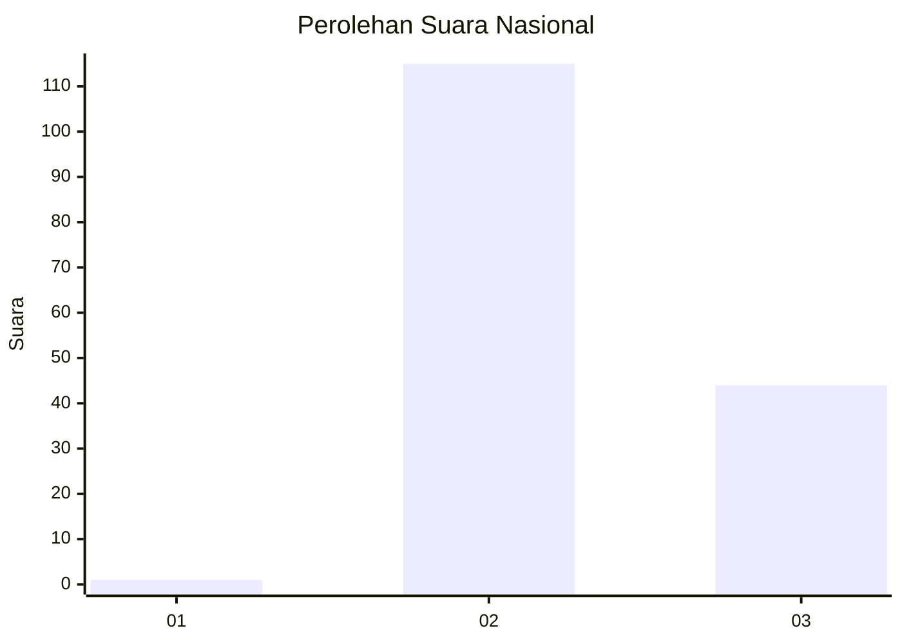
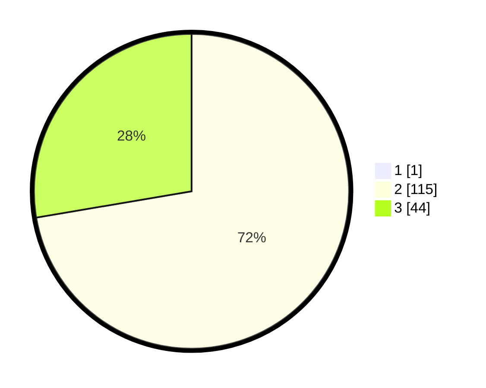

# Hasil

## Grafik

## Tabel

| No. | Nama Paslon    | Suara | Suara (raw) | Persentase |
|:--- |:-------------- | -----:| -----------:| ----------:|
| 1   | ANIES MUHAIMIN | 1     | [1][p-1]    | 0,63       |
| 2   | PRABOWO GIBRAN | 115   | [115][p-2]  | 71,88      |
| 3   | GANJAR MAHFUD  | 44    | [44][p-3]   | 27,50      |

[p-1]: https://github.com/gigit-pemilu/pemilu-2024/blob/main/pilpres/hitung-suara/sub/11-aceh/sub/02-aceh-tenggara/sub/06-babul-makmur/sub/2013-pardamean/sub/001-tps/sub/paslon-1.txt
[p-2]: https://github.com/gigit-pemilu/pemilu-2024/blob/main/pilpres/hitung-suara/sub/11-aceh/sub/02-aceh-tenggara/sub/06-babul-makmur/sub/2013-pardamean/sub/001-tps/sub/paslon-2.txt
[p-3]: https://github.com/gigit-pemilu/pemilu-2024/blob/main/pilpres/hitung-suara/sub/11-aceh/sub/02-aceh-tenggara/sub/06-babul-makmur/sub/2013-pardamean/sub/001-tps/sub/paslon-3.txt

## Foto C Plano

https://sirekap-obj-formc.kpu.go.id/7efd/pemilu/ppwp/11/02/06/20/13/1102062013001-20240215-053909--1e7baaf6-43c3-42b8-9395-f5ea72c30f82.jpg

https://sirekap-obj-formc.kpu.go.id/7efd/pemilu/ppwp/11/02/06/20/13/1102062013001-20240215-054624--8be11bb8-6938-443c-9ac2-2ee427b4347e.jpg

https://sirekap-obj-formc.kpu.go.id/7efd/pemilu/ppwp/11/02/06/20/13/1102062013001-20240215-054814--29934bbe-9a6c-4fbe-a2f1-27fd0e29c2a1.jpg

## Metadata

| Key        | Value               |
| ---------- | ------------------- |
| Time Stamp | 2024-02-24 22:31:28 |

## DATA PEMILIH TETAP

Jumlah pemilih dalam DPT: **197**.
 * L: **95**.
 * P: **102**.

## DATA PENGGUNA HAK PILIH

Jumlah pengguna hak pilih dalam DPT: **151**.
 * L: **68**.
 * P: **83**.

Jumlah pengguna hak pilih dalam DPTb: **6**.
 * L: **2**.
 * P: **4**.

Jumlah pengguna hak pilih dalam DPK: **12**.
 * L: **7**.
 * P: **5**.

Jumlah pengguna hak pilih: **169**.
 * L: **77**.
 * P: **92**.

## JUMLAH SUARA SAH DAN TIDAK SAH

JUMLAH SELURUH SUARA SAH: **160**.

JUMLAH SUARA TIDAK SAH: **9**.

JUMLAH SELURUH SUARA SAH DAN SUARA TIDAK SAH: **169**.

