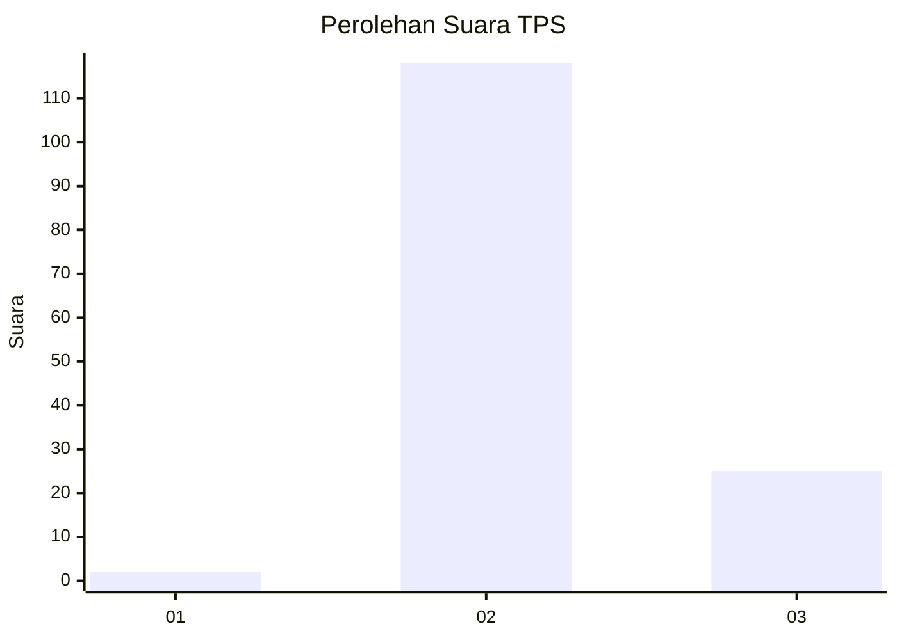
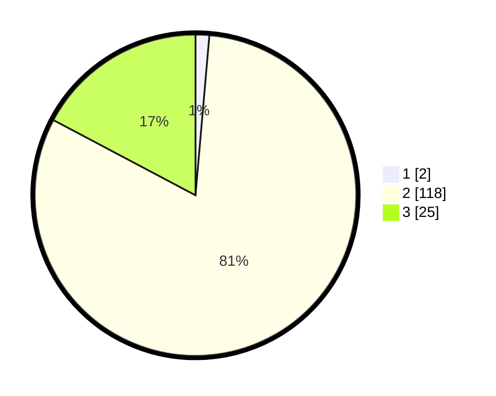

# Hasil

## Grafik

## Tabel

| No. | Nama Paslon    | Suara | Suara (raw) | Persentase |
|:--- |:-------------- | -----:| -----------:| ----------:|
| 1   | ANIES MUHAIMIN | 2     | [2][p-1]    | 1,38       |
| 2   | PRABOWO GIBRAN | 118   | [118][p-2]  | 81,38      |
| 3   | GANJAR MAHFUD  | 25    | [25][p-3]   | 17,24      |

[p-1]: https://github.com/gigit-pemilu/pemilu-2024-11-aceh/blob/main/pilpres/hitung-suara/sub/11-aceh/sub/02-aceh-tenggara/sub/06-babul-makmur/sub/2014-lawe-mantik/sub/003-tps/sub/paslon-1.txt
[p-2]: https://github.com/gigit-pemilu/pemilu-2024-11-aceh/blob/main/pilpres/hitung-suara/sub/11-aceh/sub/02-aceh-tenggara/sub/06-babul-makmur/sub/2014-lawe-mantik/sub/003-tps/sub/paslon-2.txt
[p-3]: https://github.com/gigit-pemilu/pemilu-2024-11-aceh/blob/main/pilpres/hitung-suara/sub/11-aceh/sub/02-aceh-tenggara/sub/06-babul-makmur/sub/2014-lawe-mantik/sub/003-tps/sub/paslon-3.txt

## Foto C Plano

https://sirekap-obj-formc.kpu.go.id/4217/pemilu/ppwp/11/02/06/20/14/1102062014003-20240221-205548--4c80e5c2-17f5-4de2-b16a-088326d33a35.jpg

https://sirekap-obj-formc.kpu.go.id/4217/pemilu/ppwp/11/02/06/20/14/1102062014003-20240221-210159--b81b338a-dc8e-4081-baff-31e550f40118.jpg

https://sirekap-obj-formc.kpu.go.id/4217/pemilu/ppwp/11/02/06/20/14/1102062014003-20240221-210321--5063f89e-0335-41b9-b655-cf728aedc7b4.jpg

## Metadata

| Key        | Value               |
| ---------- | ------------------- |
| Time Stamp | 2024-02-24 22:31:28 |

## DATA PEMILIH TETAP

Jumlah pemilih dalam DPT: **168**.
 * L: **80**.
 * P: **88**.

## DATA PENGGUNA HAK PILIH

Jumlah pengguna hak pilih dalam DPT: **136**.
 * L: **63**.
 * P: **73**.

Jumlah pengguna hak pilih dalam DPTb: **3**.
 * L: **2**.
 * P: **1**.

Jumlah pengguna hak pilih dalam DPK: **9**.
 * L: **7**.
 * P: **2**.

Jumlah pengguna hak pilih: **148**.
 * L: **72**.
 * P: **76**.

## JUMLAH SUARA SAH DAN TIDAK SAH

JUMLAH SELURUH SUARA SAH: **145**.

JUMLAH SUARA TIDAK SAH: **3**.

JUMLAH SELURUH SUARA SAH DAN SUARA TIDAK SAH: **148**.

